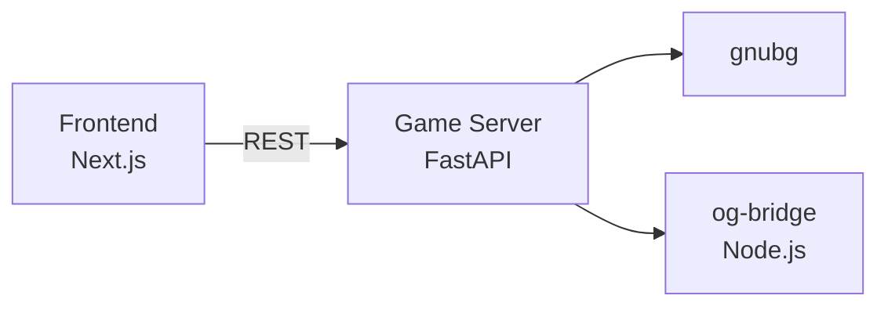
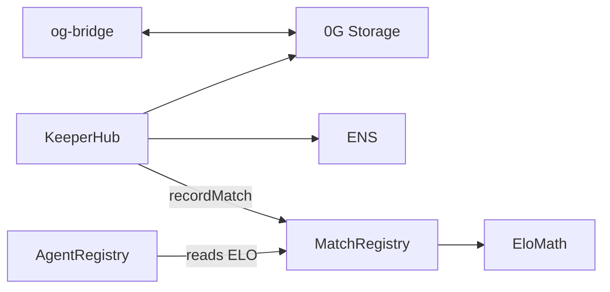
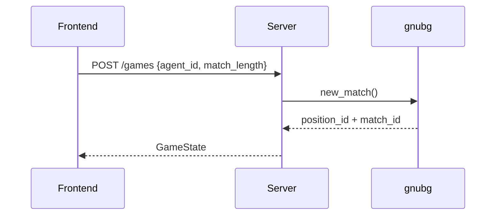
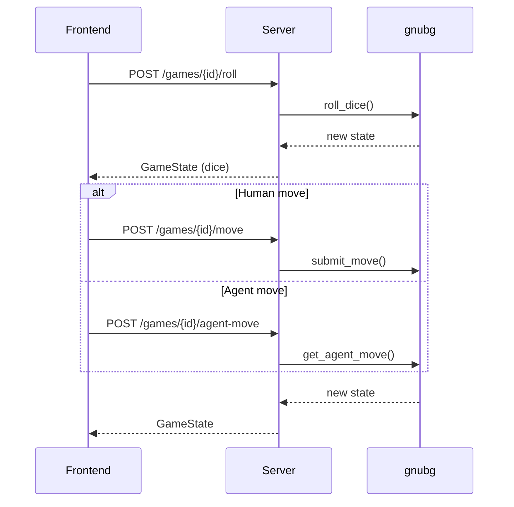
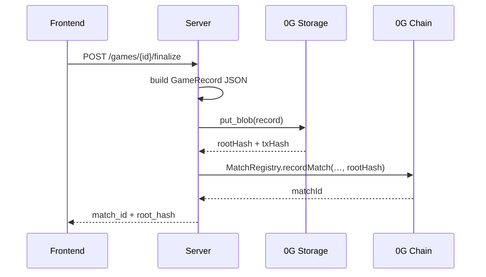
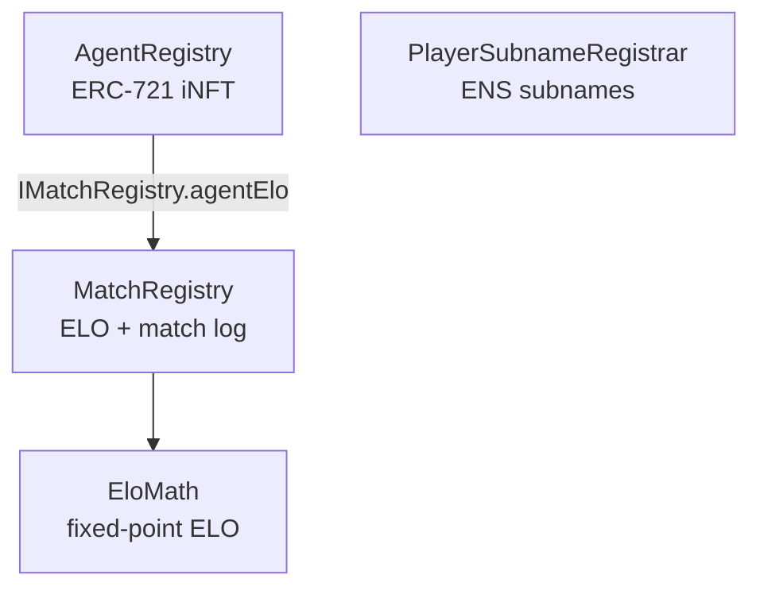
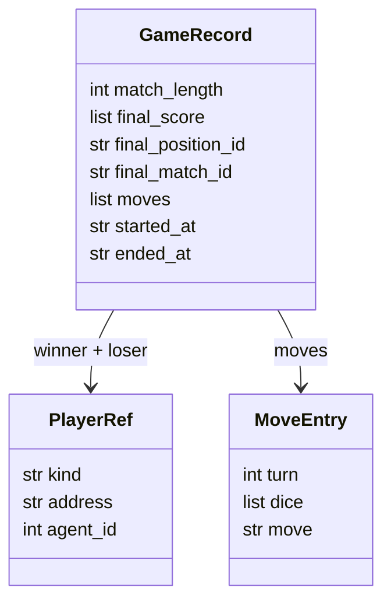
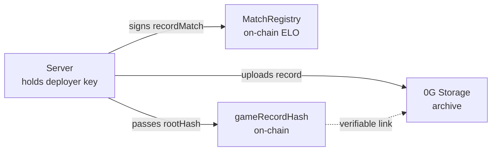
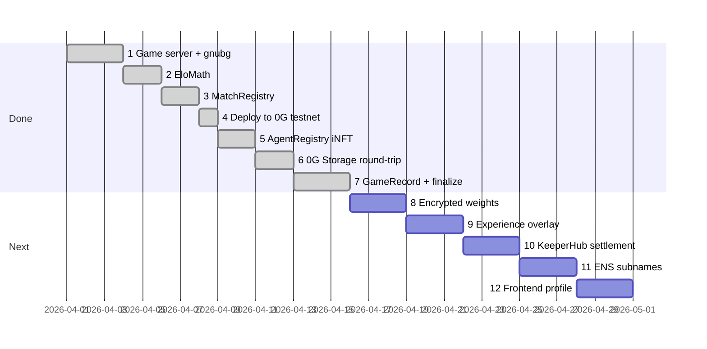

# Chaingammon — Architecture

An open protocol for portable backgammon reputation. Players and AI agents carry an ENS subname whose text records hold their ELO rating and a link to their full match archive on 0G Storage.

---

## 1. Components

---

## 2. Starting a game

---

## 3. One turn

---

## 4. Finalizing a match

---

## 5. Smart contracts

**EloMath** — pure library, fixed-point K=32 formula. No storage.

**MatchRegistry** — `recordMatch(winner, loser, matchLength, gameRecordHash)` updates ELO and stores `MatchInfo`. Default ELO = 1500.

**AgentRegistry** — ERC-721 where each token carries `dataHashes[2]`: `[baseWeightsHash, overlayHash]`. ERC-7857-compatible shape.

**PlayerSubnameRegistrar** — issues `<name>.chaingammon.eth` subnames and controls their text records (`elo`, `match_count`, `style_uri`, `archive_uri`).

---

## 6. Data on 0G Storage

| What | Encrypted? | Who writes |
|------|-----------|------------|
| Game record JSON (moves + final state) | No | Server on `/finalize` |
| KeeperHub audit trail | No | KeeperHub workflow |
| Player style profile (KV) | No | KeeperHub workflow |
| gnubg base weights (Blob) | Yes — AES-256-GCM | `upload_base_weights.py` once |
| Agent experience overlay (Blob) | Yes | Server after each match |

The `gameRecordHash` in `MatchRegistry.MatchInfo` is the 0G Merkle root of the game record. Anyone can fetch and replay the match from the chain reference alone.

---

## 7. Game record schema

---

## 8. Trust model (v1)

The server is the trusted dice roller and settlement submitter in v1. Commit-reveal VRF is a v2 roadmap item.

---

## 9. Phases

