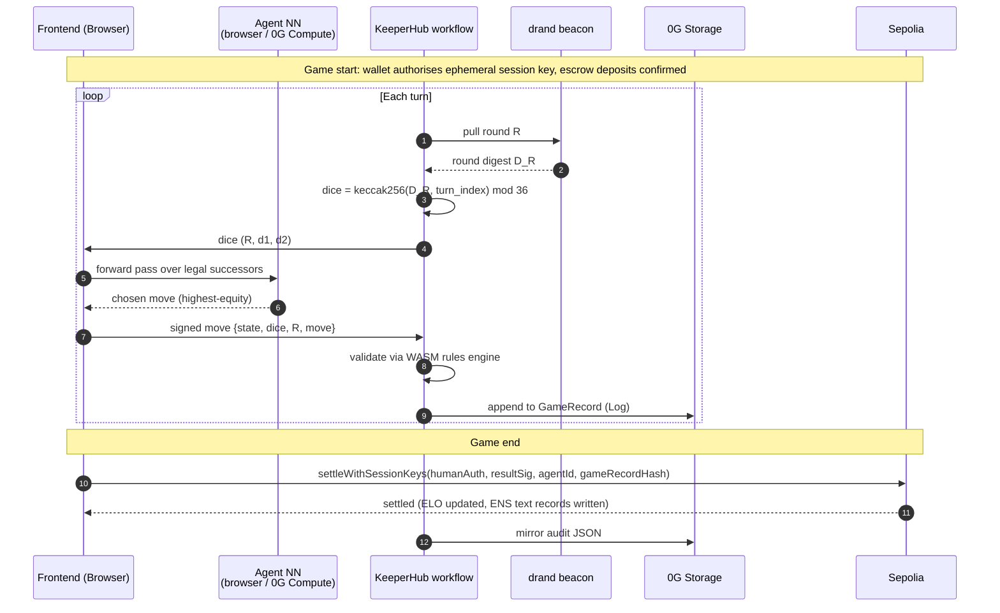
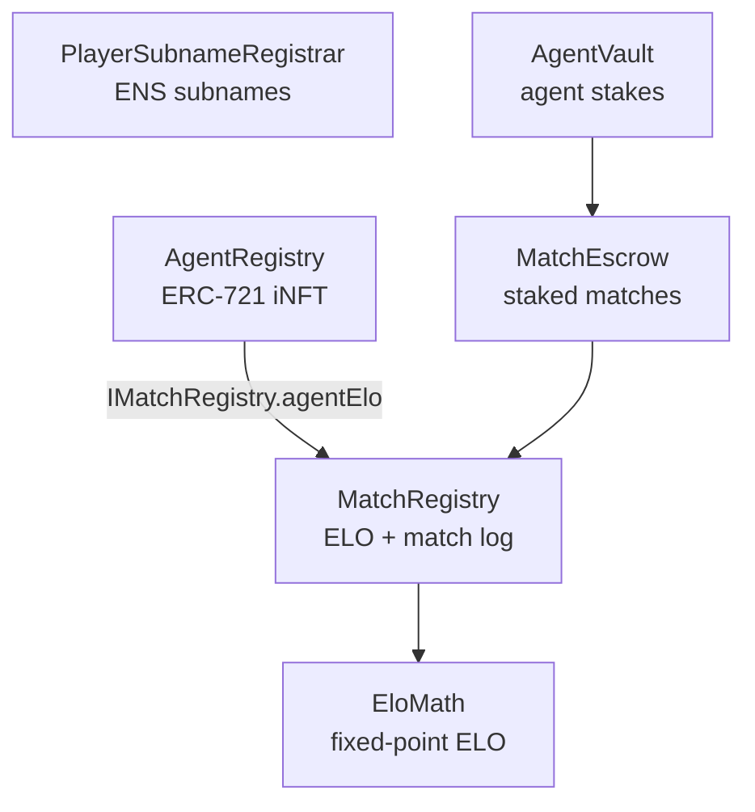
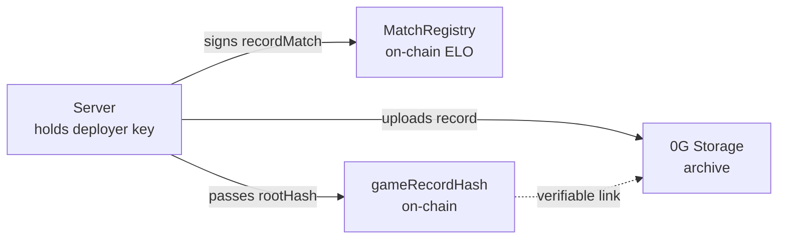

# Chaingammon — Architecture

An open protocol for portable backgammon reputation. Players and AI agents carry an ENS subname whose text records hold their ELO rating and a link to their full match archive on 0G Storage.

See [README.md](README.md) for project overview, setup instructions, deployed contracts, and roadmap.

---

## System overview

```
                   ┌──────────────────────────┐
                   │    Frontend (Next.js)    │
                   │  matchmaking, profile,   │
                   │  replay, live game,      │
                   │  LLM coach panel         │
                   └────────────┬─────────────┘
                                │ HTTP (browser, no central server)
    ┌───────────────────────────┼────────────────────────────┐
    ▼                           ▼                            ▼
┌────────────────┐       ┌──────────────────┐
│  Browser-side  │       │  0G Compute      │
│   value-net    │       │  TEE-attested    │
│   forward pass │       │  coach LLM +     │
│ (ONNX Runtime) │       │  offline NN      │
└────────────────┘       └──────────────────┘
                                │
                                │ KeeperHub workflow
                                ▼
    ┌───────────────────────────────────────────────────┐
    │  Per-turn:  drand round → dice → move → 0G Log    │
    │  Per-game:  rules-engine validation → settle      │
    │             → ENS text records → audit JSON       │
    └───────────────┬───────────────────────────────────┘
                    ▼
┌──────────────────────────────────────────────────────────────────┐
│  Sepolia                          0G Storage                     │
│  MatchEscrow                      Log: per-match game records    │
│  MatchRegistry                    KV : per-player style profile  │
│  AgentRegistry (ERC-7857)         Blob: encrypted agent weights  │
│  PlayerSubnameRegistrar (ENS)           gnubg strategy RAG docs  │
└──────────────────────────────────────────────────────────────────┘
```

**Browser** runs the agent value net (small ONNX model) and reaches the coach via Next.js API routes (`/api/coach/hint`, `/api/coach/chat`) that talk to 0G Compute through `@0glabs/0g-serving-broker` — no proxy process in the request path.

**WASM** — the backgammon rules engine and the ONNX runtime are compiled to WebAssembly so move validation and AI evaluation run client-side at near-native speed. KeeperHub uses the same WASM rules engine server-side to re-verify every move before settlement.

**Sepolia** is the settlement chain (KeeperHub-native, real ENS subnames). Mainnet would be a chain swap; the design is identical.

**drand** is the dice randomness beacon. Each turn's dice are `keccak256(drand_round_digest, turn_index) mod 36` — anyone replaying the match recovers the same dice without trusting the server.

---

## Per-turn sequence



---

## Serverless human-vs-human (Nostr + WebRTC)

Live human-vs-human play runs with no server in the loop.

1. Each searcher generates an ephemeral Nostr keypair and publishes presence (kind 20100) to public Nostr relays, carrying their ENS label and ELO in the event content.
2. Clients deterministically compute the same pairing from the observed set of searchers (`computePairing` in `frontend/lib/matchmaker.ts`) — nearest-ELO pairs, lower pubkey is offerer.
3. The offerer sends an SDP offer (kind 20101) to the answerer via the same Nostr relays; they exchange ICE candidates over the same channel.
4. Once the WebRTC data channel opens, moves flow peer-to-peer; Nostr is only used during setup.
5. Dice use the same drand scheme (each browser independently fetches the round). Settlement reuses the session-key path — both players pre-sign, the result is auto-signed at game-end, any relayer submits with gas from Privy or the escrow pot.

### WebRTC ICE / TURN server

WebRTC needs a TURN relay when both peers are behind NAT (symmetric NAT, enterprise firewall) and cannot connect directly. The VPS runs **coturn** for this.

**Port constraint:** the Oracle Cloud VCN security list only opens ports 22, 80, and 443. Standard TURN port (3478) is blocked. Public free-tier services (e.g. `openrelay.metered.ca`) are unreliable.

**Solution — port 443 multiplexing with sslh:**

```
browser ──TCP 443──► sslh (0.0.0.0:443)
                        │
                        ├─ TLS ClientHello ──► nginx (127.0.0.1:8443)  [HTTPS]
                        └─ plain TCP       ──► coturn (127.0.0.1:3479) [TURN]
```

`sslh` reads the first bytes of each connection and routes by protocol: TLS goes to nginx, plain TCP (TURN) goes to coturn. HTTPS continues to work; TURN relay requests use the only available external port.

**ICE server config** (`frontend/lib/webrtc_match.ts`):

```ts
{ urls: "turn:132.145.158.84:443?transport=tcp", username: "cg", credential: "chaingammon2026" }
```

**Restarting the stack on the VPS:**

```bash
# coturn — plain TURN on 3479 (no TLS; WebRTC data channel has its own DTLS)
pkill turnserver
turnserver -c /tmp/turnserver.conf --daemon

# sslh — multiplexes port 443
sudo sslh -p 0.0.0.0:443 --tls=127.0.0.1:8443 --anyprot=127.0.0.1:3479 -P /tmp/sslh.pid

# nginx is on 8443 (moved off 443 to make room for sslh)
sudo nginx -s reload

# frontend static files on 3001 (nginx proxies / → 3001)
npm exec serve@latest /home/ubuntu/chaingammon/frontend/out -- -p 3001 -s &
```

**coturn config** (`/tmp/turnserver.conf`):

```ini
listening-port=3479
listening-ip=0.0.0.0
external-ip=132.145.158.84/10.0.0.120   # public/private IP pair
realm=chaingammon.local
user=cg:chaingammon2026
lt-cred-mech
fingerprint
no-multicast-peers
denied-peer-ip=10.0.0.0-10.255.255.255
denied-peer-ip=172.16.0.0-172.31.255.255
denied-peer-ip=192.168.0.0-192.168.255.255
```

**Migrating to a dedicated port:** if TCP/UDP 3478 is ever opened in the VCN security list, revert to a standard setup: coturn on 3478, stop sslh, restore nginx to `listen 443 ssl`, frontend back on 3000.

---

## Smart contracts



**EloMath** — pure library, fixed-point K=32 formula. No storage.

**MatchRegistry** — `recordMatch` / `recordMatchAndSplit` update ELO and store `MatchInfo`. `onlyOwnerOrSettler` gate allows KeeperHub's Para MPC wallet to submit settlements. Default ELO = 1500.

**AgentRegistry** — ERC-721 where each token carries `dataHashes[2]`: `[baseWeightsHash, overlayHash]`. ERC-7857-compatible.

**PlayerSubnameRegistrar** — issues `<name>.chaingammon.eth` subnames and controls reserved text records (`elo`, `match_count`, `last_match_id`, `kind`, `inft_id`). Only `MatchRegistry` (via KeeperHub settlement) can write reserved keys — owner writes are rejected.

**MatchEscrow** — holds per-side ETH deposits, pays out to winner on `recordMatchAndSplit`. `settler` is immutable; a fresh `MatchRegistry` deploy requires a fresh `MatchEscrow`.

**AgentVault** — holds ETH balances per agent token ID. Only the NFT owner can withdraw; the server operator can stake up to the owner's pre-approved allowance but cannot withdraw to arbitrary addresses.

---

## ENS as protocol identity

Chaingammon uses ENS subnames as a verifiable, composable reputation primitive readable by any third-party tool without coordinating with us.

- **Verified, not claimed.** Five text record keys (`elo`, `match_count`, `last_match_id`, `kind`, `inft_id`) are reserved on-chain in `PlayerSubnameRegistrar`. Only the contract owner (KeeperHub-driven settlement) can write them.
- **One identity layer for humans and agents.** Both register under `chaingammon.eth`. The `kind` text record (`"human"` or `"agent"`) discriminates. When an agent iNFT is minted via `AgentRegistry.mintAgent`, the contract atomically mints the corresponding subname and sets `kind="agent"` + `inft_id=<tokenId>`.
- **Cross-protocol composability.** A betting market reads `text(namehash("alice.chaingammon.eth"), "elo")` to price a match. A tournament organiser walks `subnameCount()` + `subnameAt(i)` to enumerate ranked players. A coaching platform reads `text(node, "style_uri")` to pull style profiles from 0G Storage.

Full schema: [docs/ENS_SCHEMA.md](docs/ENS_SCHEMA.md).

---

## Agent intelligence

Each agent is a small per-agent value network. Two blobs on 0G Storage, both Merkle-committed to the iNFT:

- **`dataHashes[0]` — starter weights.** Every agent initialises from gnubg's published feedforward weights (exported to `backgammon_net.onnx`). Same starting point across the protocol.
- **`dataHashes[1]` — per-agent checkpoint.** The owner runs a self-play / refereed-match training loop and uploads a new checkpoint after each session.

Inference runs in the browser by default (small forward pass, ~10K parameters). 0G Compute (TEE-attested) covers the offline case.

### Full-board encoding

`BackgammonNet` uses the standard Tesauro 198-dim contact-net encoding via `agent/gnubg_encoder.py`. Checkpoints carry `feature_encoder: "gnubg_full"` so `POST /games/{id}/agent-move` with `use_per_agent_nn=true` scores real positions.

### Training

Two streams:

1. **Self-play.** Full matches against a frozen older checkpoint produce `(state, action, next_state, reward)` triples. The canonical TD-Gammon setup.
2. **Refereed matches.** Every match settled on-chain archives a `GameRecord` to 0G Storage — training data with cryptographically attested outcomes.

Updates are TD(λ) backprop: `δ = r + γ V(s′) − V(s)`; weights step by `α · δ · e` where `e = γλ · e_prev + ∇V(s)`.

The career-mode extras head encodes a 40-d context vector — `[own_18 | opp_18 | stake | tournament | is_team | bias]` — fed into a separate MLP head alongside the 198-d board encoding. The 18 style axes are `ACTIVE_AXES = CATEGORIES[:18]` (all non-cube categories; cube axes excluded because they have no v1 move classifier). Implementation: `agent/sample_trainer.py`, `agent/career_features.py`, `agent/agent_profile.py`.

### Sample trainer CLI

| Flag | Effect |
|------|--------|
| `--matches N` | Self-play matches (default 100) |
| `--save-checkpoint <path>` | Write `state_dict` + metadata |
| `--load-checkpoint <path>` | Resume from prior checkpoint |
| `--drand-digest <hex>` | Derive dice via `drand_dice.derive_dice` |
| `--upload-to-0g` | Encrypt, upload to 0G Storage, print `rootHash` |
| `--no-encrypt` | Upload raw bytes (demo only) |
| `--init-from-0g <hash>` + `--init-key <path>` | Resume from 0G checkpoint |
| `--career-mode` | Sample fresh `CareerContext` per match |
| `--full-board` | Use gnubg 198-dim encoding |
| `--logdir <path>` | TensorBoard event output |
| `--launch-tensorboard` | Spawn TensorBoard after training |

---

## Match archive on 0G Storage

Each match produces a `GameRecord` envelope — JSON, sorted keys, UTF-8:

| Field | What it carries |
|-------|----------------|
| `match_length`, `final_score` | match-point target and final score |
| `winner`, `loser` | wallet address (human) or ERC-7857 token ID (agent) |
| `final_position_id`, `final_match_id` | gnubg base64 strings for replay |
| `moves` | full play sequence: `(turn, drand_round, dice, move, position_id_after)` |
| `cube_actions` | doubling-cube events (offer / take / drop / beaver / raccoon) |
| `started_at`, `ended_at` | ISO-8601 UTC |

Sized at ~2–10 KB compressed. At game end the frontend uploads the `GameRecord` to 0G Storage, gets back a 32-byte Merkle `rootHash`, then calls `MatchRegistry.settleWithSessionKeys(…, rootHash)` which permanently links metadata to the archive.

| What | Encrypted? | Who writes |
|------|-----------|------------|
| Game record JSON | No | Browser on settle |
| KeeperHub audit trail | No | KeeperHub workflow |
| Player style profile (KV) | No | KeeperHub workflow |
| gnubg base weights (Blob) | Yes — AES-256-GCM | `upload_base_weights.py` once |
| Agent experience overlay (Blob) | Yes | Server after each match |

---

## Compute backends

Three distinct compute operations, each running locally (default) or on **0G Compute**:

| Operation | Local | 0G Compute | Status |
|-----------|-------|-----------|--------|
| **Coaching** (Qwen 2.5 7B) | `agent/coach_service.py` | `og-compute-bridge/src/chat.mjs` | Live end-to-end on testnet |
| **Inference** (`BackgammonNet.forward`) | `torch` call in trainer | `og-compute-bridge/src/eval.mjs` | Wire plumbed; no provider on 0G network yet |
| **Training** (round-robin TD-λ) | `agent/round_robin_trainer.py` | Same with `--use-0g-inference` | Control loop always local; ~99% compute is per-move forward passes |

The compute pill in the frontend header flips the backend per operation. State persists in `localStorage["chaingammon.computeBackends"]`.

### Env vars

```
OG_STORAGE_RPC              0G testnet/mainnet RPC
OG_STORAGE_PRIVATE_KEY      funded wallet (pays for inference + storage)
OG_COMPUTE_PROVIDER          (coach)     pin a chat provider
OG_COMPUTE_EVAL_PROVIDER     (inference) pin a backgammon-net provider
BACKGAMMON_NET_MODEL         (inference) listService filter (default backgammon-net-v1)
OG_COMPUTE_PER_INFERENCE_OG  fallback per-inference price (default 0.00001)
OG_COMPUTE_MIN_BALANCE       sub-account min OG balance (default 0.01)
OG_COMPUTE_DEPOSIT           initial ledger deposit (default 0.05)
CHAINGAMMON_MEAN_PLIES       trainer-side gas-estimate denominator (default 60)
```

---

## Coach

The coach is a turn-by-turn conversation, not one-shot narration. Per turn the agent considers the human's history, the opponent's style, and the dialogue so far; free-text corrections bias later turns within the same session (session-local only, does not feed agent training).

| Endpoint | Body | Purpose |
|----------|------|---------|
| `POST /chat` | `ChatRequest{kind, match_id, turn_index, position_id, dice, candidates, dialogue, preferences, ...}` | Turn-by-turn. Kinds: `open_turn`, `human_reply`, `move_committed`. Returns `ChatResponse{message, backend, preferences_delta, latency_ms}`. |
| `POST /hint` | (existing) | Single-sentence narration |

Full design: [docs/coach-dialogue.md](docs/coach-dialogue.md).

### Team mode

A human and an agent (or any 2v2 mix) play as teammates. Per turn the captain receives advisor signals from each teammate (`{teammate_id, proposed_move, confidence, optional_message}`); the captain decides; contributions are archived in the match record.

- `POST /games` accepts optional `team_a` / `team_b` rosters with `captain_rotation`.
- Each `/agent-move` scores non-captain teammates via `teammate_advisor.score_advisor_move` and returns `AdvisorSignal[]` + `captain_id`.
- `/team-demo` exercises the flow end-to-end.

Design: [docs/team-mode.md](docs/team-mode.md).

---

## Staked matches

**Contracts.** `MatchRegistry.recordMatch` and `recordMatchAndSplit` are gated by `onlyOwnerOrSettler`. `MatchEscrow.settler` is `immutable` so it pins to the active `MatchRegistry` at construction time.

**Agent staking — vault model.**

- **Owner** deposits via `AgentVault.deposit(agentId)` and can withdraw at any time. Only the NFT owner can withdraw.
- **Server operator** calls `AgentVault.depositToEscrow(agentId, matchId, stake, escrow)` to move a stake — capped by the owner's pre-approved `allowances[agentId][operatorAddress]`.

**End-to-end flow.**

1. User picks a stake. Empty/`0` keeps the free-match path.
2. Owner calls `AgentVault.depositToEscrow` from their browser wallet; human wallet calls `MatchEscrow.deposit`.
3. Game plays out identically to a free match.
4. Browser calls `MatchRegistry.settleWithSessionKeys` directly; KeeperHub can settle via `recordMatchAndSplit` as fallback.
5. Winner's ETH is paid out atomically by the escrow.

**Endpoints:**

| Endpoint | Body | Purpose |
|----------|------|---------|
| `POST /finalize-direct-staked` | `{escrow_match_id, stake_wei, keeper_settle?}` | Atomic settle + payout |
| `POST /replay` | `{match_id}` | KeeperHub validate step; returns `valid: false` if not ready |

Frontend: `frontend/app/match/page.tsx` + `AgentWalletPanel.tsx`.

---

## KeeperHub workflow

Two YAML workflows live in [`keeperhub/`](keeperhub/):

### `match-settle.yaml` — staked-match settlement

Triggered by `MatchEscrow.Deposited` on Sepolia.

| # | Node | What it does |
|---|------|-------------|
| 1 | `on-deposit` | Event trigger on `MatchEscrow.Deposited`. Captures `matchId`. |
| 2 | `validate` | `POST /replay`. Returns winner/loser, `gameRecordHash`, `winnerAddr`. Returns `valid: false` if not finalized with `keeper_settle=true`. |
| 3 | `gate` | Halts if `valid !== true`. |
| 4 | `read-pot` | `MatchEscrow.pot(matchId)` — reads live pot. |
| 5 | `record` | `MatchRegistry.recordMatchAndSplit(…)` — keeper wallet submits. |

Required one-time setup: `MatchRegistry.setSettler(0x8422451d456D1374b73b14dCe24C5B10Ef43bD99)` from the deployer wallet.

### `post-settle-audit.yaml` — ENS sync + audit trail

Triggered by every `MatchRecorded` event from `MatchRegistry` — fires for both browser-direct and relayer settlements.

| # | Step | What it does |
|---|------|-------------|
| 1 | `confirm-match` | Logs `MatchRecorded` event (matchId, winner, loser, new ELOs). |
| 2 | `run-audit` | `POST /post-settle-audit` — reads chain, fetches 0G blob, pushes `elo` + `last_match_id` ENS text records, updates agent style-overlay KV. |
| 3 | `audit-done` | Logs per-side ENS and overlay update results. |

**Required secrets:** `SEPOLIA_RPC_URL`, `MATCH_REGISTRY_ADDRESS` (`0xaCF222C7c19a3418246B1aa2fbC4Bd97eC4930Dc`), `SERVER_URL`.

### Serverless settlement path (browser-direct)

1. At game-open the human wallet signs a one-time auth (one MetaMask popup). A session key is generated in the browser and stored in `sessionStorage`.
2. Session key signs each move; at game-end it signs the result hash.
3. Browser calls `POST /upload-game-record` → gets Merkle root hash.
4. Browser calls `MatchRegistry.settleWithSessionKeys(…, gameRecordHash)` directly.
5. `post-settle-audit.yaml` fires on `MatchRecorded` and handles ENS sync.

---

## Live training visualisation

TensorBoard metrics written by `challenge_trainer.py`:

| Frequency | Metric keys | What it measures |
|-----------|------------|-----------------|
| Every match | `match/plies`, `win/agent_<id>`, `bankroll/agent_<id>` | Game length, wins, running bankrolls |
| Every epoch | `market/accept_rate`, `market/avg_stake_wei`, `market/proposed`, `market/accepted` | Challenge marketplace health |
| Every epoch | `weights/core_l2_agent_<id>`, `weights/extras_l2_agent_<id>` | Whether network weights are changing |

The `weights/*` charts are the key "is the network learning?" signal: flat lines mean no movement, gradual drift means TD-λ updates are landing.

---

## Frontend routes

| Route | Page | Data source |
|-------|------|------------|
| `/` | Agent discovery + ELO-biased matchmaking | On-chain reads via wagmi |
| `/team-demo` | Off-chain game vs agent (no stake) | ONNX Runtime Web |
| `/team-demo?settle=1` | On-chain game vs agent (ELO + optional stake) | ONNX Runtime Web + `MatchRegistry` |
| `/match?agentId=N` | KeeperHub pre-game card | `AgentRegistry` + `MatchEscrow` |
| `/play-human?id=<matchId>` | Live human-vs-human game | WebRTC data channel (peer-to-peer) |
| `/profile/[ensName]` | Player profile | `PlayerSubnameRegistrar.text()` |
| `/log/[matchId]` | Match replay + audit trail | 0G Storage |
| `/training` | Trigger training runs, monitor progress | FastAPI `/training/*` |

---

## Trust model



The server is the trusted dice roller and settlement submitter for agent-vs-human matches in v1. For human-vs-human, settlement is fully browser-direct — the server is not in the trust path. Commit-reveal VRF for agent matches is a v2 roadmap item.

---

## Glossary

**coturn** — the open-source TURN server software running on the VPS. Listens on port 3479 internally; traffic reaches it via sslh on port 443.

**ICE (Interactive Connectivity Establishment)** — the WebRTC process for finding the best network path between two browsers. It tries three options in order: (1) direct connection, (2) STUN-assisted hole-punch, (3) TURN relay.

**NAT (Network Address Translation)** — a router technique that lets many devices share one public IP. Most home and mobile networks use NAT. It often blocks direct peer-to-peer connections, which is why TURN exists.

**Nostr** — a simple open relay protocol used here for WebRTC signaling. Both players connect to the same public Nostr relays to exchange SDP offers and ICE candidates before switching to a direct WebRTC channel.

**SDP (Session Description Protocol)** — the "handshake document" two WebRTC peers exchange to agree on codecs, network addresses, and encryption parameters. The offerer sends an SDP offer; the answerer replies with an SDP answer.

**sslh** — a port-multiplexer that reads the first bytes of each TCP connection on port 443 and routes it: TLS traffic goes to nginx (HTTPS), plain TCP goes to coturn (TURN). This lets one port serve both the website and the TURN relay.

**STUN (Session Traversal Utilities for NAT)** — a lightweight protocol that tells a browser its own public IP and port as seen from the internet. Used in ICE step 2. Does not relay traffic; only works when at least one peer is not behind symmetric NAT.

**TURN (Traversal Using Relays around NAT)** — a relay server that forwards WebRTC traffic between two peers when a direct connection is impossible. The server at `132.145.158.84` runs coturn for this purpose. Falls back to `openrelay.metered.ca` if the private server is unreachable.

**VCN (Virtual Cloud Network)** — Oracle Cloud's network isolation layer. Each VPS lives inside a VCN. The VCN has its own firewall ("security list") that controls which ports the internet can reach — separate from the VM's own iptables rules. Both must allow a port for it to be reachable. The VCN security list currently only opens 22, 80, and 443, which is why TURN is tunnelled through 443 via sslh.

**VPS (Virtual Private Server)** — the Oracle Cloud virtual machine at `132.145.158.84` that runs the TURN relay (coturn), the reverse proxy (nginx), and the frontend static file server.

**WebRTC (Web Real-Time Communication)** — the browser API for peer-to-peer audio, video, and data channels. Chaingammon uses only the data channel (no audio/video) to send moves directly between players without a game server.
