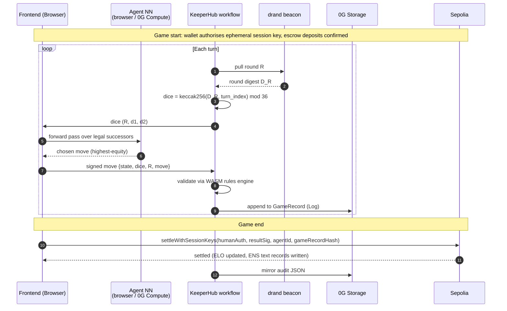
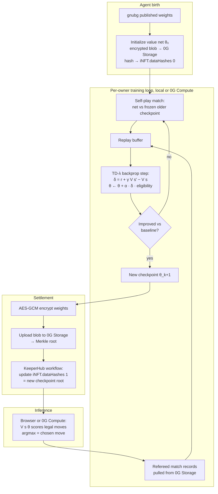

# Chaingammon

> **An open protocol for portable backgammon reputation.** Your wallet (or your AI agent) is your player profile. Your ENS subname is your portable identity. Your full match archive lives on 0G Storage, owned by you forever.

Built for ETHGlobal Open Agents. The three sponsor protocols Chaingammon targets:

- **0G** — full game records (Log), per-player style profiles (KV), encrypted agent weights (Blob, hash-committed to the iNFT) on **0G Storage**; TEE-attested agent NN inference and coach LLM (Qwen 2.5 7B) on **0G Compute**.
- **ENS** — `<name>.chaingammon.eth` subnames carry verified ELO and a pointer to the match archive. Protocol-reserved text records cannot be self-claimed.
- **KeeperHub** — orchestrates the per-match workflow: deposit verification, drand round pulls, WASM rules-engine validation, settlement broadcast, audit trail.

Other infrastructure (not sponsor-affiliated):

- **Sepolia** — the settlement chain. KeeperHub-native, hosts the contracts (`MatchEscrow`, `MatchRegistry`, `AgentRegistry`, the ENS subname registrar). Mainnet move would be a chain swap; the design is identical.
- **drand** — verifiable dice randomness. Each turn's roll is derived from a public drand round; anyone replaying the match recovers the same dice without trusting the server.

---

## TL;DR

A decentralized, verifiable ELO ledger for backgammon — humans and agents share one identity layer.

- **Open identity.** ENS subnames written only by the protocol. Reserved text records (`elo`, `match_count`, `kind`, `inft_id`, `style_uri`, `archive_uri`) cannot be self-claimed; any third-party tool reads them without coordinating with us.
- **Verifiable.** Every match settles to `MatchRegistry` on Sepolia. The on-chain record carries a 32-byte 0G Storage hash of the full archive (every move, every dice roll) — anyone can audit any rating change end-to-end.
- **Living agents.** Each AI agent _is_ an ERC-7857 iNFT (with ERC-721 fallback). It pins two `dataHashes`: a starter NN initialized from gnubg's published weights, and a per-agent trained checkpoint that grows match by match. Transfer the token, transfer the brain.
- **Trustless dice.** Each turn's dice are `keccak256(drand_round_digest, turn_index) mod 36`. No server PRNG, no commit-reveal coordination, fully reproducible.
- **No central server.** Move evaluation runs in the browser (small NN forward pass) or on 0G Compute (TEE-attested for offline play). The coach LLM runs on 0G Compute (Qwen 2.5 7B) with a local flan-t5-base fallback. KeeperHub workflows orchestrate settlement.

---

## How It Works

1. Connect a wallet → frontend resolves (or auto-mints) `<name>.chaingammon.eth` on Sepolia.
2. Pick an opponent — another player's subname or an AI agent (e.g. `gnubg-classic.chaingammon.eth`).
3. Per-turn loop:
   - KeeperHub pulls drand round R → next dice roll is deterministic from the round digest.
   - Active side's agent runs a value-network forward pass (browser or 0G Compute) and selects the highest-equity legal move.
   - The move is appended to the in-progress `GameRecord`; KeeperHub validates legality via the WASM rules engine.
4. Game ends → both players sign the result → `MatchRegistry.settleWithSessionKeys` verifies signatures → ENS text records updated → KeeperHub mirrors the audit JSON to 0G Storage.
5. Any other tool reads your ENS subname and reconstructs your full backgammon DNA — ELO, games played, playing style.

### Per-turn sequence



---

## Where each protocol fits

**Sponsor protocols** (the three Chaingammon targets at ETHGlobal Open Agents):

| Sponsor | Role | Where it lives |
| --- | --- | --- |
| **0G Storage** | Per-match game records (Log), per-player style profiles (KV), encrypted agent weights (Blob, hash-committed to iNFT), gnubg strategy docs (coach RAG context). | HTTP via the 0G Storage indexer SDK; `og-bridge/` |
| **0G Compute** | TEE-attested agent NN inference (offline play, autonomous tournaments) and coach LLM (Qwen 2.5 7B). | `og-compute-bridge/`, `agent/coach_compute_client.py` |
| **ENS** (real) | Portable identity. `<name>.chaingammon.eth` subnames; protocol-reserved text records carry ELO + style profile pointer. | `contracts/src/PlayerSubnameRegistrar.sol` |
| **KeeperHub** | Per-match workflow: deposit verification, drand round pulls, move validation via WASM rules engine, settlement broadcast, audit JSON on 0G Storage. | `docs/keeperhub-feedback.md` |

**Other infrastructure** (chosen for fit, not a sponsor track):

| Layer | Choice | Why |
| --- | --- | --- |
| Settlement chain | **Sepolia** | KeeperHub-native and the canonical home for real-ENS subnames. Mainnet move is a chain swap; design is identical. |
| Dice randomness | **drand** | Public, verifiable randomness beacon. Each turn's dice are `keccak256(drand_round_digest, turn_index) mod 36` — anyone re-derives the same dice during replay. |

---

## Architecture

```
                       ┌──────────────────────────┐
                       │    Frontend (Next.js)    │
                       │  matchmaking, profile,   │
                       │  replay, live game,      │
                       │  LLM coach panel         │
                       └────────────┬─────────────┘
                                    │ HTTP (browser, no central server)
        ┌───────────────────────────┼────────────────────────────┐
        ▼                           ▼                            ▼
 ┌────────────────┐       ┌──────────────────┐         ┌──────────────────┐
 │  Browser-side  │       │  0G Compute      │         │  Local agent     │
 │   value-net    │       │  TEE-attested    │         │  process (dev    │
 │   forward pass │       │  coach LLM +     │         │  convenience):   │
 │   (PyTorch →   │       │  offline NN      │         │  gnubg :8001     │
 │   ONNX/TF.js)  │       │  inference       │         │  coach  :8002    │
 └────────────────┘       └──────────────────┘         └──────────────────┘
                                    │
                                    │ KeeperHub workflow
                                    ▼
        ┌───────────────────────────────────────────────────┐
        │  Per-turn:  drand round → dice → move → 0G Log    │
        │  Per-game:  rules-engine validation → settle      │
        │             → ENS text records → audit JSON       │
        └───────────────┬───────────────────────────────────┘
                        ▼
 ┌──────────────────────────────────────────────────────────────────┐
 │  Sepolia                          0G Storage                     │
 │  MatchEscrow                      Log: per-match game records    │
 │  MatchRegistry                    KV : per-player style profile  │
 │  AgentRegistry (ERC-7857)         Blob: encrypted agent weights  │
 │  PlayerSubnameRegistrar (ENS)           gnubg strategy RAG docs  │
 └──────────────────────────────────────────────────────────────────┘
```

---

## Agent Intelligence Model

Each agent's brain is a small per-agent value network. Two pieces, both stored as 0G Storage blobs whose Merkle roots are committed to the iNFT:

- **`dataHashes[0]` — starter weights.** Every agent is initialized from gnubg's published feedforward weights (a few hundred neurons, single hidden layer for the contact net). Same starting point for every agent in the protocol; what changes is what the owner trains on top.
- **`dataHashes[1]` — per-agent checkpoint.** The owner runs a self-play / refereed-match training loop and uploads the latest checkpoint after each session. Two iNFTs that started identical drift into measurably different play styles as their match histories diverge.

Inference at game time runs in the browser (default — small forward pass, ~10K parameters) or on 0G Compute (TEE-attested, used when the owner's machine is offline so other players can still challenge the agent).

### How agents are trained — backprop, self-play, and refereed matches

**Why we dropped gnubg as a runtime dependency.** gnubg shipped as a single C subprocess driven via its External Player socket. Running it server-side made one cloud endpoint a liveness chokepoint for every agent; porting it to the browser meant a WASM rebuild of decades of C code (the bearoff databases alone are hundreds of MB). The pivot: each agent owns its own neural network, the weights live on 0G Storage, training and inference run locally (or on 0G Compute when the owner is offline). gnubg becomes an *initialization* and *baseline-strength check*, not a runtime dependency.

**Where the training signal comes from.** Two streams, combined:

1. **Self-play.** The agent plays full matches against a frozen copy of itself (or against an older checkpoint) inside a local rollout loop. Every match yields a sequence of `(state, action, next_state)` triples ending in a terminal win/loss reward. Canonical TD-Gammon setup; how gnubg's own weights were originally trained.
2. **Refereed matches against other agents and humans.** Every match settled on Sepolia produces a `GameRecord` archived on 0G Storage. Those records are training data with verifiable provenance — the agent learns from games whose outcomes are cryptographically attested, not just claimed.

There is **no static corpus** in the loop. The only corpus-shaped step is one-time initialization: copy gnubg's published weights into the new agent's value-network backbone.

**How weights are updated — TD(λ) backprop.** The agent's value network `V(s; θ)` predicts equity. After each move:

- Forward pass: `V(s_t; θ)` and `V(s_{t+1}; θ)`.
- TD target: `target = r_{t+1} + γ · V(s_{t+1}; θ)` (bootstrap), or `r_terminal` at game end.
- TD error: `δ_t = target − V(s_t; θ)`.
- Gradient step: `θ ← θ + α · δ_t · e_t`, where `e_t = γλ · e_{t-1} + ∇_θ V(s_t; θ)` is the **eligibility trace** — a running sum of past gradients that lets a terminal reward propagate back to all positions in the trajectory at once.

The career-mode head adds contextual feature inputs (teammate style, opponent profile, tournament position, stake size) and optimizes a longer-horizon return; the same backprop machinery applies.

**Pseudocode** (one self-play training match):

```python
def self_play_training_match(net, opponent_net, gamma=1.0, lam=0.7, lr=1e-3):
    state = initial_position()
    eligibility = {p: torch.zeros_like(p) for p in net.parameters()}

    while not terminal(state):
        dice = drand_dice(round_R)                      # verifiable VRF
        candidates = legal_successors(state, dice)
        next_state = argmax(candidates, key=lambda s: net(features(s)).item())

        v_now = net(features(state))                    # autograd ON
        with torch.no_grad():
            v_next = net(features(next_state))
        reward = terminal_reward(next_state)
        target = reward + gamma * v_next * (0 if terminal(next_state) else 1)
        td_error = (target - v_now).item()

        net.zero_grad()
        v_now.backward()
        for p in net.parameters():
            eligibility[p] = gamma * lam * eligibility[p] + p.grad
            p.data += lr * td_error * eligibility[p]

        state = opponent_move(opponent_net, next_state)

    return net
```

**Visualization — agent training lifecycle.**



**PyTorch snippet — value network and TD(λ) step:**

```python
import torch
from torch import nn

class BackgammonNet(nn.Module):
    """Per-agent value network. core layer is gnubg-init (shared across
    all agents); extras layer is randomly initialized per-agent for
    career-mode contextual features."""
    def __init__(self, in_dim=198, hidden=80, ctx_dim=0):
        super().__init__()
        self.core = nn.Linear(in_dim, hidden)            # init from gnubg weights
        self.extras = nn.Linear(ctx_dim, hidden) if ctx_dim else None
        self.head = nn.Linear(hidden, 1)

    def forward(self, board, ctx=None):
        h = torch.sigmoid(self.core(board))
        if self.extras is not None and ctx is not None:
            h = h + torch.sigmoid(self.extras(ctx))
        return torch.sigmoid(self.head(h)).squeeze(-1)


def td_lambda_step(net, state_feat, next_state_feat, reward, terminal,
                   eligibility, gamma=1.0, lam=0.7, lr=1e-3):
    v_now = net(state_feat)
    with torch.no_grad():
        v_next = net(next_state_feat) if not terminal else torch.tensor(0.0)
    td_error = (reward + gamma * v_next - v_now).detach()

    net.zero_grad()
    v_now.backward()
    with torch.no_grad():
        for p in net.parameters():
            eligibility[p].mul_(gamma * lam).add_(p.grad)
            p.add_(lr * td_error * eligibility[p])
```

**Pretrain → fine-tune.** Two phases:

1. **Pretrain on the single-game objective.** Initialize from gnubg weights, run self-play with `ctx_dim = 0`, optimize for win/loss. Convergence target: near-identical move choice to gnubg on a held-out test set.
2. **Fine-tune on the long-game objective.** Attach the context head (`ctx_dim > 0`), continue training on refereed multi-match sessions where the reward signal is cumulative payout / tournament result. Zeroing the context inputs at inference recovers single-game behavior.

**Where the gradient steps run.** Local for development (laptops train meaningful checkpoints overnight — backgammon nets are small), or on **0G Compute** with TEE attestation for production. The attestation lets a buyer of the iNFT verify "every weight update came from refereed match data." Resulting weights are AES-256-GCM-encrypted and uploaded to 0G Storage; the new Merkle root replaces `iNFT.dataHashes[1]` via a settlement transaction.

### Sample trainer

`agent/sample_trainer.py` is a runnable, end-to-end version of the training loop with TensorBoard wired in. It instantiates two `BackgammonNet`s that share gnubg-initialized core weights but have *different* random `extras` heads, runs self-play TD(λ) matches, and logs scalars (TD error, value estimates, gradient norm, win-rate vs frozen opponent), parameter and gradient histograms, and the model graph to TensorBoard:

```bash
cd agent
uv run python sample_trainer.py --matches 200 --launch-tensorboard
# then open http://localhost:6006
```

The environment in the demo is a deliberately tiny pip-race abstraction so the file runs anywhere without a backgammon engine; production training swaps it for the real engine, with the same encoder shape and the same training mechanics.

---

## Match Archive on 0G Storage

Every completed match is preserved as a canonical, content-addressed archive on 0G Storage. The on-chain `MatchRegistry` only stores match metadata (timestamp, participants, winner, length); the *full* match — every move, every dice roll, the final position — lives off-chain on 0G Storage Log, and the on-chain record carries a cryptographic pointer to it.

Each match produces a `GameRecord` envelope — JSON, sorted keys, UTF-8, deterministic so the bytes always hash the same way:

| Field                                 | What it carries                                                                                  |
| ------------------------------------- | ------------------------------------------------------------------------------------------------ |
| `match_length`, `final_score`         | match-point target and final score                                                               |
| `winner`, `loser`                     | each side's identity (a wallet address for humans, an ERC-7857 token id for agent iNFTs)         |
| `final_position_id`, `final_match_id` | gnubg's native base64 strings — any tool can reconstruct the end state                           |
| `moves`                               | the full play sequence: `(turn, drand_round, dice, move, position_id_after)` for every move      |
| `cube_actions`                        | doubling-cube events (offer / take / drop / beaver / raccoon)                                    |
| `started_at`, `ended_at`              | ISO-8601 UTC timestamps                                                                          |

Sized at ~2–10 KB compressed per match. A player with 1,000 lifetime matches has ~5–10 MB of game data.

When a match ends the frontend builds the `GameRecord`, uploads the JSON bytes to 0G Storage (the indexer returns a 32-byte Merkle `rootHash`), and calls `MatchRegistry.settleWithSessionKeys(...)` which permanently links match metadata to the archive. Anyone can later resolve a match by id, fetch the bytes, and replay the game move-by-move — no login, no API key.

---

## ENS as Protocol Identity

Chaingammon uses ENS subnames as a true protocol identity layer — a verifiable, composable reputation primitive that any third-party tool reads without coordinating with us.

- **Verified, not claimed.** Five text record keys (`elo`, `match_count`, `last_match_id`, `kind`, `inft_id`) are reserved on-chain in `PlayerSubnameRegistrar`. Only the contract owner (KeeperHub-driven settlement) can write them; the on-chain `setText` rejects subname-owner writes via a `bytes32 → bool` reserved-key map.
- **One identity layer for humans and agents.** Both register under `chaingammon.eth`. The `kind` text record (`"human"` or `"agent"`) discriminates. When an agent iNFT is minted via `AgentRegistry.mintAgent`, the contract atomically mints the corresponding subname and sets `kind="agent"` + `inft_id=<tokenId>` in the same transaction.
- **Cross-protocol composability.** A betting market reads `text(namehash("alice.chaingammon.eth"), "elo")` to price a match. A tournament organiser walks `subnameCount()` + `subnameAt(i)` to enumerate ranked players. A coaching platform reads `text(node, "style_uri")` to pull style profiles from 0G Storage. None of them touch our API.

Full schema: [docs/ENS_SCHEMA.md](docs/ENS_SCHEMA.md).

---

## Local Agent Process (dev convenience)

`agent/gnubg_service.py` and `agent/coach_service.py` are small FastAPI services that run on the player's machine (`localhost:8001` and `:8002`) for local development. The browser hits them directly via `fetch`. CORS is open in dev.

| Process | Port | What it does |
| --- | --- | --- |
| **gnubg agent** (`agent/gnubg_service.py`) | 8001 | Wraps the gnubg subprocess via its External Player interface. Useful for ground-truth equity comparisons during training; not part of the production data path. |
| **LLM coach** (`agent/coach_service.py`) | 8002 | Local flan-t5-base coach with gnubg strategy docs as RAG context. Falls back to this when 0G Compute is unreachable. |

Production move evaluation is the per-agent NN forward pass — in the browser by default, on 0G Compute when the owner is offline. The gnubg subprocess is *not* on the production path; it's an initialization source and a local debugging aid.

---

## Running Locally

### Prerequisites

- Python 3.12+, [uv](https://github.com/astral-sh/uv)
- Node 20+, [pnpm](https://pnpm.io)
- `gnubg` (for local debugging only) — `sudo apt install gnubg` (Ubuntu/Debian) or `brew install gnubg` (macOS)

### One-time setup

```bash
git clone <repo> && cd chaingammon
pnpm install                    # frontend + contracts (workspace)
cd agent && uv sync && cd ..    # agent Python deps
cp contracts/.env.example contracts/.env       # add DEPLOYER_PRIVATE_KEY + Sepolia RPC_URL
cp frontend/.env.example frontend/.env.local
```

Fund the deployer wallet with Sepolia ETH from any public faucet.

### Bootstrap and run

```bash
# 1. deploy + verify settlement contracts on Sepolia (one shot)
./scripts/bootstrap-network.sh

# 2. start the local agent processes
cd agent && ./start.sh           # gnubg :8001, coach :8002

# 3. start the frontend (separate terminal, from repo root)
pnpm frontend:dev                # Next.js on :3000
```

Or use the VS Code Tasks workflow (`.vscode/tasks.json`) — `Tasks: Run Task` → `Localhost: launch all` fires hardhat node + deploy + agent + frontend in parallel terminals.

### Local dev with Hardhat

```bash
cd contracts && pnpm exec hardhat node            # local chain (chainId 31337)
cd contracts && pnpm exec hardhat run script/deploy.js --network localhost
# copy addresses from contracts/deployments/localhost.json into frontend/.env.local
```

Switch chains in MetaMask; the frontend re-targets the new chain's contracts automatically (see `frontend/app/chains.ts`).

### Test commands

```bash
pnpm test                  # all tests: agent (pytest) + contracts (hardhat) + frontend (build)
pnpm contracts:test
pnpm agent:test
pnpm frontend:test
```

---

## Frontend Routes

| Route | Page | Data source |
| --- | --- | --- |
| `/` | Agent discovery + matchmaking | On-chain reads via wagmi |
| `/play/new` | Pick two players or teams, start a match | Wallet + `AgentRegistry` |
| `/match?agentId=N` | Live match against agent N | local gnubg service (`:8001`) |
| `/profile/[ensName]` | Player profile (ENS text records) | `PlayerSubnameRegistrar.text()` |
| `/match/[matchId]` | Match replay + audit trail | 0G Storage |

---

## Roadmap

- **v1 (this submission):** human-vs-human and human-vs-agent gameplay; on-chain ELO; ENS subnames; agent iNFTs with hash-committed weights; 0G Storage match archive; drand dice; KeeperHub-orchestrated settlement on Sepolia.
- **v2:** all-agent autonomous tournaments driven by KeeperHub; 0G Compute for TEE-attested fine-tuning; team / chouette mode (career head); per-agent cube doubling.
- **v3:** ZK proofs of agent inference (zkML); betting markets and ELO derivative tokens; mainnet on Base/Optimism (design is identical, chain swap only).

See [ROADMAP.md](ROADMAP.md) for the full version. Architecture: [ARCHITECTURE.md](ARCHITECTURE.md).

---

## Submission Checklist

**General:**

- [x] Public repo + README with pitch and architecture
- [x] Session-key state channel (`MatchRegistry.settleWithSessionKeys`) — pre-authorized at game start, either side can submit
- [x] Sample trainer (`agent/sample_trainer.py`) with TensorBoard
- [ ] Contracts deployed on Sepolia (etherscan links)
- [ ] Demo video < 3 min

**0G** (`Storage`, `Compute`):

- [ ] At least one agent iNFT with hash-committed weights on 0G Storage
- [ ] Match game records visible on 0G Storage Log
- [ ] Coach LLM running on 0G Compute (Qwen 2.5 7B) with TEE attestation surfaced
- [ ] Write-up: which 0G features are used and where

**ENS:**

- [x] Subname schema spec ([docs/ENS_SCHEMA.md](docs/ENS_SCHEMA.md)) + reserved keys enforced on-chain
- [ ] Subname registrar deployed (Sepolia explorer link)
- [ ] At least one `<name>.chaingammon.eth` minted with text records
- [ ] Write-up: text record schema and resolver flow

**KeeperHub:**

- [ ] Workflow live (drand round → move validation → Sepolia settlement → audit JSON to 0G Storage)
- [ ] Write-up: workflow definition + audit trail UX
- [ ] Feedback document ([docs/keeperhub-feedback.md](docs/keeperhub-feedback.md))

Claude Code is enabled on this repo.
