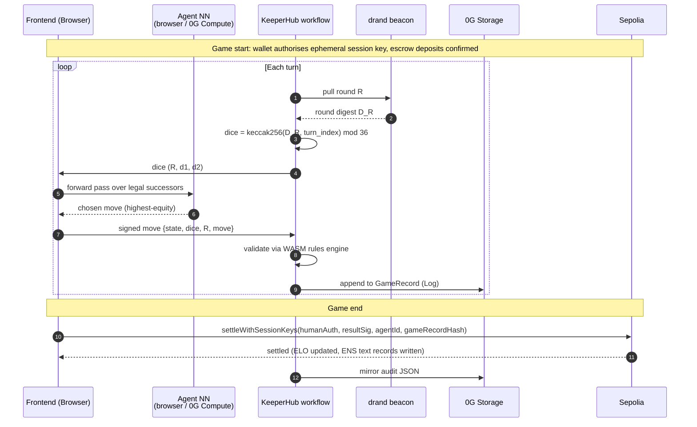
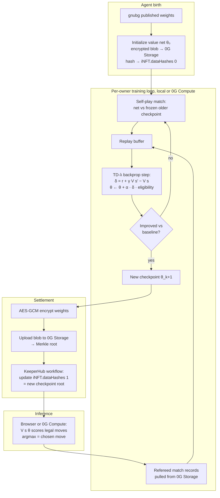

# Chaingammon

> **An open protocol for portable backgammon reputation.** Your wallet (or your AI agent) is your player profile. Your ENS subname is your portable identity. Your full match archive lives on 0G Storage, owned by you forever.

Built for ETHGlobal Open Agents. The three sponsor protocols Chaingammon targets:

- **0G** — full game records (Log), per-player style profiles (KV), encrypted agent weights (Blob, hash-committed to the iNFT) on **0G Storage**; TEE-attested agent NN inference and coach LLM (Qwen 2.5 7B) on **0G Compute**.
- **ENS** — `<name>.chaingammon.eth` subnames carry verified ELO and a pointer to the match archive. Protocol-reserved text records cannot be self-claimed.
- **KeeperHub** — orchestrates the per-match workflow: deposit verification, drand round pulls, WASM rules-engine validation, settlement broadcast, audit trail.

Other infrastructure (not sponsor-affiliated):

- **Sepolia** — the settlement chain. KeeperHub-native, hosts the contracts (`MatchEscrow`, `MatchRegistry`, `AgentRegistry`, the ENS subname registrar). Mainnet move would be a chain swap; the design is identical.
- **drand** — verifiable dice randomness. Each turn's roll is derived from a public drand round; anyone replaying the match recovers the same dice without trusting the server.

---

## TL;DR

A decentralized, verifiable ELO ledger for backgammon — humans and agents share one identity layer.

- **Open identity.** ENS subnames written only by the protocol. Reserved text records (`elo`, `match_count`, `kind`, `inft_id`, `style_uri`, `archive_uri`) cannot be self-claimed; any third-party tool reads them without coordinating with us.
- **Verifiable.** Every match settles to `MatchRegistry` on Sepolia. The on-chain record carries a 32-byte 0G Storage hash of the full archive (every move, every dice roll) — anyone can audit any rating change end-to-end.
- **Living agents.** Each AI agent _is_ an ERC-7857 iNFT (with ERC-721 fallback). It pins two `dataHashes`: a starter NN initialized from gnubg's published weights, and a per-agent trained checkpoint that grows match by match. Transfer the token, transfer the brain.
- **Trustless dice.** Each turn's dice are `keccak256(drand_round_digest, turn_index) mod 36`. No server PRNG, no commit-reveal coordination, fully reproducible.
- **No central server.** Move evaluation runs in the browser (small NN forward pass) or on 0G Compute (TEE-attested for offline play). The coach LLM runs on 0G Compute (Qwen 2.5 7B) with a local flan-t5-base fallback. KeeperHub workflows orchestrate settlement.

---

## How It Works

1. Connect a wallet → frontend resolves (or auto-mints) `<name>.chaingammon.eth` on Sepolia.
2. Pick an opponent — another player's subname or an AI agent (e.g. `gnubg-classic.chaingammon.eth`).
3. Per-turn loop:
   - KeeperHub pulls drand round R → next dice roll is deterministic from the round digest.
   - Active side's agent runs a value-network forward pass (browser or 0G Compute) and selects the highest-equity legal move.
   - The move is appended to the in-progress `GameRecord`; KeeperHub validates legality via the WASM rules engine.
4. Game ends → both players sign the result → `MatchRegistry.settleWithSessionKeys` verifies signatures → ENS text records updated → KeeperHub mirrors the audit JSON to 0G Storage.
5. Any other tool reads your ENS subname and reconstructs your full backgammon DNA — ELO, games played, playing style.

### Per-turn sequence



---

## Where each protocol fits

**Sponsor protocols** (the three Chaingammon targets at ETHGlobal Open Agents):

| Sponsor | Role | Where it lives |
| --- | --- | --- |
| **0G Storage** | Per-match game records (Log), per-player style profiles (KV), encrypted agent weights (Blob, hash-committed to iNFT), gnubg strategy docs (coach RAG context). | HTTP via the 0G Storage indexer SDK; `og-bridge/` |
| **0G Compute** | TEE-attested agent NN inference (offline play, autonomous tournaments) and coach LLM (Qwen 2.5 7B). | `og-compute-bridge/`, `agent/coach_compute_client.py` |
| **ENS** (real) | Portable identity. `<name>.chaingammon.eth` subnames; protocol-reserved text records carry ELO + style profile pointer. | `contracts/src/PlayerSubnameRegistrar.sol` |
| **KeeperHub** | Per-match workflow: deposit verification, drand round pulls, move validation via WASM rules engine, settlement broadcast, audit JSON on 0G Storage. | [`docs/keeperhub-workflow.md`](docs/keeperhub-workflow.md), `docs/keeperhub-feedback.md` |

**Other infrastructure** (chosen for fit, not a sponsor track):

| Layer | Choice | Why |
| --- | --- | --- |
| Settlement chain | **Sepolia** | KeeperHub-native and the canonical home for real-ENS subnames. Mainnet move is a chain swap; design is identical. |
| Dice randomness | **drand** | Public, verifiable randomness beacon. Each turn's dice are `keccak256(drand_round_digest, turn_index) mod 36` — anyone re-derives the same dice during replay. |

---

## Architecture

```
                       ┌──────────────────────────┐
                       │    Frontend (Next.js)    │
                       │  matchmaking, profile,   │
                       │  replay, live game,      │
                       │  LLM coach panel         │
                       └────────────┬─────────────┘
                                    │ HTTP (browser, no central server)
        ┌───────────────────────────┼────────────────────────────┐
        ▼                           ▼                            ▼
 ┌────────────────┐       ┌──────────────────┐         ┌──────────────────┐
 │  Browser-side  │       │  0G Compute      │         │  Local agent     │
 │   value-net    │       │  TEE-attested    │         │  process (dev    │
 │   forward pass │       │  coach LLM +     │         │  convenience):   │
 │   (PyTorch →   │       │  offline NN      │         │  gnubg :8001     │
 │   ONNX/TF.js)  │       │  inference       │         │  coach  :8002    │
 └────────────────┘       └──────────────────┘         └──────────────────┘
                                    │
                                    │ KeeperHub workflow
                                    ▼
        ┌───────────────────────────────────────────────────┐
        │  Per-turn:  drand round → dice → move → 0G Log    │
        │  Per-game:  rules-engine validation → settle      │
        │             → ENS text records → audit JSON       │
        └───────────────┬───────────────────────────────────┘
                        ▼
 ┌──────────────────────────────────────────────────────────────────┐
 │  Sepolia                          0G Storage                     │
 │  MatchEscrow                      Log: per-match game records    │
 │  MatchRegistry                    KV : per-player style profile  │
 │  AgentRegistry (ERC-7857)         Blob: encrypted agent weights  │
 │  PlayerSubnameRegistrar (ENS)           gnubg strategy RAG docs  │
 └──────────────────────────────────────────────────────────────────┘
```

---

## Agent Intelligence Model

Each agent's brain is a small per-agent value network. Two pieces, both stored as 0G Storage blobs whose Merkle roots are committed to the iNFT:

- **`dataHashes[0]` — starter weights.** Every agent is initialized from gnubg's published feedforward weights (a few hundred neurons, single hidden layer for the contact net). Same starting point for every agent in the protocol; what changes is what the owner trains on top.
- **`dataHashes[1]` — per-agent checkpoint.** The owner runs a self-play / refereed-match training loop and uploads the latest checkpoint after each session. Two iNFTs that started identical drift into measurably different play styles as their match histories diverge.

Inference at game time runs in the browser (default — small forward pass, ~10K parameters) or on 0G Compute (TEE-attested, used when the owner's machine is offline so other players can still challenge the agent).

### How agents are trained — backprop, self-play, and refereed matches

**Why we dropped gnubg as a runtime dependency.** gnubg shipped as a single C subprocess driven via its External Player socket. Running it server-side made one cloud endpoint a liveness chokepoint for every agent; porting it to the browser meant a WASM rebuild of decades of C code (the bearoff databases alone are hundreds of MB). The pivot: each agent owns its own neural network, the weights live on 0G Storage, training and inference run locally (or on 0G Compute when the owner is offline). gnubg becomes an *initialization* and *baseline-strength check*, not a runtime dependency.

**Where the training signal comes from.** Two streams, combined:

1. **Self-play.** The agent plays full matches against a frozen copy of itself (or against an older checkpoint) inside a local rollout loop. Every match yields a sequence of `(state, action, next_state)` triples ending in a terminal win/loss reward. Canonical TD-Gammon setup; how gnubg's own weights were originally trained.
2. **Refereed matches against other agents and humans.** Every match settled on Sepolia produces a `GameRecord` archived on 0G Storage. Those records are training data with verifiable provenance — the agent learns from games whose outcomes are cryptographically attested, not just claimed.

There is **no static corpus** in the loop. The only corpus-shaped step is one-time initialization: copy gnubg's published weights into the new agent's value-network backbone.

**How weights are updated — TD(λ) backprop.** The agent's value network `V(s; θ)` predicts equity. After each move:

- Forward pass: `V(s_t; θ)` and `V(s_{t+1}; θ)`.
- TD target: `target = r_{t+1} + γ · V(s_{t+1}; θ)` (bootstrap), or `r_terminal` at game end.
- TD error: `δ_t = target − V(s_t; θ)`.
- Gradient step: `θ ← θ + α · δ_t · e_t`, where `e_t = γλ · e_{t-1} + ∇_θ V(s_t; θ)` is the **eligibility trace** — a running sum of past gradients that lets a terminal reward propagate back to all positions in the trajectory at once.

The career-mode head adds contextual feature inputs (teammate style, opponent profile, tournament position, stake size) and optimizes a longer-horizon return; the same backprop machinery applies.

**Career-mode training (the `--career-mode` flag).** The default trainer fills the value net's `extras` slot with a per-agent random projection — the architecture works, the encoder is a placeholder. `--career-mode` swaps that placeholder for `agent/career_features.encode_career_context`, which projects five contextual inputs into a 16-d vector consumed by the extras head. The trainer samples a fresh `CareerContext` per match (uniform style, log-uniform stake on `[0, 1e21]` wei, 50/50 teammate) so the extras head sees a wide distribution of contexts. Trained checkpoints can then meaningfully condition on context at inference time, which is what makes "agent vs human" and "agent + human team" different in practice.

**Career-mode training inputs (slot layout).** The five inputs and their encodings, as enforced by `encode_career_context`:

| Slots | Input | Encoding |
| --- | --- | --- |
| `[0:6]` | `opponent_style` | 6-axis projection of the opponent's `agent_overlay` style dict; each component clamped to `[-1, 1]`; missing axes default to 0. |
| `[6:12]` | `teammate_style` | Same 6 axes for the teammate; all zeros when solo. |
| `[12]` | `stake_wei` | `log1p(stake_wei) / 70` clamped to `[0, 1]`. Divisor 70 chosen because `log1p(1e30) ≈ 69.08` — stakes up to 10^30 wei map into `[0, 1]` without clamping. |
| `[13]` | `tournament_position` | Scalar in `[-1, 1]`; 0 = casual match. |
| `[14]` | `is_team_match` | `1.0` in doubles / chouette / human+agent; `0.0` solo. |
| `[15]` | (bias) | Constant `1.0` ones-channel so the extras head has usable signal even before training. |

The 16-d minimum is enforced (`encode_career_context` raises on `dim < 16`); larger `dim` zero-pads `[16:dim)`.

**The six style axes.** `opponent_style` and `teammate_style` project onto these axes (`career_features.STYLE_AXES`):

| Axis | What it measures |
| --- | --- |
| `opening_slot` | Aggressive opening preference. |
| `phase_prime_building` | Tendency to build primes. |
| `runs_back_checker` | Running-game preference (vs holding). |
| `phase_holding_game` | Holding-game preference. |
| `bearoff_efficient` | Bear-off skill. |
| `hits_blot` | Aggression on contact. |

These match a subset of the `agent_overlay.CATEGORIES` keys produced by the per-agent overlay JSON on 0G Storage KV; opponent profiles fetched at runtime project onto these axes without a translation step.

**Why these features and not others.**

- *Why these five input kinds.* They are exactly the contextual inputs `chaingammon_plan.md` calls out for the career-mode head — opponent profile, teammate identity (and their style), match stake, tournament position — plus the team-match flag added so a single network handles solo and team modes without retraining. Anything else (match length, time controls, dice variance) is either part of the board features the gnubg-init core already encodes or stays at training-time defaults until evidence says otherwise.

- *Why these six style axes.* They are a strict subset of `agent_overlay.CATEGORIES`. Two reasons: (a) they cover the four distinguishable strategic dimensions the coach already reads — opening, phase (prime / holding), mid-game risk (`hits_blot`), bear-off — so the encoder isn't introducing a new vocabulary the rest of the system has to learn; (b) reusing the existing CATEGORIES keeps the on-disk style-profile blob format on 0G Storage KV in lockstep with the trainer's input format, so opponent profiles fetched at runtime drop straight in without a translation step.

- *Why log1p for the stake.* Stake distributions are heavy-tailed (most matches are unstaked; a handful are large). A linear scaling would saturate the field for every realistic stake; log scaling spreads the typical range across the unit interval. The exact divisor (70) is the smallest integer that doesn't clamp at the high end for any plausible Ethereum-balance stake.

The encoder lives in `agent/career_features.py`; see the module docstring and `STYLE_AXES` for the canonical layout this README mirrors.

**Pseudocode** (one self-play training match):

```python
def self_play_training_match(net, opponent_net, gamma=1.0, lam=0.7, lr=1e-3):
    state = initial_position()
    eligibility = {p: torch.zeros_like(p) for p in net.parameters()}

    while not terminal(state):
        dice = drand_dice(round_R)                      # verifiable VRF
        candidates = legal_successors(state, dice)
        next_state = argmax(candidates, key=lambda s: net(features(s)).item())

        v_now = net(features(state))                    # autograd ON
        with torch.no_grad():
            v_next = net(features(next_state))
        reward = terminal_reward(next_state)
        target = reward + gamma * v_next * (0 if terminal(next_state) else 1)
        td_error = (target - v_now).item()

        net.zero_grad()
        v_now.backward()
        for p in net.parameters():
            eligibility[p] = gamma * lam * eligibility[p] + p.grad
            p.data += lr * td_error * eligibility[p]

        state = opponent_move(opponent_net, next_state)

    return net
```

**Visualization — agent training lifecycle.**



**PyTorch snippet — value network and TD(λ) step:**

```python
import torch
from torch import nn

class BackgammonNet(nn.Module):
    """Per-agent value network. core layer is gnubg-init (shared across
    all agents); extras layer is randomly initialized per-agent for
    career-mode contextual features."""
    def __init__(self, in_dim=198, hidden=80, ctx_dim=0):
        super().__init__()
        self.core = nn.Linear(in_dim, hidden)            # init from gnubg weights
        self.extras = nn.Linear(ctx_dim, hidden) if ctx_dim else None
        self.head = nn.Linear(hidden, 1)

    def forward(self, board, ctx=None):
        h = torch.sigmoid(self.core(board))
        if self.extras is not None and ctx is not None:
            h = h + torch.sigmoid(self.extras(ctx))
        return torch.sigmoid(self.head(h)).squeeze(-1)


def td_lambda_step(net, state_feat, next_state_feat, reward, terminal,
                   eligibility, gamma=1.0, lam=0.7, lr=1e-3):
    v_now = net(state_feat)
    with torch.no_grad():
        v_next = net(next_state_feat) if not terminal else torch.tensor(0.0)
    td_error = (reward + gamma * v_next - v_now).detach()

    net.zero_grad()
    v_now.backward()
    with torch.no_grad():
        for p in net.parameters():
            eligibility[p].mul_(gamma * lam).add_(p.grad)
            p.add_(lr * td_error * eligibility[p])
```

**Pretrain → fine-tune.** Two phases:

1. **Pretrain on the single-game objective.** Initialize from gnubg weights, run self-play with `ctx_dim = 0`, optimize for win/loss. Convergence target: near-identical move choice to gnubg on a held-out test set.
2. **Fine-tune on the long-game objective.** Attach the context head (`ctx_dim > 0`), continue training on refereed multi-match sessions where the reward signal is cumulative payout / tournament result. Zeroing the context inputs at inference recovers single-game behavior.

**Where the gradient steps run.** Local for development (laptops train meaningful checkpoints overnight — backgammon nets are small), or on **0G Compute** with TEE attestation for production. The attestation lets a buyer of the iNFT verify "every weight update came from refereed match data." Resulting weights are AES-256-GCM-encrypted and uploaded to 0G Storage; the new Merkle root replaces `iNFT.dataHashes[1]` via a settlement transaction.

### Sample trainer

`agent/sample_trainer.py` is a runnable, end-to-end version of the training loop with TensorBoard wired in. It instantiates two `BackgammonNet`s that share gnubg-initialized core weights but have *different* random `extras` heads, runs self-play TD(λ) matches, and logs scalars (TD error, value estimates, gradient norm, win-rate vs frozen opponent), parameter and gradient histograms, and the model graph to TensorBoard:

```bash
cd agent
uv run python sample_trainer.py --matches 200 --launch-tensorboard
# then open http://localhost:6006
```

The environment in the demo is a deliberately tiny pip-race abstraction so the file runs anywhere without a backgammon engine; production training swaps it for the real engine, with the same encoder shape and the same training mechanics.

**Trainer CLI flags worth knowing:**

| Flag | Effect |
| --- | --- |
| `--matches N` | Number of self-play matches (default 100). |
| `--save-checkpoint <path>` | Write the trained agent's `state_dict` + metadata as a torch blob. |
| `--load-checkpoint <path>` | Resume training from a prior checkpoint. |
| `--drand-digest <hex>` | Derive every turn's dice via `drand_dice.derive_dice(digest, turn_index)` instead of local PRNG — the same deterministic mapping production uses. Get a fresh round digest from `scripts/fetch_drand_round.py`. |
| `--upload-to-0g` | After saving, AES-256-GCM-encrypt the checkpoint with a fresh key, write the key to `<ckpt>.key`, and upload the sealed blob to 0G Storage via `og-bridge`. Prints the resulting `rootHash` (what KeeperHub commits to `iNFT.dataHashes[1]` in production). |
| `--no-encrypt` | Demo modifier for `--upload-to-0g`: upload the raw `torch.save` bytes (no AES-256-GCM seal, no `.key` file). Used by the recommend-teammate demo path so a server with no key can fetch and content-sniff the checkpoint via `agent_profile.load_profile`. Production agents should leave this off — the encrypted path is the verifiable-training flow. |
| `--init-from-0g <root_hash>` + `--init-key <path>` | Resume training from a 0G Storage checkpoint. Fetches the sealed blob, decrypts with the local key file, and continues with `match_count` carried forward. Mutually exclusive with `--load-checkpoint`. |
| `--career-mode` | Replace the placeholder per-agent random extras with `career_features.encode_career_context(...)` over a freshly-sampled `CareerContext` per match. Requires `--extras-dim >= 16`. The career-mode head learns to use opponent style, teammate style, stake, tournament position, and the team-match flag. |
| `--launch-tensorboard` | Spawn `tensorboard --logdir <logdir>` after training (sample_trainer's standalone-mode convenience). For round-robin runs spawned from `/training`, the FastAPI service launches the sidecar and the `/training` page embeds the iframe — no separate `tensorboard` invocation needed. |
| `--logdir <path>` | TensorBoard event-file output directory. The round-robin trainer (`agent/round_robin_trainer.py --logdir <path>`) supports the same flag and writes `train/*` (TD error, gradient norm, eligibility norm), `match/*` (plies, per-pair win), `win_rate/agent_*` (rolling), and `weights/*_agent_*` (per-epoch L2 norms). `/training/start` sets this automatically and spawns TensorBoard alongside the trainer. |

**Supporting modules** (each with a focused test file):

- `agent/agent_profile.py` — runtime resolver: `load_profile(weights_hash)` fetches the blob behind `iNFT.dataHashes[1]` and content-sniffs it. JSON (`{...`) → `OverlayProfile` (Phase 9 hand-coded category vector, the cold-start path); torch zip (`PK\x03\x04`) → `ModelProfile` with a deserialized `BackgammonNet` ready for inference (`weights_only=True` deserialization, safe against pickle-RCE). The same `weights_hash` field thus addresses overlay-only agents and trained agents transparently — the resolver figures out which is which.
- `agent/career_features.py` — career-mode feature encoder. `encode_career_context(ctx, dim=16)` projects opponent style, teammate style, stake (log1p/70), tournament position, and team-match flag into a fixed-dim vector consumed by the value net's extras head. `sample_career_context(rng)` draws synthetic contexts for the trainer's `--career-mode` path.
- `agent/teammate_selection.py` — minimum viable teammate-preference scoring. `recommend_teammate(net, candidates)` projects each candidate's style into the extras vector's teammate slots [6:12], runs the trained net's forward pass over a deterministic 8-board reference battery, returns the candidate with the highest mean equity. Demonstrates that career-mode training produces an extractable preference, not just better play.
- `agent/drand_dice.py` — derive dice from a drand round digest. The contract is `dice = keccak256(round_digest ‖ turn_index_be8) mod 36`. Pure stdlib, no network.
- `agent/checkpoint_encryption.py` — AES-256-GCM wrap/unwrap. Sealed blob is `nonce(12) ‖ ciphertext_with_tag`. Used to encrypt checkpoints before upload.
- `agent/og_storage_upload.py` — shells out to the `og-bridge` Node CLI to publish bytes to 0G Storage and return the Merkle root.
- `agent/og_storage_download.py` — symmetric of upload; fetches a blob by Merkle root.
- `scripts/fetch_drand_round.py` — manual / debugging companion to `--drand-digest`. Pulls a public drand round and prints its digest in hex.

---

## Match Archive on 0G Storage

Every completed match is preserved as a canonical, content-addressed archive on 0G Storage. The on-chain `MatchRegistry` only stores match metadata (timestamp, participants, winner, length); the *full* match — every move, every dice roll, the final position — lives off-chain on 0G Storage Log, and the on-chain record carries a cryptographic pointer to it.

Each match produces a `GameRecord` envelope — JSON, sorted keys, UTF-8, deterministic so the bytes always hash the same way:

| Field                                 | What it carries                                                                                  |
| ------------------------------------- | ------------------------------------------------------------------------------------------------ |
| `match_length`, `final_score`         | match-point target and final score                                                               |
| `winner`, `loser`                     | each side's identity (a wallet address for humans, an ERC-7857 token id for agent iNFTs)         |
| `final_position_id`, `final_match_id` | gnubg's native base64 strings — any tool can reconstruct the end state                           |
| `moves`                               | the full play sequence: `(turn, drand_round, dice, move, position_id_after)` for every move      |
| `cube_actions`                        | doubling-cube events (offer / take / drop / beaver / raccoon)                                    |
| `started_at`, `ended_at`              | ISO-8601 UTC timestamps                                                                          |

Sized at ~2–10 KB compressed per match. A player with 1,000 lifetime matches has ~5–10 MB of game data.

When a match ends the frontend builds the `GameRecord`, uploads the JSON bytes to 0G Storage (the indexer returns a 32-byte Merkle `rootHash`), and calls `MatchRegistry.settleWithSessionKeys(...)` which permanently links match metadata to the archive. Anyone can later resolve a match by id, fetch the bytes, and replay the game move-by-move — no login, no API key.

---

## ENS as Protocol Identity

Chaingammon uses ENS subnames as a true protocol identity layer — a verifiable, composable reputation primitive that any third-party tool reads without coordinating with us.

- **Verified, not claimed.** Five text record keys (`elo`, `match_count`, `last_match_id`, `kind`, `inft_id`) are reserved on-chain in `PlayerSubnameRegistrar`. Only the contract owner (KeeperHub-driven settlement) can write them; the on-chain `setText` rejects subname-owner writes via a `bytes32 → bool` reserved-key map.
- **One identity layer for humans and agents.** Both register under `chaingammon.eth`. The `kind` text record (`"human"` or `"agent"`) discriminates. When an agent iNFT is minted via `AgentRegistry.mintAgent`, the contract atomically mints the corresponding subname and sets `kind="agent"` + `inft_id=<tokenId>` in the same transaction.
- **Cross-protocol composability.** A betting market reads `text(namehash("alice.chaingammon.eth"), "elo")` to price a match. A tournament organiser walks `subnameCount()` + `subnameAt(i)` to enumerate ranked players. A coaching platform reads `text(node, "style_uri")` to pull style profiles from 0G Storage. None of them touch our API.

Full schema: [docs/ENS_SCHEMA.md](docs/ENS_SCHEMA.md).

---

## Local Agent Process (dev convenience)

`agent/gnubg_service.py` and `agent/coach_service.py` are small FastAPI services that run on the player's machine (`localhost:8001` and `:8002`) for local development. The browser hits them directly via `fetch`. CORS is open in dev.

| Process | Port | What it does |
| --- | --- | --- |
| **gnubg agent** (`agent/gnubg_service.py`) | 8001 | Wraps the gnubg subprocess via its External Player interface. Useful for ground-truth equity comparisons during training; not part of the production data path. |
| **LLM coach** (`agent/coach_service.py`) | 8002 | Local flan-t5-base coach with gnubg strategy docs as RAG context. Falls back to this when 0G Compute is unreachable. |

Production move evaluation is the per-agent NN forward pass — in the browser by default, on 0G Compute when the owner is offline. The gnubg subprocess is *not* on the production path; it's an initialization source and a local debugging aid.

---

## Coach dialogue — turn-by-turn explanation

The coach is a turn-by-turn conversation, not a one-shot narrator. Per turn the agent considers the human's history, the opponent's style, and the dialogue so far; the human can challenge, ask follow-ups, or accept; and the agent's next message is conditioned on the exchange. A free-text correction ("I prefer running games, stop suggesting primes") becomes a per-session preference signal that biases later turns within the same match. The signal is session-local UX adaptation; it expires when the session ends and does **not** feed agent training.

| Endpoint | Body | Purpose |
| --- | --- | --- |
| `POST /chat` | `ChatRequest{kind, match_id, turn_index, position_id, dice, candidates, dialogue, preferences, ...}` | Turn-by-turn dialogue. Three message kinds: `open_turn` (initial take after dice roll), `human_reply` (response to the human's text), `move_committed` (acknowledgement after move commit). Returns `ChatResponse{message, backend, preferences_delta, latency_ms}`. |
| `POST /hint` | (existing one-shot) | Single-sentence narration for users who don't want a back-and-forth. Stays for backwards-compat. |

Full design: [docs/coach-dialogue.md](docs/coach-dialogue.md). Phase A (data shapes + endpoint stub) is in code now (`agent/coach_dialogue.py`, `agent/coach_service.py`); Phase B wires the LLM call, Phase C lands the frontend dialogue panel, Phase D persists per-session preferences across turns within a match.

### Team mode (the human-in-the-loop story)

The actual *human-in-the-loop* feature is **team mode** — a human and an agent (or any 2v2 mix) playing as teammates against an opponent. Per turn the captain receives advisor signals from each teammate (`{teammate_id, proposed_move, confidence, optional_message}`); the captain decides; both contributions are logged into the match record. This is where humans enter the agent training loop: refereed team-vs-team match data feeds future training rounds. Design: [docs/team-mode.md](docs/team-mode.md) (forthcoming).

## Compute Backends — three operations × two backends

Chaingammon has three distinct compute operations. Each can run locally (default) or on **0G Compute** — the bounty story is that the matrix is wired and visible end-to-end:

| Operation | What it computes | Local backend | 0G compute backend | Status |
| --- | --- | --- | --- | --- |
| **Coaching** | LLM hint text (Qwen 2.5 7B chat) | `agent/coach_service.py` fallback | `og-compute-bridge/src/chat.mjs` → `agent/coach_compute_client.chat()` | Both wired end-to-end. A chat provider exists on 0G testnet today; flipping the pill makes /hint route through it. |
| **Inference** | `BackgammonNet.forward(board, extras) → equity` | `torch.nn.Module(...)` call in the trainer | `og-compute-bridge/src/eval.mjs` → `agent/og_compute_eval_client.evaluate()` | Wire plumbed end-to-end (eval bridge, Python client, `/training/estimate`, match-page chip, round-robin trainer's `--use-0g-inference`). **Provider not yet registered** — backgammon-net-v1 isn't advertised on the 0G serving network, so calls return `available: false` with a clear note. Once a provider stands up the toggle becomes live without code changes. |
| **Training** | Round-robin self-play with TD-λ updates | `agent/round_robin_trainer.py` spawned by FastAPI | Same trainer with `--use-0g-inference` so per-move forward passes route through the eval bridge | Inference-on-0G during a run is the bounty path; remote training-as-a-service is out of scope. Trainer probes the bridge once, emits a `0g_inference_active` JSONL event with provider+price on success, or a `warning` event with reason+fallback="local" on unavailable. Run completes either way. While running, the `/training` page embeds TensorBoard (`localhost:6006`) with a per-agent dropdown so judges can watch TD error, gradient norm, per-agent rolling win-rate, and per-agent weight L2 norms update live. |

**The compute pill** in the frontend header (visible on every page) shows the current backend per operation; clicking flips it. State persists in `localStorage["chaingammon.computeBackends"]`.

### What "Training on 0G compute" actually means

The trainer's control loop, TD-λ updates, optimizer steps, and weight saves always run locally. The 0G toggle reroutes only the per-move `net(features, extras)` forward passes through the eval bridge. ~99 % of training compute lives in those forward passes — that's where meterable cost actually accrues — so this is enough to surface a real gas estimate to the judge before they hit Play.

### Env vars per backend

All compute backends use the same wallet that the storage bridge already needs:

```
OG_STORAGE_RPC          0G testnet/mainnet RPC
OG_STORAGE_PRIVATE_KEY  funded wallet (pays for inference + storage)
```

Per-backend optional pinning + tuning:

```
OG_COMPUTE_PROVIDER          (coach)     pin a chat provider, else first chatbot
OG_COMPUTE_EVAL_PROVIDER     (inference) pin a backgammon-net provider
BACKGAMMON_NET_MODEL         (inference) listService filter (default backgammon-net-v1)
OG_COMPUTE_PER_INFERENCE_OG  fallback per-inference price when provider doesn't
                              expose live rates (default 0.00001)
OG_COMPUTE_MIN_BALANCE       sub-account min balance in OG (default 0.01)
OG_COMPUTE_DEPOSIT           initial ledger deposit on first run (default 0.05)
CHAINGAMMON_MEAN_PLIES       trainer-side gas-estimate denominator (default 60)
```

### Cost expectations

- **Coach** ≈ 0.0001 OG per chat completion (Qwen 2.5 7B token-priced on 0G).
- **Inference** ≈ 0.00001 OG per forward pass (placeholder until a real backgammon-net provider publishes live rates).
- **Training** = `epochs × C(N, 2) × ~60 plies × per-inference-cost`. The training page shows a live estimate as you move the slider.

### Provider availability — current limitation

The 0G inference network advertises chat-completion services today (Qwen, Llama, etc.) but not a backgammon equity-net. Hosting a backgammon-NN provider on the 0G compute network is documented as a follow-up. When no provider is registered, `og-compute-bridge/src/eval.mjs` exits non-zero with `OG_EVAL_UNAVAILABLE`; the frontend disables the inference 0G toggle with a tooltip explaining why. Local-mode training is unaffected.

You can pin a custom backgammon-net endpoint via `OG_COMPUTE_EVAL_PROVIDER=<addr>` for testing — the bridge will route through it as if it were a real 0G provider (with the same auth + funding flow).

### Demo playbook (the bounty story)

1. Connect a wallet that holds testnet OG.
2. Click the compute pill (top right of every page); flip **Coach** to 0G — watch a match's coach hints route through 0G Compute (live), OG balance ticks down per hint.
3. Open `/training`. Select a few agents. Move the slider to ~10 epochs. The estimate row shows games + total inferences.
4. Flip **Inference** to 0G in the pill. Slider extends to 10 M; gas estimate row appears with the placeholder per-inference cost. (When a real backgammon-net provider exists, this becomes the live cost.)
5. Click **Play**. Two subprocesses spawn — the trainer + a TensorBoard sidecar at `localhost:6006`. The status panel polls every 2 s and shows per-agent wins as `C(N, 2)` games per epoch run. The **TensorBoard panel below the status panel** renders live charts: TD error per ply, match length, rolling win-rate per agent, and per-epoch weight L2 norms. Pick `agent 2` from the dropdown to filter to that agent's scalars only — `weights/core_l2_agent_2` and `weights/extras_l2_agent_2` are the "is the network actually learning" signal: flat lines = no learning, gentle drift = TD-λ is working as expected.
6. Hover any agent card on `/`. The popover lazy-fetches `/agents/{id}/profile` and shows the agent's match count + style summary.
7. On `/match?teamMode=1`, the read-only "🤝 Agent prefers teammate #N" chip appears, scored by `recommend_teammate` against the requester's trained checkpoint loaded from 0G storage.
8. Open `/team-demo`. Click "Create team game" then "Play next move" repeatedly — each turn renders one `AdvisorSignal` per non-captain teammate (proposed move + confidence bar + rationale), with the captain badge tagging who decided. The captain rotates per the team's `captain_rotation` policy ("alternating" by default). All signals are archived to `MoveEntry.advisor_signals` for the audit replayer.

## Full-board training (Phase J)

The trained `BackgammonNet` originally operated on a simplified pip-race state. **Phase J** (commit `63f6f18` and predecessors) replaces that with the standard Tesauro 198-dim contact-net encoding — `agent/gnubg_encoder.py` ports the canonical layout, `agent/full_board_state.py` drives self-play through real gnubg subprocesses, and `agent/sample_trainer.py --full-board` writes checkpoints carrying `feature_encoder: "gnubg_full"` so `/games/{id}/agent-move` with `use_per_agent_nn=true` can score real positions.

**Producing a full-board checkpoint** (one-shot, ~30-60 min wall time):

```bash
cd agent
uv run python sample_trainer.py \
    --full-board \
    --matches 100 \
    --career-mode \
    --save-checkpoint /tmp/agent7-fullboard.pt \
    --upload-to-0g --no-encrypt \
    --status-file /tmp/run.jsonl \
    --logdir /tmp/agent7-tb
```

Add `--logdir /tmp/agent7-tb` to write TensorBoard events; open with `tensorboard --logdir /tmp/agent7-tb` in another terminal to watch the full-board encoding's TD-error trajectory mid-run.

The trainer prints the resulting Merkle `rootHash`. Register it on `AgentRegistry`:

```bash
# from contracts/
npx hardhat run scripts/set-agent-data-hash.ts --network 0g-testnet \
    -- --agent-id 7 --slot 1 --hash 0x<rootHash>
```

After the on-chain write, `POST /games/{gameId}/agent-move` with body `{"use_per_agent_nn": true}` will load the checkpoint, encode each gnubg candidate's successor position to 198 features, and pick the NN's argmax — that's the per-agent neural net actually driving moves.

**Latency note:** each `/agent-move` with the NN flag costs ~N gnubg subprocess calls (one per candidate). For typical positions (5-10 candidates) that's ~500-1000 ms per move. The gnubg+overlay fallback path remains the default (no flag); the NN flag is opt-in for demo turns.

**Compatibility:** old race-only checkpoints stay loadable (`ModelProfile.metrics()["feature_encoder"]` defaults to `"race"`). The `/agent-move` helper refuses race weights for full-board scoring and falls through to overlay so a transition mid-deployment is safe.

## Team-mode communication (Phase K)

Two agents on the same team now publish per-turn signals. **Phase K** (commit `1ca678c`) wires the live flow:

- `POST /games` accepts optional `team_a` and `team_b` rosters (each is `{members: PlayerRef[], captain_rotation: "alternating" | "fixed_first" | "per_turn_vote"}`).
- Each `/agent-move` computes the captain via `team_mode.captain_index`, scores every non-captain teammate via `teammate_advisor.score_advisor_move`, and returns `AdvisorSignal[]` + `captain_id` alongside the new `GameState`.
- Signals are archived in `MoveEntry.advisor_signals` and propagated into the on-chain `GameRecord` commitment.
- The `/team-demo` frontend page exercises the flow end-to-end with a 2v1 game.

**MVP captain decision rule:** the captain ignores advisors at pick time — its own move (gnubg+overlay, or per-agent NN under Phase J's flag) is final. Signals are *archived*, not *consumed*. Vote fusion / confidence-weighted rank fusion is a follow-up: every signal is on the on-chain record, so a future endpoint that re-ranks captain picks against archived advisors lights up retroactively.

## KeeperHub workflow (Phase 37)

The keeper-orchestrated settlement workflow is real, not a Phase-36 mock. `server/app/keeper_workflow.py` runs 8 sequential steps for any matchId that's been finalized on-chain:

| # | Step ID | What it does |
| - | --- | --- |
| 1 | `escrow_deposit` | Reads MatchInfo from MatchRegistry; fails if the match isn't on-chain (i.e. `/finalize-game` was never called). |
| 2 | `vrf_rolls` | Probes the drand mainnet HTTP endpoint to confirm the VRF source the trainer uses (`agent/drand_dice.py`) is reachable. |
| 3 | `og_storage_fetch` | Pulls the GameRecord blob from 0G Storage by the rootHash in MatchInfo. |
| 4 | `gnubg_replay` | Walks every recorded move through `gnubg.submit_move` from the canonical opening; asserts the final `position_id` matches the recorded value. A mismatch means the GameRecord doesn't faithfully describe play and the match shouldn't settle. |
| 5 | `settlement_signed` | Confirms the MatchInfo presence (session-key flow pre-authorizes; the relay tx itself is the proof). |
| 6 | `relay_tx` | Surfaces `gameRecordHash` as the canonical audit anchor — the same value KeeperHub commits to its run-audit log. |
| 7 | `ens_update` | Cross-checks elo + last_match_id text records on each labelled subname; cleanly skips for unnamed / agent-vs-agent matches. |
| 8 | `audit_append` | Serializes the entire workflow run to JSON, uploads to 0G Storage, and surfaces the rootHash as the audit-trail anchor. |

Trigger via `POST /keeper-workflow/{matchId}/run` (the Run button on `/keeper/[matchId]` does this). The workflow runs on a background thread; `GET /keeper-workflow/{matchId}` polls return live mid-run progress, persisted to `/tmp/chaingammon-keeper-workflows/<matchId>.json` so navigating away and back during a long-running step doesn't lose state. A step failure marks itself "failed" with the exception message in `error`, the workflow status flips to "failed", and remaining steps stay "pending" — an audit reader can immediately see *which* step broke and *why*.

The 8 step IDs and the response shape (`{matchId, status, steps: [{id, name, status, duration_ms, retry_count, tx_hash, error, detail}]}`) are the same canonical contract Phase 36 locked in for the frontend, so existing `/keeper/[matchId]` rendering works unchanged against the real orchestrator.

## Live training visualization (Phase L)

Round-robin training runs spawned from the `/training` page are observable in real time via an embedded TensorBoard panel — judges can watch the network learn while it learns.

How the pieces fit:

- **Trainer side.** `agent/round_robin_trainer.py` opens a `SummaryWriter` when `--logdir` is set and emits scalars at three cadences:
  - per-ply (via `td_lambda_match`'s existing writer hook): `train/td_error`, `train/v_now`, `train/v_next`, `train/grad_norm`, `train/eligibility_norm`
  - per-match: `match/plies`, `win/agent_a_vs_b`, `win_rate/agent_<id>` (rolling)
  - per-epoch: `weights/core_l2_agent_<id>` and `weights/extras_l2_agent_<id>`
- **Service side.** `server/app/training_service.py` `mkdtemp`s a fresh logdir per run, passes `--logdir` to the trainer, and spawns `tensorboard --logdir <path> --host localhost --port 6006 --bind_all` as a sidecar. Best-effort: if the binary isn't on PATH or the port is in use, the launch fails silently and `/training/status` returns `tensorboard_url: null` so the frontend can disclose state cleanly.
- **Frontend side.** `/training` reads `tensorboard_url` from `/training/status` and mounts the dashboard in an iframe. A per-agent dropdown filters scalars via TensorBoard 2.x's `#scalars&tagFilter=agent_<id>` URL fragment — pick "agent 2" and the iframe re-mounts showing only that agent's `win_rate/agent_2`, `weights/core_l2_agent_2`, etc. The `weights/*_agent_*` charts are the canonical "is the network actually learning" signal: flat lines mean no movement, gentle drift means TD-λ is updating the value head as expected.

To inspect a saved run after the fact, point TensorBoard at the persisted logdir from `/training/status` (the directory survives the trainer subprocess; cleanup on `/training/abort`).

---

## Running Locally

### Prerequisites

- Python 3.12+, [uv](https://github.com/astral-sh/uv)
- Node 20+, [pnpm](https://pnpm.io)
- `gnubg` (for local debugging only) — `sudo apt install gnubg` (Ubuntu/Debian) or `brew install gnubg` (macOS)

### One-time setup

```bash
git clone <repo> && cd chaingammon
pnpm install                    # frontend + contracts (workspace)
cd agent && uv sync && cd ..    # agent Python deps
cp contracts/.env.example contracts/.env       # add DEPLOYER_PRIVATE_KEY + Sepolia RPC_URL
cp frontend/.env.example frontend/.env.local
```

Fund the deployer wallet with Sepolia ETH from any public faucet.

### Bootstrap and run

```bash
# 1. deploy + verify settlement contracts on Sepolia (one shot)
./scripts/bootstrap-network.sh

# 2. start the local agent processes
cd agent && ./start.sh           # gnubg :8001, coach :8002

# 3. start the frontend (separate terminal, from repo root)
pnpm frontend:dev                # Next.js on :3000
```

Or use the VS Code Tasks workflow (`.vscode/tasks.json`) — `Tasks: Run Task` → `Localhost: launch all` fires hardhat node + deploy + agent + frontend in parallel terminals.

### Local dev with Hardhat

```bash
cd contracts && pnpm exec hardhat node            # local chain (chainId 31337)
cd contracts && pnpm exec hardhat run script/deploy.js --network localhost
# copy addresses from contracts/deployments/localhost.json into frontend/.env.local
```

Switch chains in MetaMask; the frontend re-targets the new chain's contracts automatically (see `frontend/app/chains.ts`).

### Test commands

```bash
pnpm test                  # all tests: agent (pytest) + contracts (hardhat) + frontend (build)
pnpm contracts:test
pnpm agent:test
pnpm frontend:test
```

---

## Frontend Routes

| Route | Page | Data source |
| --- | --- | --- |
| `/` | Agent discovery + matchmaking | On-chain reads via wagmi |
| `/play/new` | Pick two players or teams, start a match | Wallet + `AgentRegistry` |
| `/match?agentId=N` | Live match against agent N | local gnubg service (`:8001`) |
| `/profile/[ensName]` | Player profile (ENS text records) | `PlayerSubnameRegistrar.text()` |
| `/match/[matchId]` | Match replay + audit trail | 0G Storage |

---

## Roadmap

- **v1 (this submission):** human-vs-human and human-vs-agent gameplay; on-chain ELO; ENS subnames; agent iNFTs with hash-committed weights; 0G Storage match archive; drand dice; KeeperHub-orchestrated settlement on Sepolia.
- **v2:** all-agent autonomous tournaments driven by KeeperHub; 0G Compute for TEE-attested fine-tuning; team / chouette mode (career head); per-agent cube doubling.
- **v3:** ZK proofs of agent inference (zkML); betting markets and ELO derivative tokens; mainnet on Base/Optimism (design is identical, chain swap only).

See [ROADMAP.md](ROADMAP.md) for the full version. Architecture: [ARCHITECTURE.md](ARCHITECTURE.md).

---

## Submission Checklist

**General:**

- [x] Public repo + README with pitch and architecture
- [x] Session-key state channel (`MatchRegistry.settleWithSessionKeys`) — pre-authorized at game start, either side can submit
- [x] Sample trainer (`agent/sample_trainer.py`) with TensorBoard
- [x] Round-robin multi-agent trainer + `/training` page with live TensorBoard panel (per-agent picker)
- [x] Contracts deployed on Sepolia: [MatchRegistry](https://sepolia.etherscan.io/address/0x8708C6DaA55F9B322f6d83c5D89774febeEff2da) · [AgentRegistry](https://sepolia.etherscan.io/address/0xaBbC7484A444967a6B7b1752416B8d2ee516B81c) · [PlayerSubnameRegistrar](https://sepolia.etherscan.io/address/0x077a62a6aA3f28E8f2Ef586411613a55639BA734) (deployed 2026-04-28; full deployment record at `contracts/deployments/sepolia.json`)
- [x] Contracts also deployed on 0G testnet: [MatchRegistry](https://chainscan-galileo.0g.ai/address/0x60E52e2d9Ea7b4A851Dd63365222c7d102A11eaE) · [AgentRegistry](https://chainscan-galileo.0g.ai/address/0xCb0a562fa9079184922754717BB3035C0F7A983E) · [PlayerSubnameRegistrar](https://chainscan-galileo.0g.ai/address/0xf260aE6b2958623fC4e865433201050DC2Ed1ccC) (deployed 2026-04-27)
- [ ] Demo video < 3 min

**0G** (`Storage`, `Compute`):

- [x] At least one agent iNFT with hash-committed weights on 0G Storage — agent #1 minted on both Sepolia and 0G testnet at deployment time (see `seedAgent` in the deployments JSONs); Sepolia's `initialBaseWeightsHash` is `0x989ba07766cc35aa0011cf3f764831d9d1a7e11495db78c310d764b4478409ad` (non-zero, references a 0G Storage blob). Producing a real *trained* `gnubg_full` checkpoint is a one-shot offline step (Phase J runbook in this README); the v1 commitment-hash mechanism is already wired and on-chain.
- [ ] Match game records visible on 0G Storage Log — code path live (`/finalize-game` uploads + `/log/[matchId]` renders; `/game-records/{root_hash}` decodes), pending the first end-to-end finalized match on testnet to populate it
- [ ] Coach LLM running on 0G Compute (Qwen 2.5 7B) with TEE attestation surfaced — coach 0G inference is live (see Compute Backends section); TEE attestation provenance isn't surfaced on the frontend yet (the broker SDK exposes it but the chip in `/match` only shows backend, not attestation)
- [x] Write-up: which 0G features are used and where — covered by the [Compute Backends](#compute-backends--three-operations--two-backends), [Full-board training](#full-board-training-phase-j), [Live training visualization](#live-training-visualization-phase-l), and [KeeperHub workflow](#keeperhub-workflow-phase-37) sections above

**ENS:**

- [x] Subname schema spec ([docs/ENS_SCHEMA.md](docs/ENS_SCHEMA.md)) + reserved keys enforced on-chain
- [x] Subname registrar deployed: [Sepolia](https://sepolia.etherscan.io/address/0x077a62a6aA3f28E8f2Ef586411613a55639BA734) · [0G testnet](https://chainscan-galileo.0g.ai/address/0xf260aE6b2958623fC4e865433201050DC2Ed1ccC)
- [ ] At least one `<name>.chaingammon.eth` minted with text records — `server/tests/test_phase11_ens_live.py` mints + sets text records on every live-network test run; a permanent demo subname (for the deck / video) is a separate one-off step
- [x] Write-up: text record schema and resolver flow — [docs/ENS_SCHEMA.md](docs/ENS_SCHEMA.md) covers the keys (`elo`, `match_count`, `last_match_id`, `style_uri`, `archive_uri`) + the deterministic-namehash resolution path; the on-chain enforcement of reserved keys is in `PlayerSubnameRegistrar.sol`

**KeeperHub:**

- [x] Workflow live (Phase 37): 8-step orchestrator at `server/app/keeper_workflow.py` runs sequentially — escrow_deposit (on-chain MatchInfo lookup), vrf_rolls (drand reachability), og_storage_fetch (GameRecord blob from 0G Storage), gnubg_replay (re-walk every move + assert final position), settlement_signed (MatchInfo presence proof), relay_tx (audit anchor surfaced as gameRecordHash), ens_update (cross-check ENS text records on labelled subnames), audit_append (workflow JSON pinned to 0G Storage). Triggered via `POST /keeper-workflow/{matchId}/run`; live progress via `GET /keeper-workflow/{matchId}` polled every 1.5s by `/keeper/[matchId]` page.
- [x] Write-up: workflow definition + audit trail UX (this section + module docstring at `server/app/keeper_workflow.py:1-50`).
- [ ] Feedback document (`docs/keeperhub-feedback.md` — referenced in the codebase but not yet written)

Claude Code is enabled on this repo.
