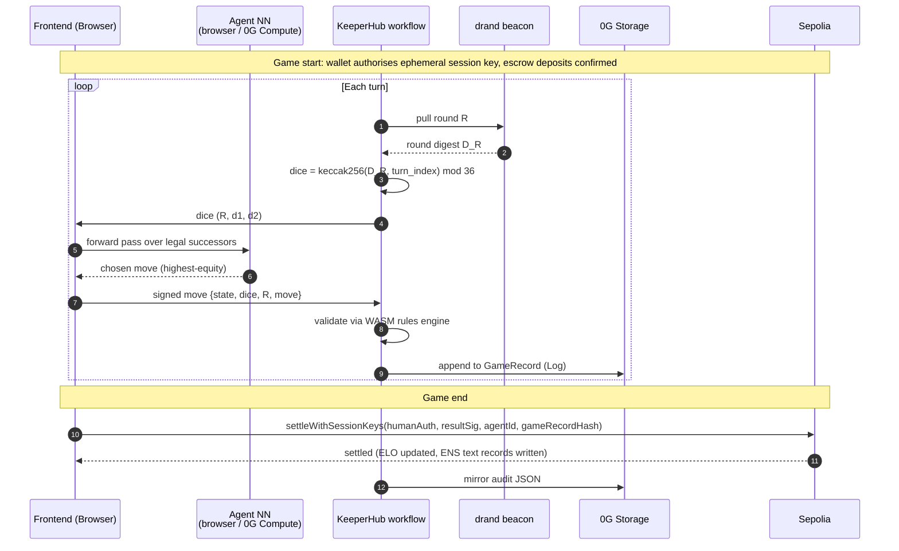

# Chaingammon

> **An open protocol for portable backgammon reputation.** Your wallet (or your AI agent) is your player profile. Your ENS subname is your portable identity. Your full match archive lives on 0G Storage, owned by you forever.

A decentralised, verifiable ELO ledger for backgammon — humans and agents share one identity layer.

- **Open identity.** ENS subnames written only by the protocol. Reserved text records (`elo`, `match_count`, `kind`, `inft_id`, `style_uri`, `archive_uri`) cannot be self-claimed; any third-party tool reads them without coordinating with us.
- **Verifiable.** Every match settles to `MatchRegistry` on Sepolia. The on-chain record carries the 32-byte 0G Storage hash of the full archive (every move, every dice roll) — anyone can audit any rating change end-to-end.
- **Living agents.** Each AI agent is an ERC-7857 iNFT (with ERC-721 fallback). It pins two `dataHashes`: a starter NN initialised from gnubg's published weights, and a per-agent checkpoint that grows match by match. Transfer the token, transfer the brain.
- **Trustless dice.** Each turn's dice are `keccak256(drand_round_digest, turn_index) mod 36`. The server passes drand's BLS12-381 signature through to the client so an auditor can independently verify the round against drand's group public key.
- **Optional stakes.** A match can be free (ELO-only) or staked (per-side ETH deposit, winner takes the pot). Agent funds live in `AgentVault` — only the NFT owner can withdraw; the server operator key can stake but not steal. Settlement is browser-direct via `settleWithSessionKeys`, with KeeperHub as fallback.
- **No central server.** Move evaluation runs in the browser (ONNX Runtime Web). The coach LLM runs on 0G Compute (Qwen 2.5 7B) with a local fallback. KeeperHub orchestrates settlement.
- **Serverless human-vs-human (in progress).** Press Play to be matched — by nearest ELO — with another human who is also searching, with no matchmaking server and nothing volatile on-chain: presence and the WebRTC handshake ride public Nostr relays, moves flow peer-to-peer over a WebRTC data channel, dice stay drand-verifiable, and settlement fires automatically from session keys both players sign before the game (gas via Privy or the pot).

---

## How it works

1. Connect a wallet → frontend resolves (or auto-mints) `<name>.chaingammon.eth` on Sepolia.
2. Pick an opponent — another player's subname or an AI agent (e.g. `gnubg-classic.chaingammon.eth`).
3. Per-turn loop:
   - KeeperHub pulls drand round R → dice are deterministic from the round digest.
   - The active side's agent runs a value-network forward pass (browser or 0G Compute) and selects the highest-equity legal move.
   - The move is appended to the in-progress `GameRecord`; KeeperHub validates legality via the WASM rules engine.
4. Game ends → browser uploads `GameRecord` to 0G Storage (`POST /upload-game-record`) → `MatchRegistry.settleWithSessionKeys` called directly from the browser with the real blob hash → `post-settle-audit` KeeperHub workflow fires → ENS text records updated → audit trail anchored.
5. Any other tool reads your ENS subname and reconstructs your full backgammon DNA — ELO, games played, playing style.

### Per-turn sequence



---

## Architecture

```
                       ┌──────────────────────────┐
                       │    Frontend (Next.js)    │
                       │  matchmaking, profile,   │
                       │  replay, live game,      │
                       │  LLM coach panel         │
                       └────────────┬─────────────┘
                                    │ HTTP (browser, no central server)
        ┌───────────────────────────┼────────────────────────────┐
        ▼                           ▼                            ▼
 ┌────────────────┐       ┌──────────────────┐
 │  Browser-side  │       │  0G Compute      │
 │   value-net    │       │  TEE-attested    │
 │   forward pass │       │  coach LLM +     │
 │ (ONNX Runtime) │       │  offline NN      │
 └────────────────┘       └──────────────────┘
                                    │
                                    │ KeeperHub workflow
                                    ▼
        ┌───────────────────────────────────────────────────┐
        │  Per-turn:  drand round → dice → move → 0G Log    │
        │  Per-game:  rules-engine validation → settle      │
        │             → ENS text records → audit JSON       │
        └───────────────┬───────────────────────────────────┘
                        ▼
 ┌──────────────────────────────────────────────────────────────────┐
 │  Sepolia                          0G Storage                     │
 │  MatchEscrow                      Log: per-match game records    │
 │  MatchRegistry                    KV : per-player style profile  │
 │  AgentRegistry (ERC-7857)         Blob: encrypted agent weights  │
 │  PlayerSubnameRegistrar (ENS)           gnubg strategy RAG docs  │
 └──────────────────────────────────────────────────────────────────┘
```

**Browser** runs the agent value net (small ONNX model) and reaches the coach via Next.js API routes (`/api/coach/hint`, `/api/coach/chat`) that talk to 0G Compute through `@0glabs/0g-serving-broker` — no proxy process in the request path.

**WASM** — the backgammon rules engine and the ONNX runtime are compiled to WebAssembly so move validation and AI evaluation run client-side at near-native speed. KeeperHub uses the same WASM rules engine server-side to re-verify every move before settlement.

**Sepolia** is the settlement chain (KeeperHub-native, real ENS subnames). Mainnet would be a chain swap; the design is identical.

**drand** is the dice randomness beacon. Each turn's dice are `keccak256(drand_round_digest, turn_index) mod 36` — anyone replaying the match recovers the same dice without trusting the server.

**Nostr + WebRTC (human-vs-human, in progress).** Live human-vs-human play runs with no server in the loop. Each searcher publishes ephemeral presence to public Nostr relays; clients pair deterministically by nearest ELO and exchange the WebRTC offer/answer over the same relays; moves then flow directly peer-to-peer over a WebRTC data channel. Dice use the same drand scheme (each browser fetches the round), and settlement reuses the session-key path — both players pre-authorize a session key, the result is auto-signed at game-end, and any relayer submits it with gas from Privy or the escrow pot.

---

## Agent intelligence

Each agent is a small per-agent value network. Two blobs on 0G Storage, both Merkle-committed to the iNFT:

- **`dataHashes[0]` — starter weights.** Every agent initialises from gnubg's published feedforward weights (exported to `backgammon_net.onnx`). Same starting point across the protocol; what changes is what the owner trains on top.
- **`dataHashes[1]` — per-agent checkpoint.** The owner runs a self-play / refereed-match training loop and uploads a new checkpoint after each session. Two iNFTs that started identical drift into measurably different play styles as their histories diverge.

Inference at game time runs in the browser by default (small forward pass, ~10K parameters). 0G Compute (TEE-attested) covers the offline case so other players can still challenge the agent when the owner's machine is down.

### Training

Two streams of training data, combined into a single replay buffer:

1. **Self-play.** Full matches against a frozen older checkpoint produce `(state, action, next_state, reward)` triples. The canonical TD-Gammon setup; how gnubg's own weights were originally trained.
2. **Refereed matches.** Every match settled on Sepolia archives a `GameRecord` to 0G Storage. Those records are training data with cryptographically attested outcomes — the agent learns from games whose results were verified on-chain, not just claimed.

Updates are TD(λ) backprop with eligibility traces. After each move: `δ = r + γ V(s′) − V(s)`; weights step by `α · δ · e` where `e = γλ · e_prev + ∇V(s)` accumulates past gradients so a terminal reward propagates back to every position in the trajectory.

The career-mode head adds five contextual inputs — opponent style, teammate style, stake size (log1p-scaled), tournament position, team-match flag — projected into a 16-d vector so a single network handles solo and team modes without retraining. Style projects onto six axes (`opening_slot`, `phase_prime_building`, `runs_back_checker`, `phase_holding_game`, `bearoff_efficient`, `hits_blot`) drawn from the existing `agent_overlay.CATEGORIES` keys, so opponent profiles fetched at runtime drop straight in.

Gradient steps run locally for development or on **0G Compute** with TEE attestation for production — the attestation lets a buyer of the iNFT verify "every weight update came from refereed match data." New weights are AES-256-GCM-encrypted, uploaded to 0G Storage, and the Merkle root replaces `iNFT.dataHashes[1]` via a settlement transaction.

Implementation lives in `agent/sample_trainer.py` (single-agent TD(λ) loop with TensorBoard), `agent/round_robin_trainer.py` (multi-agent), `agent/career_features.py` (slot layout + style-axes spec), and `agent/agent_profile.py` (runtime resolver that content-sniffs the blob behind `dataHashes[1]` — JSON overlay vs torch checkpoint — and returns the right wrapper).

### Full-board encoding

The trained `BackgammonNet` operates on the standard Tesauro 198-dim contact-net encoding via `agent/gnubg_encoder.py`. Self-play drives through real gnubg subprocesses (`agent/full_board_state.py`); checkpoints carry `feature_encoder: "gnubg_full"` so `POST /games/{id}/agent-move` with `use_per_agent_nn=true` scores real positions instead of the simplified pip-race fallback.

Producing a checkpoint (~30–60 min wall time):

```bash
cd agent
uv run python sample_trainer.py \
    --full-board --career-mode \
    --matches 100 \
    --save-checkpoint /tmp/agent7.pt \
    --upload-to-0g --no-encrypt \
    --logdir /tmp/agent7-tb
```

Trainer prints the resulting Merkle `rootHash`. Register it:

```bash
# from contracts/
npx hardhat run scripts/set-agent-data-hash.ts --network 0g-testnet \
    -- --agent-id 7 --slot 1 --hash 0x<rootHash>
```

After the on-chain write, `POST /games/{gameId}/agent-move` with `{"use_per_agent_nn": true}` loads the checkpoint and picks each move via NN argmax. Latency is ~500–1000 ms/move for 5–10 candidates (one gnubg subprocess per candidate). The gnubg+overlay fallback path remains the default.

### Sample trainer CLI

| Flag                                          | Effect                                                                                                                                                                                                                                                                                                |
| --------------------------------------------- | ----------------------------------------------------------------------------------------------------------------------------------------------------------------------------------------------------------------------------------------------------------------------------------------------------- |
| `--matches N`                                 | Self-play matches (default 100).                                                                                                                                                                                                                                                                      |
| `--save-checkpoint <path>`                    | Write `state_dict` + metadata as a torch blob.                                                                                                                                                                                                                                                        |
| `--load-checkpoint <path>`                    | Resume from a prior checkpoint.                                                                                                                                                                                                                                                                       |
| `--drand-digest <hex>`                        | Derive dice via `drand_dice.derive_dice` — production-deterministic.                                                                                                                                                                                                                                  |
| `--upload-to-0g`                              | AES-256-GCM-encrypt the checkpoint, write the key to `<ckpt>.key`, upload the sealed blob to 0G Storage. Prints the `rootHash`.                                                                                                                                                                       |
| `--no-encrypt`                                | Upload raw `torch.save` bytes (no AES seal, no `.key` file). Demo-only — production should leave this off.                                                                                                                                                                                            |
| `--init-from-0g <hash>` + `--init-key <path>` | Resume from a 0G Storage checkpoint. `match_count` carries forward.                                                                                                                                                                                                                                   |
| `--career-mode`                               | Sample a fresh `CareerContext` per match (uniform style, log-uniform stake, 50/50 teammate). Requires `--extras-dim >= 16`.                                                                                                                                                                           |
| `--full-board`                                | Use the gnubg 198-dim contact-net encoding (vs the simplified pip-race default).                                                                                                                                                                                                                      |
| `--logdir <path>`                             | (`challenge_trainer.py` only) Write TensorBoard event files here. Emits `match/plies`, `win/agent_<id>`, `bankroll/agent_<id>` per match; `market/accept_rate`, `market/avg_stake_wei`, `market/proposed`, `market/accepted`, `weights/core_l2_agent_<id>`, `weights/extras_l2_agent_<id>` per epoch. |
| `--launch-tensorboard`                        | (`challenge_trainer.py` only) Spawn `tensorboard --logdir <logdir>` after training finishes. Without this flag, start TensorBoard yourself: `tensorboard --logdir <path>`.                                                                                                                            |

---

## Match archive on 0G Storage

Every completed match is preserved as a canonical, content-addressed archive on 0G Storage. The on-chain `MatchRegistry` only stores metadata (timestamp, participants, winner, length); the _full_ match — every move, every dice roll, the final position — lives off-chain on 0G Storage Log, and the on-chain record carries a cryptographic pointer to it.

Each match produces a `GameRecord` envelope — JSON, sorted keys, UTF-8, deterministic so the bytes always hash the same way:

| Field                                 | What it carries                                                                          |
| ------------------------------------- | ---------------------------------------------------------------------------------------- |
| `match_length`, `final_score`         | match-point target and final score                                                       |
| `winner`, `loser`                     | each side's identity (a wallet address for humans, an ERC-7857 token id for agent iNFTs) |
| `final_position_id`, `final_match_id` | gnubg's native base64 strings — any tool can reconstruct the end state                   |
| `moves`                               | the full play sequence: `(turn, drand_round, dice, move, position_id_after)` per move    |
| `cube_actions`                        | doubling-cube events (offer / take / drop / beaver / raccoon)                            |
| `started_at`, `ended_at`              | ISO-8601 UTC timestamps                                                                  |

Sized at ~2–10 KB compressed per match. A player with 1,000 lifetime matches has ~5–10 MB of game data.

At game end the frontend builds the `GameRecord`, uploads the JSON to 0G Storage (the indexer returns a 32-byte Merkle `rootHash`), and calls `MatchRegistry.settleWithSessionKeys(...)` which permanently links match metadata to the archive. Anyone can later resolve a match by id, fetch the bytes, and replay the game move-by-move — no login, no API key.

---

## ENS as protocol identity

Chaingammon uses ENS subnames as a verifiable, composable reputation primitive that any third-party tool reads without coordinating with us.

- **Verified, not claimed.** Five text record keys (`elo`, `match_count`, `last_match_id`, `kind`, `inft_id`) are reserved on-chain in `PlayerSubnameRegistrar`. Only the contract owner (KeeperHub-driven settlement) can write them; the on-chain `setText` rejects subname-owner writes via a `bytes32 → bool` reserved-key map.
- **One identity layer for humans and agents.** Both register under `chaingammon.eth`. The `kind` text record (`"human"` or `"agent"`) discriminates. When an agent iNFT is minted via `AgentRegistry.mintAgent`, the contract atomically mints the corresponding subname and sets `kind="agent"` + `inft_id=<tokenId>` in the same transaction.
- **Cross-protocol composability.** A betting market reads `text(namehash("alice.chaingammon.eth"), "elo")` to price a match. A tournament organiser walks `subnameCount()` + `subnameAt(i)` to enumerate ranked players. A coaching platform reads `text(node, "style_uri")` to pull style profiles from 0G Storage. None of them touch our API.

Full schema: [docs/ENS_SCHEMA.md](docs/ENS_SCHEMA.md).

---

## Compute backends

Three distinct compute operations. Each runs locally (default) or on **0G Compute**:

| Operation                                        | Local                                             | 0G Compute                                                                                     | Status                                                                                                                                                                                      |
| ------------------------------------------------ | ------------------------------------------------- | ---------------------------------------------------------------------------------------------- | ------------------------------------------------------------------------------------------------------------------------------------------------------------------------------------------- |
| **Coaching** (Qwen 2.5 7B chat hints)            | `agent/coach_service.py`                          | `og-compute-bridge/src/chat.mjs` → `agent/coach_compute_client.chat()`                         | Live end-to-end on testnet. Flipping the pill routes `/hint` and `/chat` through 0G.                                                                                                        |
| **Inference** (`BackgammonNet.forward → equity`) | `torch` call in the trainer                       | `og-compute-bridge/src/eval.mjs` → `agent/og_compute_eval_client.evaluate()`                   | Wire plumbed. **No backgammon-net provider on the 0G serving network yet** — calls return `available: false`. Once a provider stands up, the toggle becomes live with no code change.       |
| **Training** (round-robin self-play, TD-λ)       | `agent/round_robin_trainer.py` spawned by FastAPI | Same trainer with `--use-0g-inference` — per-move forward passes route through the eval bridge | The control loop, optimiser steps, and weight saves always run locally. ~99 % of training compute lives in per-move forward passes, so the toggle is enough to surface a real gas estimate. |

The compute pill in the frontend header (visible on every page) shows the current per-operation backend; clicking flips it. State persists in `localStorage["chaingammon.computeBackends"]`.

### Env vars

```
OG_STORAGE_RPC              0G testnet/mainnet RPC
OG_STORAGE_PRIVATE_KEY      funded wallet (pays for inference + storage)

OG_COMPUTE_PROVIDER          (coach)     pin a chat provider
OG_COMPUTE_EVAL_PROVIDER     (inference) pin a backgammon-net provider
BACKGAMMON_NET_MODEL         (inference) listService filter (default backgammon-net-v1)
OG_COMPUTE_PER_INFERENCE_OG  fallback per-inference price (default 0.00001)
OG_COMPUTE_MIN_BALANCE       sub-account min OG balance (default 0.01)
OG_COMPUTE_DEPOSIT           initial ledger deposit (default 0.05)
CHAINGAMMON_MEAN_PLIES       trainer-side gas-estimate denominator (default 60)
```

### Cost expectations

- **Coach** ≈ 0.0001 OG per chat completion.
- **Inference** ≈ 0.00001 OG per forward pass (placeholder until a real backgammon-net provider publishes live rates).
- **Training** = `epochs × C(N, 2) × ~60 plies × per-inference-cost`. `/training` shows a live estimate.

You can pin a custom backgammon-net endpoint via `OG_COMPUTE_EVAL_PROVIDER=<addr>` for testing — the bridge routes through it as if it were a real 0G provider (same auth + funding flow).

---

## Coach

The coach is a turn-by-turn conversation, not one-shot narration. Per turn the agent considers the human's history, the opponent's style, and the dialogue so far; the human can challenge, ask follow-ups, or accept; the agent's next message is conditioned on the exchange. A free-text correction ("I prefer running games, stop suggesting primes") becomes a per-session preference signal that biases later turns within the same match. The signal is session-local UX adaptation; it expires when the session ends and does **not** feed agent training.

| Endpoint     | Body                                                                                                 | Purpose                                                                                                                                                                                                                           |
| ------------ | ---------------------------------------------------------------------------------------------------- | --------------------------------------------------------------------------------------------------------------------------------------------------------------------------------------------------------------------------------- |
| `POST /chat` | `ChatRequest{kind, match_id, turn_index, position_id, dice, candidates, dialogue, preferences, ...}` | Turn-by-turn. Three kinds: `open_turn` (initial take after dice roll), `human_reply` (response to the human's text), `move_committed` (acknowledgement). Returns `ChatResponse{message, backend, preferences_delta, latency_ms}`. |
| `POST /hint` | (existing)                                                                                           | Single-sentence narration for users who don't want a back-and-forth.                                                                                                                                                              |

Full design: [docs/coach-dialogue.md](docs/coach-dialogue.md).

### Team mode

A human and an agent (or any 2v2 mix) play as teammates against an opponent. Per turn the captain receives advisor signals from each teammate (`{teammate_id, proposed_move, confidence, optional_message}`); the captain decides; both contributions are logged into the match record. The captain ignores advisors at pick time — its own move is final, signals are archived not consumed. Vote fusion / confidence-weighted rank fusion is a follow-up: every signal is on the on-chain record, so a future endpoint that re-ranks captain picks against archived advisors lights up retroactively.

API surface:

- `POST /games` accepts optional `team_a` and `team_b` rosters (each `{members: PlayerRef[], captain_rotation: "alternating" | "fixed_first" | "per_turn_vote"}`).
- Each `/agent-move` computes the captain via `team_mode.captain_index`, scores every non-captain teammate via `teammate_advisor.score_advisor_move`, and returns `AdvisorSignal[]` + `captain_id` alongside the new `GameState`.
- Signals archive in `MoveEntry.advisor_signals` and propagate into the on-chain `GameRecord` commitment.
- `/team-demo` exercises the flow end-to-end with a 2v1 game.

Design: [docs/team-mode.md](docs/team-mode.md).

---

## Staked matches

A match can be free (ELO-only) or staked (per-side ETH deposit, winner takes the pot). The two paths share the same `MatchRegistry` write — only the escrow wiring differs.

**Contracts.** `MatchRegistry.recordMatch` and `recordMatchAndSplit` are gated by `onlyOwnerOrSettler` rather than `onlyOwner`, so a hosted orchestrator (e.g. KeeperHub's Para MPC wallet) can submit settlements without holding the deployer key. Owner-only `setSettler(address)` grants and revokes that role; zero-address default keeps original behaviour. `MatchEscrow.settler` is `immutable` so its constructor pins it to the active `MatchRegistry` — a fresh `MatchRegistry` deploy requires a fresh `MatchEscrow` deploy too.

**Agent staking — vault model.** Stakes live in `AgentVault.sol`, a single on-chain contract that holds ETH balances per agent token ID:

- **Owner** deposits ETH via `AgentVault.deposit(agentId)` (the Fund button on `/agent/{id}`) and can withdraw at any time via `AgentVault.withdraw(agentId, to, amount)`. Only the NFT owner can withdraw — enforced by the contract, not by trust.
- **Server operator** (`SERVER_OPERATOR_PRIVATE_KEY` in `server/.env`) calls `AgentVault.depositToEscrow(agentId, matchId, stake, escrow)` to move a stake into `MatchEscrow`. It can only stake up to the owner's pre-approved `allowances[agentId][operatorAddress]` — it cannot withdraw to arbitrary addresses.
- Agents do **not** have individual signing wallets. Identity is the NFT token ID and the ENS name (`<label>.chaingammon.eth`).

**End-to-end flow.**

1. Match-page user picks a stake amount. Empty / `0` keeps the existing free-match path.
2. The owner calls `AgentVault.depositToEscrow` directly from their browser wallet (no server key in the deposit path). The human's wallet calls `MatchEscrow.deposit` for the human side. Both deposits land before "Start Game" enables.
3. Game plays out exactly like a free match.
4. At game-end the browser calls `MatchRegistry.settleWithSessionKeys` directly — no server key in the settlement path. The KeeperHub keeper can also settle via `recordMatchAndSplit` as a fallback.
5. Winner's ETH is paid out atomically by the escrow contract.

**Endpoints** (`server/app/main.py`):

| Endpoint                       | Body                                                   | Purpose                                                             |
| ------------------------------ | ------------------------------------------------------ | ------------------------------------------------------------------- |
| `POST /finalize-direct-staked` | `{escrow_match_id, stake_wei, keeper_settle?}` | Atomic settle + payout (default), or upload-only when `keeper_settle=true`. |
| `POST /replay`                 | `{match_id}` (0x-prefixed bytes32)                     | KeeperHub validate step: returns settlement params. `valid: false` if not ready. |

**Operator note:** set `SERVER_OPERATOR_PRIVATE_KEY` in `server/.env` — one key for all agents. The key must be pre-approved by each agent owner via `AgentVault.setAllowance(agentId, operatorAddress, allowanceWei)` before staked matches can start.

Frontend: `frontend/app/match/page.tsx` + `AgentWalletPanel.tsx` — agent address (click-to-copy), live balance, "Fund X ETH" (computes shortfall, sends from connected wallet), "Withdraw all". A `depositStatus` state machine (`idle → human-pending → agent-pending → ready`) drives the Start button label across both deposits.

---

## KeeperHub workflow

Two YAML workflows live in [`keeperhub/`](keeperhub/):

### `match-settle.yaml` — staked-match settlement (escrow path)

Triggered by `MatchEscrow.Deposited` on Sepolia. The registered KeeperHub workflow (`7f9dqwtohidj6lc89tuht`) calls `MatchRegistry.recordMatchAndSplit` **directly** — the server is not in the settlement transaction path.

**Required one-time setup:** call `MatchRegistry.setSettler(0x8422451d456D1374b73b14dCe24C5B10Ef43bD99)` from the deployer wallet to grant the KeeperHub Para MPC wallet the settler role. The workflow is kept `enabled: false` until this is done.

| #  | Node ID        | What it does                                                                                                                          |
|----|----------------|---------------------------------------------------------------------------------------------------------------------------------------|
| 1  | `on-deposit`   | Event trigger: fires on `MatchEscrow.Deposited` (`0xcBE5…01C9F`). Captures `matchId` (bytes32).                                      |
| 2  | `validate`     | `POST /replay` with the escrow `matchId`. Returns winner/loser IDs, addresses, match length, `gameRecordHash`, and `winnerAddr`. Returns `valid: false` if the match is not yet finalized with `keeper_settle=true`. |
| 3  | `gate`         | Condition: halts the workflow if `valid !== true`.                                                                                    |
| 4  | `read-pot`     | `web3/read-contract` → `MatchEscrow.pot(matchId)`. Reads the live pot in wei — no server involvement.                                |
| 5  | `record`       | `web3/write-contract` → `MatchRegistry.recordMatchAndSplit(…, escrowMatchId, [winnerAddr], [pot])`. Keeper wallet submits the tx.     |

### `post-settle-audit.yaml` — ENS sync + audit trail (all settlements)

Triggered by every `MatchRecorded` event from `MatchRegistry` on Sepolia — fires for both browser-direct settlements (`settleWithSessionKeys`) and relayer settlements (`recordMatch`). No keeper signing required.

| #  | Step ID          | What it does                                                                                                                                 |
|----|------------------|----------------------------------------------------------------------------------------------------------------------------------------------|
| 1  | `confirm-match`  | Logs the `MatchRecorded` event (matchId, winner, loser, new ELOs).                                                                           |
| 2  | `run-audit`      | POSTs `{matchId}` to `POST /post-settle-audit`. Server reads `getMatch()` from chain, fetches the 0G Storage blob, extracts `winner_label` / `loser_label`, pushes `elo` + `last_match_id` ENS text records, updates agent style-overlay KV. |
| 3  | `audit-done`     | Logs the per-side ENS and overlay update results.                                                                                            |

**Required secrets for `post-settle-audit.yaml`:** `SEPOLIA_RPC_URL`, `MATCH_REGISTRY_ADDRESS` (`0xaCF222C7c19a3418246B1aa2fbC4Bd97eC4930Dc`), `SERVER_URL`.

### Serverless settlement path (browser-direct)

The `settleWithSessionKeys` contract function is permissionless — the browser can settle without any server involvement:

1. At game-open the human wallet signs a one-time auth (one MetaMask popup). A session key is generated in the browser and stored in `sessionStorage`.
2. During play the session key signs each move; at game-end it signs the result hash.
3. The browser calls `POST /upload-game-record` to upload the `GameRecord` (with `winner_label` / `loser_label`) to 0G Storage, getting back the Merkle root hash.
4. The browser calls `MatchRegistry.settleWithSessionKeys(…, gameRecordHash)` directly — no server key in the trust path.
5. `post-settle-audit.yaml` fires on the resulting `MatchRecorded` event and handles ENS sync automatically.

### Legacy server-poll workflow (`keeper_workflow.py`)

`server/app/keeper_workflow.py` provides an in-process 8-step audit that can be triggered via `POST /keeper-workflow/{matchId}/run`. Steps cover `og_storage_fetch`, `rules_check`, `ens_update`, and `audit_append`. `GET /keeper-workflow/{matchId}` polls return live progress, persisted to `/tmp/chaingammon-keeper-workflows/<matchId>.json`.

Full feedback document: [docs/keeperhub-feedback.md](docs/keeperhub-feedback.md). Workflow spec: [docs/keeperhub-workflow.md](docs/keeperhub-workflow.md).

---

## Live training visualisation

TensorBoard metrics are supported by `challenge_trainer.py`. The `/training` page and the server do not spawn TensorBoard — metrics are only available when you run the trainer directly from the CLI.

```bash
cd agent && uv run python challenge_trainer.py \
    --agent-ids 1,4 \
    --epochs 20 \
    --starting-bankroll 100000 \
    --status-file /tmp/challenge_run.jsonl \
    --checkpoint-dir /tmp/ckpt \
    --logdir /tmp/tb_logs \
    --upload-to-0g
```

The trainer writes event files to `--logdir` as it runs. When training finishes, start TensorBoard:

```bash
tensorboard --logdir /tmp/tb_logs
# then open http://localhost:6006
```

Or use `--launch-tensorboard` to start it automatically after training completes.

### What metrics are written

| Frequency   | Metric keys                                                                        | What it measures                        |
| ----------- | ---------------------------------------------------------------------------------- | --------------------------------------- |
| Every match | `match/plies`, `win/agent_<id>`, `bankroll/agent_<id>`                             | Game length, who won, running bankrolls |
| Every epoch | `market/accept_rate`, `market/avg_stake_wei`, `market/proposed`, `market/accepted` | Challenge marketplace health            |
| Every epoch | `weights/core_l2_agent_<id>`, `weights/extras_l2_agent_<id>`                       | Whether network weights are changing    |

The `weights/*` charts are the key "is the network learning?" signal: flat lines mean no movement, gradual drift means TD-λ updates are landing.

---

## Running locally

### Prerequisites

- Python 3.12+, [uv](https://github.com/astral-sh/uv)
- Node 20+, [pnpm](https://pnpm.io)
- `gnubg` (for local debugging only) — `sudo apt install gnubg` (Ubuntu/Debian) or `brew install gnubg` (macOS)

### One-time setup

```bash
git clone <repo> && cd chaingammon
pnpm install                    # frontend + contracts (workspace)
cd agent && uv sync && cd ..    # agent Python deps
cp contracts/.env.example contracts/.env       # add DEPLOYER_PRIVATE_KEY + Sepolia RPC_URL
cp frontend/.env.example frontend/.env.local
```

Fund the deployer wallet with Sepolia ETH from any public faucet.

### Bootstrap and run

```bash
# 1. deploy + verify settlement contracts on Sepolia (one shot)
./scripts/bootstrap-network.sh

# 2. start the frontend (from repo root)
pnpm frontend:dev                # Next.js on :3000
```

The FastAPI backend (`server/`) runs on a persistent VPS at `http://132.145.158.84` and is already live — the frontend's `NEXT_PUBLIC_SERVER_URL` points there by default. To run a local backend instead, override the variable and start the server:

```bash
# terminal A — backend
cd server && uv run uvicorn app.main:app --host 0.0.0.0 --port 8000

# frontend/.env.local — point frontend at local server
NEXT_PUBLIC_SERVER_URL=http://localhost:8000
```

Or use the VS Code Tasks workflow (`.vscode/tasks.json`) — `Tasks: Run Task` → `Localhost: launch all` fires hardhat node → deploy contracts → FastAPI server → Next.js frontend in sequence, each in its own dedicated terminal tab.

### Managing the VPS backend

The production FastAPI server runs under systemd as the `chaingammon-server` unit. All commands below use two shell variables — set them once per terminal session:

```bash
export CG_VPS=ubuntu@132.145.158.84          # primary
export CG_VPS_BACKUP=oleg@136.112.73.124     # backup
export CG_KEY=~/Documents/ssh/ssh-key-2026-05-17.key
```

#### First-time installation

```bash
# 1. SSH in
ssh -i $CG_KEY $CG_VPS

# 2. Clone the repo
git clone https://github.com/oslinin/chaingammon.git
cd chaingammon

# 3. Create the env file (only step that can't be scripted — contains secrets)
cat > server/.env <<'EOF'
OG_STORAGE_RPC=https://evmrpc-testnet.0g.ai
OG_STORAGE_INDEXER=https://indexer-storage-testnet-turbo.0g.ai
OG_STORAGE_PRIVATE_KEY=<your-key>
OG_EQUITY_URL=http://132.145.158.84
EOF

# 4. Install deps, register and start the service
bash server/scripts/setup.sh
```

#### Deploying a change

```bash
ssh -i $CG_KEY $CG_VPS "cd /home/ubuntu/chaingammon && bash server/scripts/deploy.sh"
```

#### Logs and manual control

```bash
ssh -i $CG_KEY $CG_VPS   # then on the VPS:

journalctl -u chaingammon-server -f         # tail live logs
journalctl -u chaingammon-server -n 100     # last 100 lines

sudo systemctl stop    chaingammon-server
sudo systemctl start   chaingammon-server
sudo systemctl status  chaingammon-server
```

The server takes ~15 s to start (torch loads at import time). `journalctl -f` shows `Application startup complete` when it's ready. The env file lives at `server/.env` in the repo directory on the VPS; edit it there for any config changes, then run `deploy.sh`.

### Local dev with Hardhat

```bash
cd contracts && pnpm exec hardhat node            # local chain (chainId 31337)
cd contracts && pnpm exec hardhat run script/deploy.js --network localhost
# addresses are written to contracts/deployments/localhost.json and read by the frontend automatically
```

Switch chains in MetaMask; the frontend re-targets the new chain's contracts automatically (see `frontend/app/chains.ts`).

### Test commands

```bash
pnpm test                  # all tests: agent (pytest) + contracts (hardhat) + frontend (build)
pnpm contracts:test
pnpm agent:test
pnpm frontend:test
```

---

## Frontend routes

| Route                 | Page                                                                   | Data source                                     |
| --------------------- | ---------------------------------------------------------------------- | ----------------------------------------------- |
| `/`                   | Agent discovery + matchmaking                                          | On-chain reads via wagmi                        |
| `/team-demo`          | Off-chain game vs agent (no stake)                                     | ONNX Runtime Web (browser-side `BackgammonNet`) |
| `/team-demo?settle=1` | On-chain game vs agent (ELO + optional stake)                          | ONNX Runtime Web + `MatchRegistry`              |
| `/match?agentId=N`    | KeeperHub pre-game card; forwards to `/team-demo?opponents=N&settle=1` | `AgentRegistry` + `MatchEscrow`                 |
| `/profile/[ensName]`  | Player profile (ENS text records)                                      | `PlayerSubnameRegistrar.text()`                 |
| `/log/[matchId]`      | Match replay + audit trail                                             | 0G Storage                                      |
| `/training`           | Trigger training runs, monitor progress via status-file events         | FastAPI `/training/*`                           |

---

## Deployed contracts

**Sepolia:**

- [MatchRegistry](https://sepolia.etherscan.io/address/0x507d78149AE2092a5438825B1BA3F12737FAeC0C)
- [MatchEscrow](https://sepolia.etherscan.io/address/0x1206A93a9B76652382BC1F5164a8383a9F2A2e16)
- [AgentRegistry](https://sepolia.etherscan.io/address/0xE23B83cE16B292e420cd8820ac9d303A45333D17)
- [PlayerSubnameRegistrar](https://sepolia.etherscan.io/address/0x48285B8C9B04C6a3D61bBA067a4DE4399A5a4aEb)

**0G testnet:**

- [MatchRegistry](https://chainscan-galileo.0g.ai/address/0x60E52e2d9Ea7b4A851Dd63365222c7d102A11eaE)
- [AgentRegistry](https://chainscan-galileo.0g.ai/address/0xCb0a562fa9079184922754717BB3035C0F7A983E)
- [PlayerSubnameRegistrar](https://chainscan-galileo.0g.ai/address/0xf260aE6b2958623fC4e865433201050DC2Ed1ccC)

Full deployment records (constructor args, deployer, block heights): `contracts/deployments/*.json`.

---

## Roadmap

- **Current:** human-vs-agent gameplay; on-chain ELO; ENS subnames; agent iNFTs with hash-committed weights; 0G Storage match archive; drand dice; KeeperHub-orchestrated settlement on Sepolia.
- **In progress — serverless human-vs-human:** one-press, ELO-biased matchmaking and live play with no central server. Presence + the WebRTC signaling handshake ride public Nostr relays, moves flow over a peer-to-peer data channel, dice are drand-verifiable (each browser fetches the round), and settlement is automatic from session keys both players authorize before the game — submitted by any relayer with gas from Privy or the escrow pot.
- **Next:** all-agent autonomous tournaments driven by KeeperHub; 0G Compute for TEE-attested fine-tuning; team / chouette mode with the career head; per-agent cube doubling.
- **Later:** ZK proofs of agent inference (zkML); betting markets and ELO derivative tokens; mainnet on Base/Optimism.

See [ROADMAP.md](ROADMAP.md) for the full version. Architecture: [ARCHITECTURE.md](ARCHITECTURE.md).
