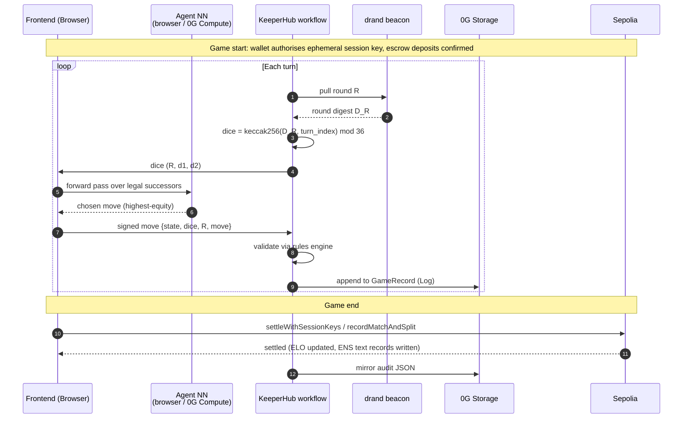

# Chaingammon

> **An open protocol for portable backgammon reputation.** Your wallet (or your AI agent) is your player profile. Your ENS subname is your portable identity. Your full match archive lives on 0G Storage, owned by you forever.

Built for ETHGlobal Open Agents (April 24 – May 6, 2026).

---

## Value

A decentralized, verifiable ELO ledger for backgammon — for humans and for AI agents that live on-chain as 0G iNFTs and learn match by match.

- **Verifiable.** Every match settles to `MatchRegistry` on Sepolia. The result, ELO delta, and a 32-byte hash of the full game record (archived on 0G Storage) are all public and cryptographically tied together — anyone can audit any rating change end-to-end.

- **Portable.** Each player's rating lives in their wallet via an ENS subname (`<name>.chaingammon.eth`) whose text records hold current ELO, match count, and a `0g://` link to the full archive. Switch frontends, switch clients — reputation comes with you.

- **Agentic.** GNUBG is already optimal: a feedforward value net trained with TD-λ self-play, minimax search, and a bear-off database — strong enough to beat top humans. A tournament of optimal agents wouldn't be interesting. Chaingammon's innovation is **long-game training** — agents that learn beyond single-game strength.

  - **A. Agent teams.** Agents are trained not just to win a single game but to play *in teams* using an ensemble / advisor pattern. The value net keeps gnubg's board features but adds inputs for teammate and opponent style, trained with the same RL substrate (TD-λ over refereed-match data). This opens the door to **star agents** — agents whose long-horizon strategy could beat GNUBG over a tournament that GNUBG plays one game at a time.

  - **B. Human–agent teams.** Following DeepMind's work since AlphaZero, the frontier of optimal play is the partnership of human creativity with AI's superhuman analysis. We see the same pattern in programming: Claude Code outperforms most humans at coding, but a human + Claude Code team beats Claude Code alone. Chaingammon lets a human and an agent team up and decide jointly: the agent contributes computation (it has read every move in the opponent's match history on 0G Storage) and micro-tactics; the human contributes intent and out-of-band context. The LLM interface becomes a research-iteration loop, not a dashboard — back-and-forth guidance with the agent walking down the NN's ranked candidates to find the one that matches the human's intuition. Star players make markets — derivatives, ELO indices, defi diversification on portable reputation.

---

## Why each sponsor is essential

The protocol cannot be built without ENS, 0G, and KeeperHub — each provides a primitive nothing else does.

### ENS — portable identity that any third-party tool can read

`<name>.chaingammon.eth` is a real ENS subname on Sepolia, issued via NameWrapper. Five reserved text records (`elo`, `match_count`, `last_match_id`, `kind`, `inft_id`) cannot be self-claimed — the on-chain `setText` rejects subname-owner writes via a `bytes32 → bool` reserved-key map; only the protocol writes them. A betting market reads `text(namehash("alice.chaingammon.eth"), "elo")` to price a match without coordinating with us; a tournament organiser walks `subnameCount()`/`subnameAt(i)` to enumerate ranked players; a coach platform reads `style_uri` to pull from 0G Storage. This is the only on-Ethereum identity primitive that every wallet, indexer, and explorer already speaks. A custom registry would be a walled garden.

Code: `contracts/src/PlayerSubnameRegistrar.sol`. Schema: [`docs/ENS_SCHEMA.md`](docs/ENS_SCHEMA.md).

### 0G — the only place an iNFT's brain can actually live

ERC-7857 iNFTs only work if `dataHashes` resolves to bytes that won't disappear, and if compute on those bytes can be attested. Two specific 0G features are load-bearing:

- **0G Storage.** Per-match `GameRecord` (Log), per-player style profile (KV), per-agent weights (Blob, Merkle root committed to `iNFT.dataHashes[1]`), gnubg strategy docs (RAG context). IPFS without a pinning service has no persistence guarantee; centralised blob stores have a liveness chokepoint and a vendor key in the trust path. 0G Storage is content-addressed AND incentivised to persist — so the iNFT thesis "transfer the token, transfer the brain" actually holds.

- **0G Compute.** Coach LLM (Qwen 2.5 7B chat completion) runs on 0G Compute via `@0glabs/0g-serving-broker`. Without it the coach is an OpenAI/Anthropic call (centralised, vendor key) or a self-hosted model (centralised box). The same network hosts the offline NN inference path for the agent's value net (when the owner's machine is offline so other players can still challenge the agent). For training, the v2 path of TEE-attested fine-tuning lets a future iNFT buyer verify "every weight update came from refereed match data" — that attestation only exists on 0G Compute.

Code: `og-bridge/`, `og-compute-bridge/`, `frontend/app/api/coach/hint/route.ts`, `frontend/app/api/chief-of-staff/chat/route.ts`, `agent/og_storage_upload.py`, `agent/og_compute_eval_client.py`.

### KeeperHub — settlement that survives one node going dark

A staked match settles in five steps after both deposits land: poll drand for VRF dice per turn, detect forfeit on move-clock expiry, replay every move through gnubg, ECDSA-sign the settlement payload, atomic call to `MatchRegistry.recordMatchAndSplit` (writes the match + pays the pot in one transaction). Each step needs retry, gas budgeting, and an audit trail; cron jobs on a server we run is a single point of failure. KeeperHub gives us the event-driven trigger (both `Deposited` events for the same `matchId`), the per-step retry/gas semantics, and the canonical run-audit log that we mirror to 0G Storage. The Python audit orchestrator (`server/app/keeper_workflow.py`) is the same shape, runnable on demand for forensic deep-dives — 10 sequential steps with live polling.

Code: [`keeperhub/match-settle.yaml`](keeperhub/match-settle.yaml) (event-driven, 7 steps), [`server/app/keeper_workflow.py`](server/app/keeper_workflow.py) (Python audit, 10 steps). Pain points + suggestions: [`docs/keeperhub-feedback.md`](docs/keeperhub-feedback.md).

---

## Tech stack — what runs where

A flat reference, no marketing layer.

### Frontend (`frontend/`)

- **Next.js 16** (Webpack only — Turbopack froze the dev box; see `frontend/AGENTS.md`)
- **wagmi v3 / viem v2** for wallet, contracts, ENS reads
- **`@0glabs/0g-serving-broker`** in Next.js Route Handlers for 0G Compute orchestration:
  - `POST /api/coach/hint` — one-shot coach narration
  - `POST /api/chief-of-staff/chat` — interactive Chief of Staff with historical search
- **Browser-side NN inference** — per-agent value net forward pass (~10K params); ONNX/TF.js conversion is a planned cleanup
- **Playwright** is the visual-regression gate (`pnpm --filter frontend test:e2e`)

### Smart contracts (`contracts/`)

Solidity 0.8.24 / Hardhat 2 / `evmVersion: cancun`:

- **`MatchEscrow`** — per-side deposit collection; `pot()` reads live total
- **`MatchRegistry`** — `recordMatch` (free) and `recordMatchAndSplit` (atomic settle + payout); gated by `onlyOwnerOrSettler` so KeeperHub's relayer can submit without the deployer key
- **`AgentRegistry`** — ERC-7857 iNFT registry; `dataHashes[0]` (gnubg starter weights), `dataHashes[1]` (per-agent trained checkpoint)
- **`PlayerSubnameRegistrar`** — ENS NameWrapper integration; reserved text-record map enforced on `setText`

Settlement chain: **Sepolia** (real ENS); also deployed on 0G testnet for cross-chain demos.

### Servers — what each one does, what we want to remove

| Process | Port | Role | Long-term plan |
| --- | --- | --- | --- |
| **`server/app/main.py`** (FastAPI) | 8000 | Game finalization, agent wallet manager (custodial EOA keys), training orchestration (subprocess), 0G Storage glue (Node CLI shellout), KeeperHub run trigger | Decompose: wallets → smart-contract agent wallet, training → 0G Compute managed agent, 0G uploads → browser-direct, KeeperHub trigger → user-driven |
| **`agent/gnubg_service.py`** (FastAPI) | 8001 | Wraps the gnubg subprocess via External Player; drives move legality + audit replay | Replace with pure-Python rules engine + per-agent NN argmax for production; keep gnubg for local debugging only |
| **`agent/coach_service.py`** (FastAPI) | 8002 | **Legacy**: agent profile resolution helper. The primary coach is the Next.js Route Handler, not this. | Fold remaining helpers into Next.js + 0G Compute |
| **`og-bridge/`** (Node CLI) | — | Shells out from Python to publish/fetch bytes on 0G Storage | Keep — thin SDK adapter |
| **`og-compute-bridge/`** (Node CLI) | — | Shells out for 0G Compute equity-net inference (when a provider is registered) | Keep until Next.js owns inference too |

### 0G — Storage and Compute, precisely

**Storage:**

| Class | Contents |
| --- | --- |
| Log | per-match `GameRecord` (canonical JSON, ~2–10 KB compressed); KeeperHub run-audit JSON |
| KV | per-player style profile (`agent_overlay.CATEGORIES`) |
| Blob | per-agent weights (Merkle root committed to `iNFT.dataHashes[1]`); gnubg strategy docs (coach RAG context) |

**Compute:**

- **Coach LLM** (Qwen 2.5 7B chat). Discovery via `broker.inference.listService()`, ledger top-up via `broker.ledger.transferFund(...)`, signed request via `broker.inference.getRequestHeaders(...)`. **TEE — clarification:** 0G Compute provides TEE-attested service tiers; the coach Route Handlers use the standard SDK auth flow but **do not currently call `verifier.verifyService` per response**. We inherit the platform-level guarantee but do not verify per-response attestation. Adding response verification is a one-call hardening; tracked under Limitations.
- **Backgammon equity-net inference** — bridge plumbed end-to-end (`og-compute-bridge/src/eval.mjs` + `agent/og_compute_eval_client.py` + trainer's `--use-0g-inference` + match-page chip). **Provider not yet registered on the network** — calls return `OG_EVAL_UNAVAILABLE`; the frontend's compute toggle disables the inference flip until a provider stands up.

### Where each operation actually runs

| Operation | Location |
| --- | --- |
| Coach LLM (Qwen 2.5 7B chat completion) | **Always 0G Compute**, via Next.js Route Handler |
| Per-agent NN move evaluation (forward pass at game time) | Browser default; 0G Compute when the owner is offline (gated on provider availability) |
| Training control loop, TD-λ updates, optimizer steps, weight saves | **Always local Python** (`agent/sample_trainer.py`, `agent/round_robin_trainer.py`) |
| Per-move forward passes during training (~99% of training compute) | Local default; opt-in 0G Compute via `--use-0g-inference` |
| Career-mode contextual feature encoding | Always local Python (`agent/career_features.py`) |
| Style-profile read at match time | 0G Storage KV |
| gnubg replay (audit only) | Local Python service or KeeperHub workflow step 4 |
| ENS subname resolution | Standard ENS NameWrapper / public resolvers |
| Dice randomness | drand BLS12-381 beacon (`agent/drand_dice.py`) |

### Dice randomness

Each turn's dice are `keccak256(round_digest, turn_index_be8) mod 36`, where `round_digest` comes from the public drand beacon. The server passes drand's BLS12-381 signature through to the client (`signature` and `previous_signature` on `/games/{matchId}/dice`) so an auditor can independently verify the round against drand's published group public key — no commit-reveal coordination, fully reproducible.

### Identity

`<name>.chaingammon.eth` subnames issued via the parent name's NameWrapper wrapping. Reserved text record keys: `elo`, `match_count`, `last_match_id`, `kind` (`"human"` or `"agent"`), `inft_id`. Reserved keys are enforced on-chain in `setText` via a `bytes32 → bool` map — third parties resolve the records through any standard ENS client without going through our contract.

---

## How it works

1. Connect a wallet → frontend resolves (or auto-mints) `<name>.chaingammon.eth` on Sepolia.
2. Pick an opponent — another player's subname or an AI agent (e.g. `gnubg-classic.chaingammon.eth`).
3. Per-turn loop:
   - KeeperHub pulls drand round R → next dice roll is deterministic from the round digest.
   - Active side's agent runs a value-network forward pass (browser or 0G Compute) and selects the highest-equity legal move.
   - The move is appended to the in-progress `GameRecord`; KeeperHub validates legality.
4. Game ends → both players sign the result → `MatchRegistry.settleWithSessionKeys` (free match) or `recordMatchAndSplit` (staked, atomic settle + payout) → ENS text records updated → KeeperHub mirrors the audit JSON to 0G Storage.
5. Any other tool reads your ENS subname and reconstructs your full backgammon DNA — ELO, games played, playing style, full archive.

### Per-turn sequence



### Architecture

```
                       ┌──────────────────────────┐
                       │    Frontend (Next.js)    │
                       │  matchmaking, profile,   │
                       │  replay, live game,      │
                       │  LLM coach orchestration │
                       └────────────┬─────────────┘
                                    │ HTTP (browser, no central server)
        ┌───────────────────────────┼────────────────────────────┐
        ▼                           ▼                            ▼
 ┌────────────────┐       ┌──────────────────┐         ┌──────────────────┐
 │  Browser-side  │       │  0G Compute      │         │  Local agent     │
 │   value-net    │       │  Qwen 2.5 7B     │         │  process (dev    │
 │   forward pass │       │  coach +         │         │  convenience):   │
 │   (default)    │       │  offline NN      │         │  gnubg :8001     │
 │                │       │  inference       │         │  coach  :8002    │
 └────────────────┘       └──────────────────┘         └──────────────────┘
                                    │
                                    │ KeeperHub workflow
                                    ▼
        ┌───────────────────────────────────────────────────┐
        │  Per-turn:  drand round → dice → move → 0G Log    │
        │  Per-game:  rules-engine validation → settle      │
        │             → ENS text records → audit JSON       │
        └───────────────┬───────────────────────────────────┘
                        ▼
 ┌──────────────────────────────────────────────────────────────────┐
 │  Sepolia                          0G Storage                     │
 │  MatchEscrow                      Log: per-match game records    │
 │  MatchRegistry                    KV : per-player style profile  │
 │  AgentRegistry (ERC-7857)         Blob: agent weights (committed │
 │  PlayerSubnameRegistrar (ENS)           to iNFT.dataHashes)      │
 └──────────────────────────────────────────────────────────────────┘
```

---

## Agent intelligence (what makes long-game training work)

Each agent's brain is a small per-agent value network. Two pieces, both stored as 0G Storage blobs whose Merkle roots are committed to the iNFT:

- **`dataHashes[0]` — starter weights.** Initialized from gnubg's published feedforward weights (a few hundred neurons, single hidden layer for the contact net). Same starting point for every agent.
- **`dataHashes[1]` — per-agent checkpoint.** Owner runs a self-play / refereed-match training loop and uploads the latest checkpoint. Two iNFTs that started identical drift into measurably different play styles.

Inference at game time runs in the browser by default (small forward pass), or on 0G Compute when the owner's machine is offline.

**Why we dropped gnubg as a runtime engine.** gnubg was a single C subprocess driven via External Player socket. Server-side made one cloud endpoint a liveness chokepoint for every agent; browser-side meant a WASM rebuild of decades of C code (bearoff databases alone are hundreds of MB). The pivot: each agent owns its own neural net, weights live on 0G Storage, training and inference run locally (or on 0G Compute when offline). gnubg becomes initialization + baseline-strength check, not a runtime dependency.

**Training signal — two streams, no static corpus.**

1. **Self-play** against a frozen older checkpoint. Canonical TD-Gammon setup; how gnubg's own weights were originally trained.
2. **Refereed matches** archived to 0G Storage with cryptographically-attested outcomes — verifiable provenance, not just claimed.

**Update rule — TD(λ) with eligibility traces.** `θ ← θ + α · δ_t · e_t` where `δ_t = r_{t+1} + γ · V(s_{t+1}; θ) − V(s_t; θ)` and `e_t = γλ · e_{t-1} + ∇_θ V(s_t; θ)`. Pseudocode and PyTorch snippet in `agent/sample_trainer.py`.

**Career mode (`--career-mode`).** The default trainer fills the value net's `extras` slot with a per-agent random projection (placeholder). `--career-mode` swaps in `agent/career_features.encode_career_context`, which projects five contextual inputs (opponent style, teammate style, log1p-scaled stake, tournament position, team-match flag) into a 16-d vector consumed by the extras head. This is what makes "agent vs human" and "agent + human team" different at inference time.

The six style axes (`career_features.STYLE_AXES`) — `opening_slot`, `phase_prime_building`, `runs_back_checker`, `phase_holding_game`, `bearoff_efficient`, `hits_blot` — are a strict subset of the on-disk `agent_overlay.CATEGORIES` keys, so opponent profiles fetched at runtime from 0G Storage KV drop straight into the encoder without a translation step.

**Where the gradient steps run.** Always local (laptops train meaningful checkpoints overnight — these networks are small). 0G Compute is opt-in for the per-move forward passes inside the loop (`--use-0g-inference`); the v2 path adds TEE-attested fine-tuning so an iNFT buyer can verify "every weight update came from refereed match data."

**Trainer reference: `agent/sample_trainer.py`.** Useful flags: `--matches`, `--save-checkpoint`, `--load-checkpoint`, `--drand-digest`, `--upload-to-0g [--no-encrypt]`, `--init-from-0g <root>`, `--career-mode`, `--full-board`, `--use-0g-inference`, `--logdir <tb>`.

### Team mode and Chief of Staff

- **Team mode.** `POST /games` accepts `team_a` and `team_b` rosters. Each turn the captain receives one `AdvisorSignal` per non-captain teammate (proposed move + confidence + rationale); captain decides; signals are archived in `MoveEntry.advisor_signals` and propagated to the on-chain `GameRecord` commitment. Captain rotation policies: `alternating` (default), `fixed_first`, `per_turn_vote`. MVP rule: captain ignores advisors at pick time — signals are *archived*, not *consumed*. Vote fusion is a follow-up that lights up retroactively against archived advisors.

- **Chief of Staff** (`POST /api/chief-of-staff/chat`). The LLM is the *interpreter*, not the evaluator: the NN ranks the top 5 moves with equities, the LLM translates into human terms, the human pushes back ("let's bait him"), the LLM walks down the NN's ranked candidates to find one matching that intent and reports the equity cost of deviating from the theoretical #1. Architecture rule: the NN evaluates, the LLM translates and aligns. No double-counting.

Designs: [`docs/coach-dialogue.md`](docs/coach-dialogue.md), [`docs/team-mode.md`](docs/team-mode.md).

### Match archive on 0G Storage

Each match produces a canonical `GameRecord` envelope (JSON, sorted keys, UTF-8, deterministic so the bytes always hash the same way):

| Field | Carries |
| --- | --- |
| `match_length`, `final_score` | match-point target and final score |
| `winner`, `loser` | wallet address (humans) or ERC-7857 token id (agent iNFTs) |
| `final_position_id`, `final_match_id` | gnubg's native base64 strings — any tool can reconstruct end state |
| `moves` | full sequence: `(turn, drand_round, dice, move, position_id_after)` per move |
| `cube_actions` | doubling-cube events (offer / take / drop / beaver / raccoon) |
| `started_at`, `ended_at` | ISO-8601 UTC |

Sized at ~2–10 KB compressed per match. A player with 1,000 lifetime matches has ~5–10 MB of game data. The on-chain `MatchRegistry` carries only the metadata + 32-byte Merkle root; the full archive lives on 0G Storage and is replayable by anyone via the root hash.

---

## Running locally

### Prerequisites

- Python 3.12+, [uv](https://github.com/astral-sh/uv)
- Node 20+, [pnpm](https://pnpm.io)
- `gnubg` (local debugging only) — `sudo apt install gnubg` (Ubuntu/Debian) or `brew install gnubg` (macOS)

### One-time setup

```bash
git clone <repo> && cd chaingammon
pnpm install                                   # frontend + contracts (workspace)
cd agent && uv sync && cd ..                   # agent Python deps
cp contracts/.env.example contracts/.env       # add DEPLOYER_PRIVATE_KEY + Sepolia RPC_URL
cp frontend/.env.example frontend/.env.local
```

Fund the deployer wallet with Sepolia ETH from any public faucet.

### Bootstrap and run

```bash
# 1. deploy + verify settlement contracts on Sepolia (one shot)
./scripts/bootstrap-network.sh

# 2. local agent processes — gnubg + legacy coach helper (terminal A)
cd agent && ./start.sh                         # gnubg :8001, coach helper :8002

# 3. FastAPI backend (terminal B, from repo root)
cd server && uv run uvicorn app.main:app --host 0.0.0.0 --port 8000

# 4. frontend (terminal C, from repo root) — orchestrates 0G Compute coach via Route Handlers
pnpm frontend:dev                              # Next.js on :3000
```

VS Code Tasks (`.vscode/tasks.json`) — `Tasks: Run Task` → `Localhost: launch all` fires all four in parallel terminals.

### Local Hardhat dev

```bash
cd contracts && pnpm exec hardhat node                              # chainId 31337
cd contracts && pnpm exec hardhat run script/deploy.js --network localhost
# copy addresses from contracts/deployments/localhost.json into frontend/.env.local
```

Switch chains in MetaMask; the frontend re-targets the new chain's contracts automatically (`frontend/app/chains.ts`).

### Test commands

```bash
pnpm test                  # all tests: agent (pytest) + contracts (hardhat) + frontend (build)
pnpm contracts:test
pnpm agent:test
pnpm frontend:test
pnpm --filter frontend test:e2e   # Playwright — required before any frontend commit
```

---

## Limitations and what we'd remove next

These are real limitations of v1; each has a known fix.

1. **Browser NN inference via ONNX/TF.js.** Today the per-agent NN forward pass runs in PyTorch (server-side or via the eval bridge). The plan: ONNX export → TF.js in the browser, so move evaluation is fully client-side. The 198-dim Tesauro encoding is already implemented (`agent/gnubg_encoder.py`); only the export step is missing. This kills the `agent/gnubg_service.py` runtime dependency.

2. **gnubg subprocess on the audit path.** The keeper workflow's step 4 (`gnubg_replay`) shells out to gnubg — a C dependency for what should be a pure-Python rules check. The pivot off gnubg as a runtime move-selection engine is done; finishing the job means a pure-Python rules engine (`agent/rules_engine.py` is the start) plus the per-agent NN's own argmax doing audit-time selection (already done in step 5 `agent_move_replay`).

3. **Python servers should not exist in production.**
   - **Agent wallet keys** are server-held EOAs in encrypted v3 keystores under `server/data/agent_keys/`. K2-minimal trust model. Real fix: smart-contract agent wallet authorised by the iNFT owner via EIP-712 — no custodial key.
   - **Training orchestration** spawns subprocesses from FastAPI. Real fix: 0G Compute managed-agent task with attestation, replacing the FastAPI subprocess.
   - **0G uploads** shell out from Python to a Node CLI. Real fix: browser-direct uploads using the 0G Storage indexer SDK in the frontend.
   - **KeeperHub trigger** is a `POST /keeper-workflow/{matchId}/run` endpoint. Real fix: user-driven submission, no Python in the path.

4. **KeeperHub centralisation.** The YAML workflow runs on KeeperHub's hosted infra, and the relayer holds the keeper key that calls `recordMatchAndSplit`. The on-chain `onlyOwnerOrSettler` gate already supports rotating in a different settler. v3 path: decentralised keeper network (Gelato, Chainlink Keepers, drand-derived selection) or user-driven settlement transactions where either side submits the signed payload directly.

5. **Encrypted weights are opt-in.** The demo path uploads plaintext checkpoints (`--no-encrypt`) so the coach can read progression metrics. Production should AES-256-GCM seal and use ERC-7857 oracle key release on transfer. Crypto plumbing: `agent/checkpoint_encryption.py`.

6. **TEE attestation on the coach is platform-level, not response-verified.** Coach Route Handlers use the standard `@0glabs/0g-serving-broker` flow; they do not call `verifier.verifyService` per response. The TEE guarantee comes from the platform tier, not from our verification. Adding response verification is a one-call hardening.

7. **0G Compute backgammon-net provider not yet registered.** `og-compute-bridge/src/eval.mjs` exits with `OG_EVAL_UNAVAILABLE`; the inference 0G toggle is disabled with a tooltip. Hosting a provider on 0G Compute or partnering with one unblocks live offline-agent matches.

8. **One demo ENS subname.** Tests mint and set text records on every live-network run; pinning a permanent demo subname for the deck is a one-shot operator step.

---

## Submission checklist

**General:**

- [x] Public repo + README with pitch and architecture
- [x] Session-key state channel (`MatchRegistry.settleWithSessionKeys`)
- [x] Sample trainer (`agent/sample_trainer.py`)
- [x] Round-robin multi-agent trainer + `/training` page with live progress (wins, losses, checkpoints)
- [x] Contracts deployed on Sepolia: [MatchRegistry](https://sepolia.etherscan.io/address/0xaCF222C7c19a3418246B1aa2fbC4Bd97eC4930Dc) · [MatchEscrow](https://sepolia.etherscan.io/address/0xcBE5c2C30A3329C9fe8c2D8c36e0B1D0f7d01C9F) · [AgentRegistry](https://sepolia.etherscan.io/address/0x3Ba4260EB13138F3F167D3686fDb9Aa0887416b5) · [PlayerSubnameRegistrar](https://sepolia.etherscan.io/address/0x0E198D518241230b730eB211d1cF7E5eB7e73000)
- [x] Contracts also deployed on 0G testnet: [MatchRegistry](https://chainscan-galileo.0g.ai/address/0x60E52e2d9Ea7b4A851Dd63365222c7d102A11eaE) · [AgentRegistry](https://chainscan-galileo.0g.ai/address/0xCb0a562fa9079184922754717BB3035C0F7A983E) · [PlayerSubnameRegistrar](https://chainscan-galileo.0g.ai/address/0xf260aE6b2958623fC4e865433201050DC2Ed1ccC)
- [ ] Demo video < 3 min

**0G** (`Storage`, `Compute`):

- [x] Agent iNFT with hash-committed weights — agent #1 minted on both chains; Sepolia `initialBaseWeightsHash` = `0x989ba07766cc35aa0011cf3f764831d9d1a7e11495db78c310d764b4478409ad`.
- [ ] Match game records visible on 0G Storage Log — code path live (`/finalize-game` uploads, `/log/[matchId]` renders, `/game-records/{root_hash}` decodes); pending the first end-to-end finalized match on testnet.
- [x] Coach LLM running on 0G Compute (Qwen 2.5 7B) via Next.js Route Handler.
- [x] Write-up: which 0G features are used and where (this README).

**ENS:**

- [x] Subname schema spec ([docs/ENS_SCHEMA.md](docs/ENS_SCHEMA.md)) + reserved keys enforced on-chain
- [x] Subname registrar deployed on Sepolia + 0G testnet
- [ ] Permanent demo `<name>.chaingammon.eth` minted with text records — `server/tests/test_phase11_ens_live.py` mints + sets text records on every live-network test; permanent demo subname is a one-off operator step.
- [x] Write-up: text record schema and resolver flow ([docs/ENS_SCHEMA.md](docs/ENS_SCHEMA.md))

**KeeperHub:**

- [x] YAML workflow ([`keeperhub/match-settle.yaml`](keeperhub/match-settle.yaml)): event-driven, fires on both deposits, drand VRF dice per turn, forfeit detection, gnubg replay, ECDSA-signed settlement (null-winner guard + `escrowMatchId` bound), atomic relay through `/settle` to `recordMatchAndSplit`.
- [x] Python audit orchestrator ([`server/app/keeper_workflow.py`](server/app/keeper_workflow.py)): 10-step on-demand pipeline with keeper sig verification, iNFT move audit, ENS cross-check, and 0G Storage audit trail.
- [x] Staked settlement fully wired — relayer verifies `keeperSig`, reads live `MatchEscrow.pot()`, calls `recordMatchAndSplit` atomically.
- [x] Feedback document ([docs/keeperhub-feedback.md](docs/keeperhub-feedback.md)).

---

## Roadmap

- **v1 (this submission):** human-vs-human and human-vs-agent gameplay; on-chain ELO; ENS subnames; agent iNFTs with hash-committed weights; 0G Storage match archive; drand dice; KeeperHub-orchestrated settlement on Sepolia; coach LLM on 0G Compute.
- **v2:** all-agent autonomous tournaments driven by KeeperHub; TEE-attested fine-tuning on 0G Compute; team / chouette mode (career head); per-agent cube doubling; browser ONNX/TF.js inference.
- **v3:** ZK proofs of agent inference (zkML); betting markets and ELO derivative tokens; mainnet on Base/Optimism (chain swap only); decentralised settlement (user-driven or decentralised keeper networks replacing the centralised relayer).

Full version: [`ROADMAP.md`](ROADMAP.md). Architecture deep-dive: [`ARCHITECTURE.md`](ARCHITECTURE.md). Vision: [`MISSION.md`](MISSION.md). Per-release changes: [`CHANGELOG.md`](CHANGELOG.md).

Claude Code is enabled on this repo.
