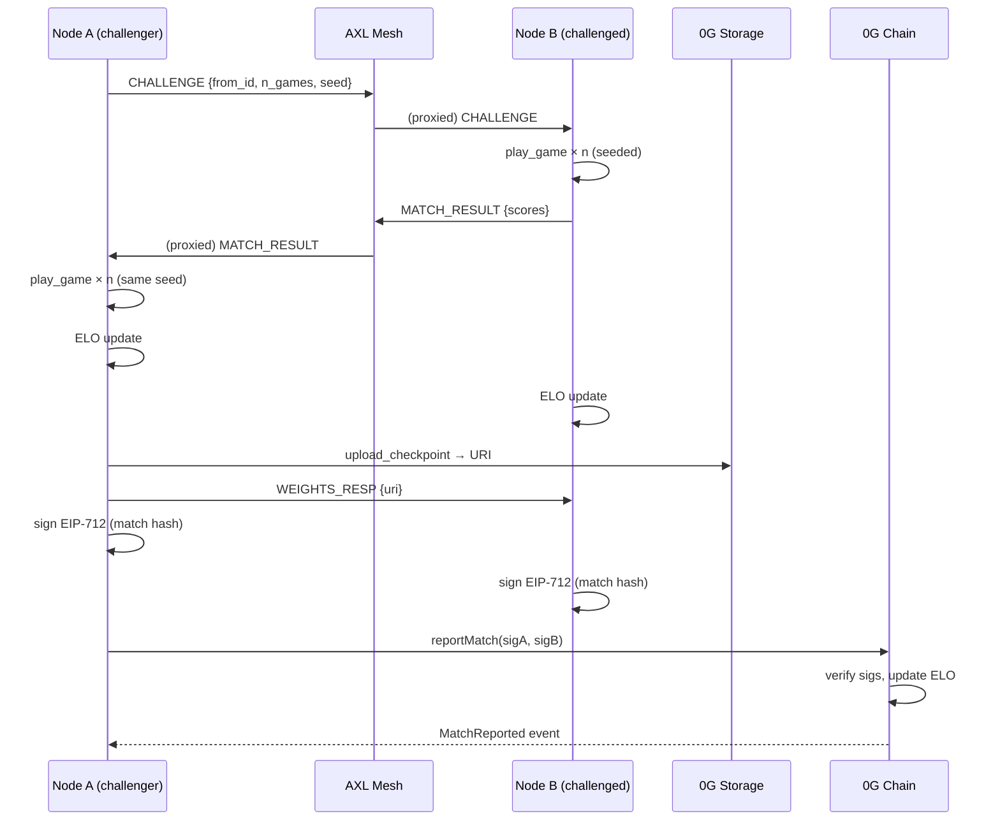

# Chaingammon RL Swarm Architecture

This document describes the three-layer architecture of the decentralised population-based training system introduced in the `learn` branch.

## Overview

Each node in the swarm is an autonomous agent that (1) trains a neural network via self-play, (2) discovers and challenges peers over AXL, and (3) persists weights and match records to 0G Storage while reporting ELO scores to a smart contract on 0G Chain.

## Layers

### Layer 1 — Training Core (`backgammon/`)

A pure Python + PyTorch implementation of TD-Gammon (Tesauro 1992).  The board is encoded as a 198-dimensional feature vector.  A two-hidden-layer MLP predicts four cumulative win probabilities from White's perspective.  TD(λ) self-play updates the network after every game using a backward λ-return sweep.

This layer has no network dependencies and runs standalone with `python -m backgammon.train`.

### Layer 2 — AXL Mesh (`backgammon/axl/`)

AXL (Gensyn Agent eXchange Layer) is a P2P binary that forms an encrypted mesh and proxies messages to registered local HTTP services.  Each node exposes a Flask HTTP service; AXL forwards peer messages to it as JSON POST requests.

Nodes exchange five message types: `ANNOUNCE`, `CHALLENGE`, `MATCH_RESULT`, `WEIGHTS_REQ`, and `WEIGHTS_RESP`.  Every two minutes a node broadcasts its current checkpoint hash and ELO, then challenges one peer.  If the peer's ELO exceeds the local ELO by 50+ points, the node downloads the peer's checkpoint from 0G Storage and replaces its local weights.

### Layer 3 — 0G Persistence (`backgammon/og/`)

**0G Storage** holds checkpoint blobs (content-addressed by SHA-256 of the weights) and game records.  The Python layer shells out to the existing `og-bridge` Node.js scripts, mirroring the pattern used elsewhere in this repo.

**0G Chain** hosts the `Tournament.sol` ELO contract.  After each match both agents co-sign the result using EIP-712, then one party submits it on-chain.  The contract applies K=32 ELO arithmetic and emits `MatchReported` events.

## Match Flow (single match)

## Feature Flags

| Flag | Effect |
|------|--------|
| `--no-network` | Disables AXL peer discovery; standalone self-play only |
| `--no-chain` | Skips on-chain ELO submission |
| `--no-storage` | Skips 0G Storage checkpoint uploads |
