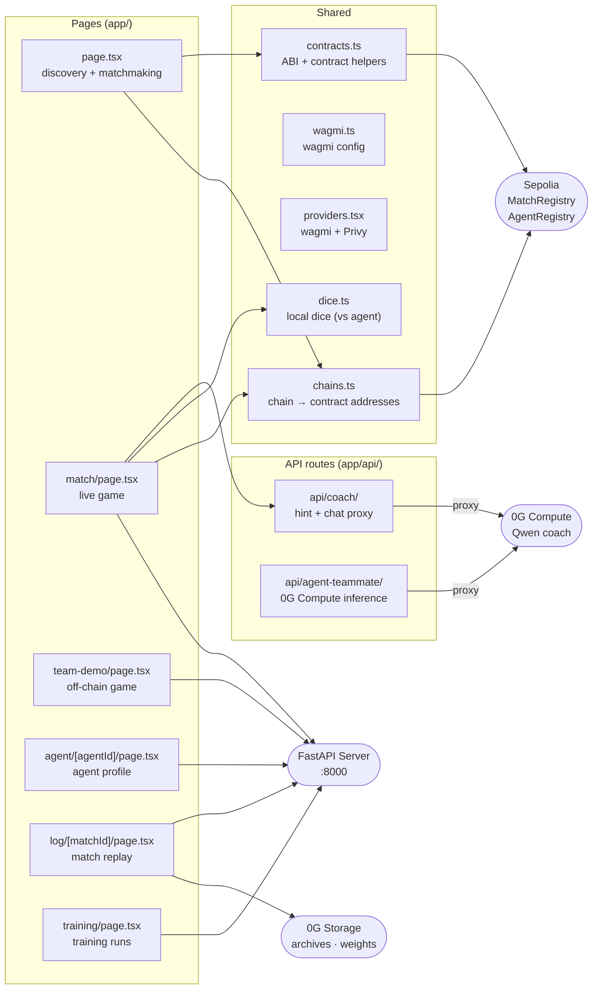

# ChainGammon — Next.js frontend

Browser-side application for matchmaking, live gameplay, match replay, agent profiles, and training management. Wallet connection is handled via wagmi + Privy (email / Google / external wallets → embedded wallet); on-chain reads go direct from the browser. Game logic — move legality, AI move selection, and match state — runs **in the browser** (`lib/match_engine.ts` + ONNX Runtime Web), not on a server. Human-vs-human play (in progress) is fully peer-to-peer: presence + WebRTC signaling over public Nostr relays, moves over a WebRTC data channel.



## Running locally

Uses `pnpm`. The dev server starts on port 3000.

```bash
pnpm install
pnpm dev
```

Point at a local backend by setting `NEXT_PUBLIC_SERVER_URL=http://localhost:8000` in `.env.local`. Without it the frontend uses the production VPS at `http://132.145.158.84`.

## Environment variables

All `NEXT_PUBLIC_*` vars are inlined at build time and visible in the browser. Server-only vars (no prefix) are only available in API routes and server components.

| Variable | Required | Description |
|----------|----------|-------------|
| `NEXT_PUBLIC_SERVER_URL` | no | FastAPI backend URL (default `http://132.145.158.84`) |
| `NEXT_PUBLIC_GNUBG_URL` | no | Local gnubg agent URL (default `http://localhost:8001`) |
| `NEXT_PUBLIC_COACH_URL` | no | Local coach agent URL (default `http://localhost:8002`) |
| `NEXT_PUBLIC_WALLETCONNECT_PROJECT_ID` | no | WalletConnect project ID for mobile wallet QR codes |
| `NEXT_PUBLIC_OG_RPC_URL` | no | 0G testnet RPC (default `https://evmrpc-testnet.0g.ai`) |
| `NEXT_PUBLIC_AGENT_REGISTRY_ADDRESS` | no | Override `AgentRegistry` address (normally from `chains.ts`) |
| `NEXT_PUBLIC_MATCH_REGISTRY_ADDRESS` | no | Override `MatchRegistry` address (normally from `chains.ts`) |
| `OG_STORAGE_RPC` | no | 0G RPC for server-side storage calls (API routes) |
| `OG_STORAGE_INDEXER` | no | 0G indexer for server-side storage calls |
| `OG_STORAGE_PRIVATE_KEY` | no | Wallet key for server-side 0G uploads |
| `BASE_PATH` | no | Set to `/chaingammon` when building for GitHub Pages |

## Pages

| Route | Description |
|-------|-------------|
| `/` | Agent discovery list and matchmaking — reads `AgentRegistry` on-chain |
| `/match` | Live game against an agent — KeeperHub pre-game card, escrow deposit, move loop |
| `/team-demo` | Off-chain game (no settlement). Add `?settle=1` for on-chain ELO + optional stake |
| `/agent/[agentId]` | Agent profile — on-chain metadata, 0G Storage weights hash, style summary |
| `/log/[matchId]` | Match replay and KeeperHub audit trail — reads archive from 0G Storage |
| `/training` | Start and monitor training runs via the FastAPI training endpoints |
| `/help` | Protocol documentation with TOC sidebar |
| `/transactions` | Recent on-chain transactions for the connected wallet |
| `/create-agent` | Mint a new agent iNFT via `AgentRegistry` |

## Key files

| File | Responsibility |
|------|---------------|
| `layout.tsx` | Root layout — fonts, wagmi providers, nav |
| `providers.tsx` | wagmi + Privy provider tree |
| `chains.ts` | Maps chain ID → deployed contract addresses (reads `contracts/deployments/*.json`) |
| `contracts.ts` | ABI imports and typed contract helpers |
| `wagmi.ts` | wagmi config — supported chains, transports, WalletConnect |
| `dice.ts` | Local dice for human-vs-agent (`crypto.getRandomValues`) |
| `lib/match_engine.ts` | In-browser backgammon match engine — state, move apply, AI move selection |
| `lib/drand_dice.ts` | drand-derived verifiable dice for human-vs-human (`keccak256(round_digest ‖ turn_index) mod 36`; ports `agent/drand_dice.py`) |
| `lib/nostr.ts` | Presence + WebRTC signaling over public Nostr relays (serverless matchmaking) |
| `lib/webrtc_match.ts` | WebRTC peer connection + data channel for human-vs-human moves |
| `lib/matchmaker.ts` | Deterministic ELO-biased pairing of searchers |
| `FindHumanButton.tsx` | Basic-mode "Play a human" — Nostr presence, auto-pair, connect |
| `Board.tsx` | Backgammon board SVG — checkers, points, dice, move highlights |
| `AgentCard.tsx` | Agent hover card with ELO, tier, and style summary |
| `AgentWalletPanel.tsx` | Session-key wallet UI — balance, fund, withdraw |
| `ComputeBackendsContext.tsx` | Global context for local vs 0G Compute toggle |
| `ComputeBackendsPill.tsx` | Header pill that shows and toggles compute backends |
| `ConnectButton.tsx` | Privy login button (email / Google / external wallet) |
| `NetworkDropdown.tsx` | Chain switcher dropdown |
| `app/api/coach/` | Server-side proxy to 0G Compute or local coach for `/hint` and `/chat` |
| `app/api/agent-teammate/` | Server-side proxy for 0G Compute inference calls |

## Building

```bash
pnpm build        # production build
pnpm start        # serve the production build locally

# GitHub Pages (sets BASE_PATH=/chaingammon)
BASE_PATH=/chaingammon pnpm build
```

## Tests

```bash
pnpm test         # runs the Next.js build check (type errors fail the build)
```
