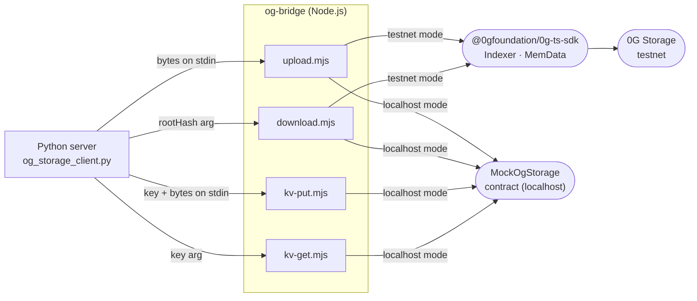

# og-bridge

Thin Node.js CLI wrapper around the `@0gfoundation/0g-ts-sdk` TypeScript SDK, giving the Python server subprocess access to 0G Storage. The SDK has no Python equivalent, so `og_storage_client.py` shells out to these scripts and communicates via stdin/stdout. All scripts follow the same protocol: payload bytes arrive on stdin, results leave on stdout as JSON or raw bytes; SDK progress logs go to stderr so stdout stays clean.



## Running locally

Install dependencies with pnpm from the repo root:

```bash
pnpm install
```

All four scripts are runnable directly via `node src/<script>.mjs`. No build step is needed — the project is pure ESM.

## Modes

`OG_STORAGE_MODE` controls which backend is used. Setting it to `localhost` is the recommended way to develop and test without spending testnet tokens or requiring a live 0G node.

| `OG_STORAGE_MODE` | Backend | Notes |
|---|---|---|
| unset / `testnet` | 0G Storage testnet | Requires `OG_STORAGE_RPC`, `OG_STORAGE_INDEXER`, `OG_STORAGE_PRIVATE_KEY` |
| `localhost` | `MockOgStorage` Solidity contract | Requires `LOCALHOST_MOCK_OG_STORAGE` or `contracts/deployments/localhost.json` |

## Environment variables

| Variable | Required for | Description |
|---|---|---|
| `OG_STORAGE_RPC` | testnet | JSON-RPC endpoint for the 0G chain |
| `OG_STORAGE_INDEXER` | testnet download | 0G Indexer URL used by the SDK |
| `OG_STORAGE_PRIVATE_KEY` | testnet upload | Wallet that signs storage transactions |
| `LOCALHOST_RPC` | localhost | Hardhat/Anvil RPC (default `http://127.0.0.1:8545`) |
| `LOCALHOST_MOCK_OG_STORAGE` | localhost | `MockOgStorage` contract address (overrides deployments JSON) |
| `LOCALHOST_PRIVATE_KEY` | localhost upload | Signing key (default: Hardhat's first well-known test key) |
| `KV_MOCK_PATH` | localhost KV | JSON file used as the KV store (default `/tmp/chaingammon-kv-mock.json`) |

## Key files

| File | Description |
|---|---|
| `src/upload.mjs` | Read bytes from stdin, upload to 0G Storage; emit `{rootHash, txHash}` JSON to stdout |
| `src/download.mjs` | Accept `rootHash` as argv[2], download blob, write raw bytes to stdout |
| `src/kv-put.mjs` | Accept `key` as argv[2] and value bytes from stdin, write to 0G KV (localhost mock only) |
| `src/kv-get.mjs` | Accept `key` as argv[2], read from 0G KV (localhost mock only), write raw bytes to stdout |
| `test/round_trip.mjs` | Integration test: upload three payloads via `MockOgStorage`, download each, assert byte equality |

## KV status

The `@0gfoundation/0g-ts-sdk` v1.2.6 does not yet expose a `KvClient`. `kv-put.mjs` and `kv-get.mjs` work in localhost mode (JSON file on disk) and exit non-zero with a clear message in testnet mode. When the SDK adds KV support the scripts include a comment indicating where to swap in the real client calls.

## Testing

The round-trip test requires a running Hardhat node with `MockOgStorage` deployed:

```bash
# from repo root
pnpm exec hardhat node &
pnpm exec hardhat run script/deploy.js --network localhost
node og-bridge/test/round_trip.mjs --mock-address 0x<MockOgStorage address>
```
