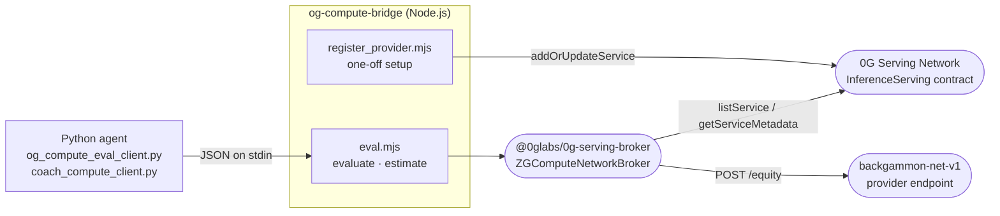

# og-compute-bridge

Thin Node.js CLI wrapper around the `@0glabs/0g-serving-broker` SDK, giving the Python agent and coach services subprocess access to the 0G decentralised compute network. The Python side (`og_compute_eval_client.py`, `coach_compute_client.py`) shells out to `eval.mjs` and reads the result from stdout as JSON. The protocol mirrors og-bridge: request JSON arrives on stdin, response JSON leaves on stdout, SDK progress logs go to stderr.



## Running locally

Install dependencies with pnpm from the repo root:

```bash
pnpm install
```

`eval.mjs` is pure ESM with no build step. It requires a live 0G Serving Network connection; there is no localhost mock (unlike og-bridge). If no `backgammon-net-v1` provider is discoverable, `estimate` returns `"available": false` and `evaluate` exits non-zero with `OG_EVAL_UNAVAILABLE` on stderr.

## Actions

`eval.mjs` reads a single JSON object from stdin and dispatches on the `action` field.

### `evaluate`

Runs one forward pass through the backgammon equity network on a 0G compute provider and returns the scalar equity value.

```
stdin:  {"action":"evaluate","features":[...198 floats...],"extras":[...16 floats...]}
stdout: {"equity": float, "model": "backgammon-net-v1", "providerAddress": "0x..."}
```

Exits non-zero with `OG_EVAL_UNAVAILABLE` on stderr if no provider is registered.

### `estimate`

Returns pricing for a hypothetical batch of N inferences without making a real call. Always exits 0 — the frontend uses `available: false` to disable the 0G toggle rather than treating it as an error.

```
stdin:  {"action":"estimate","count":N}
stdout: {"per_inference_og": float, "total_og": float, "providerAddress": "0x...", "available": bool}
```

## Environment variables

| Variable | Required | Description |
|---|---|---|
| `OG_STORAGE_RPC` | Yes | JSON-RPC endpoint for the 0G chain (shared with og-bridge wallet) |
| `OG_STORAGE_PRIVATE_KEY` | Yes | Wallet that pays for compute (shared with og-bridge) |
| `OG_COMPUTE_EVAL_PROVIDER` | No | Pin a specific provider address; bypasses `listService` discovery |
| `BACKGAMMON_NET_MODEL` | No | Model identifier to filter by (default `backgammon-net-v1`) |
| `OG_COMPUTE_PER_INFERENCE_OG` | No | Fallback per-inference price in OG when the provider doesn't publish it (default `0.00001`) |
| `OG_COMPUTE_MIN_BALANCE` | No | Minimum sub-account balance before topping up (default `0.01` OG) |
| `OG_COMPUTE_DEPOSIT` | No | Amount to deposit when creating a new ledger (default `0.05` OG) |

## Key files

| File | Description |
|---|---|
| `src/eval.mjs` | Main CLI: reads `{action, ...}` from stdin, dispatches `evaluate` or `estimate`, prints JSON to stdout |
| `src/register_provider.mjs` | One-off setup: registers (or updates) the VPS as a `backgammon-net-v1` inference provider on the `InferenceServing` contract (`0xa79F4c8311...`) |
| `test/eval.test.mjs` | Node test runner suite: pins the bridge's failure-path behaviour (bad env, bad stdin, unknown action) without requiring a live 0G connection |

## Provider registration

`register_provider.mjs` is a one-off operation that must be run once per VPS to make it discoverable on the 0G Serving Network. It reads `frontend/.env.local` automatically so no extra env setup is required:

```bash
node og-compute-bridge/src/register_provider.mjs
```

After registration, `broker.inference.listService()` will return the VPS and clients can reach it at `POST <PROVIDER_URL>/equity`.

## Testing

Tests cover pre-SDK failure paths and do not require a live 0G connection:

```bash
cd og-compute-bridge && npm test
```
