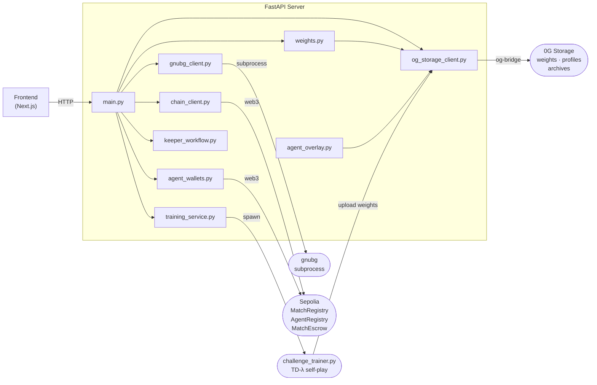

# ChainGammon — FastAPI server

FastAPI backend serving the match engine, agent registry, training orchestration, staked-match settlement, KeeperHub workflow, and 0G Storage integration. The frontend talks to this server for everything that requires on-chain reads, gnubg evaluation, or persistent state — the browser handles dice rolls and ONNX inference locally.



## Running locally

Uses `uv` for dependency management. The server starts in about 15 s because torch loads at import time.

```bash
uv sync
uv run uvicorn app.main:app --host 0.0.0.0 --port 8000
```

Point the frontend at it by setting `NEXT_PUBLIC_SERVER_URL=http://localhost:8000` in `frontend/.env.local`.

## VPS deployment

The production server runs on `132.145.158.84` under systemd as `chaingammon-server`. Two helper scripts in `scripts/` cover the full lifecycle — `setup.sh` for a fresh machine, `deploy.sh` for pushing changes. Set these shell variables once per terminal session before using any of the commands below:

```bash
export CG_VPS=ubuntu@132.145.158.84          # primary
export CG_VPS_BACKUP=oleg@136.112.73.124     # backup
export CG_KEY=~/Documents/ssh/ssh-key-2026-05-17.key
```

### First-time installation

Clone the repo on the VPS, write the env file (the only step that can't be automated — it holds secrets), then let `setup.sh` handle the rest: `uv sync`, registering the systemd unit, and starting the service.

```bash
# 1. SSH in
ssh -i $CG_KEY $CG_VPS

# 2. Clone the repo
git clone https://github.com/oslinin/chaingammon.git
cd chaingammon

# 3. Create the env file (contains secrets — not in git)
cat > server/.env <<'EOF'
OG_STORAGE_RPC=https://evmrpc-testnet.0g.ai
OG_STORAGE_INDEXER=https://indexer-storage-testnet-turbo.0g.ai
OG_STORAGE_PRIVATE_KEY=<your-key>
OG_EQUITY_URL=http://132.145.158.84
AGENT_KEYSTORE_PASSPHRASE=<your-passphrase>
EOF

# 4. Install deps, register and start the service
bash server/scripts/setup.sh
```

### Deploy a change

`deploy.sh` pulls the latest commit, re-syncs deps in case `uv.lock` changed, and restarts the service.

```bash
ssh -i $CG_KEY $CG_VPS "cd /home/ubuntu/chaingammon && bash server/scripts/deploy.sh"
```

### Logs and manual control

The service writes all output to the systemd journal. Use `journalctl` to follow logs or `systemctl` to start/stop manually.

```bash
ssh -i $CG_KEY $CG_VPS   # then on the VPS:

journalctl -u chaingammon-server -f         # tail live logs
journalctl -u chaingammon-server -n 100     # last 100 lines

sudo systemctl stop    chaingammon-server
sudo systemctl start   chaingammon-server
sudo systemctl status  chaingammon-server
```

`journalctl -f` shows `Application startup complete` when the server is ready to accept requests.

---

## Environment variables

All sourced from `server/.env` locally, or from the systemd `EnvironmentFile` on the VPS. The first three `OG_STORAGE_*` vars are required for any feature that touches 0G Storage (agent profiles, training uploads). `AGENT_KEYSTORE_PASSPHRASE` is required only if you use staked matches.

| Variable                      | Required             | Description                                                        |
| ----------------------------- | -------------------- | ------------------------------------------------------------------ |
| `OG_STORAGE_RPC`              | yes                  | 0G testnet RPC — `https://evmrpc-testnet.0g.ai`                    |
| `OG_STORAGE_INDEXER`          | yes                  | 0G storage indexer — `https://indexer-storage-testnet-turbo.0g.ai` |
| `OG_STORAGE_PRIVATE_KEY`      | yes                  | Wallet key for signing 0G Storage uploads                          |
| `OG_EQUITY_URL`               | no                   | Direct equity provider URL, bypasses on-chain 0G registration      |
| `AGENT_KEYSTORE_PASSPHRASE`   | yes (staked matches) | Passphrase for agent session-key keystores in `data/agent_keys/`   |
| `OG_COMPUTE_PROVIDER`         | no                   | Pin a specific 0G Compute chat provider                            |
| `OG_COMPUTE_EVAL_PROVIDER`    | no                   | Pin a specific 0G Compute backgammon-net inference provider        |
| `BACKGAMMON_NET_MODEL`        | no                   | `listService` filter (default `backgammon-net-v1`)                 |
| `OG_COMPUTE_PER_INFERENCE_OG` | no                   | Fallback per-inference price (default `0.00001`)                   |
| `OG_COMPUTE_MIN_BALANCE`      | no                   | Sub-account min OG balance (default `0.01`)                        |
| `OG_COMPUTE_DEPOSIT`          | no                   | Initial ledger deposit (default `0.05`)                            |
| `CHAINGAMMON_MEAN_PLIES`      | no                   | Training gas-estimate denominator (default `60`)                   |

---

## API reference

All endpoints are defined in `app/main.py`.

### Matches and game state

A game is created server-side and identified by a UUID. Moves come in from the human player or from the agent endpoint; gnubg evaluates legal moves and scores candidates. The `use_per_agent_nn=true` flag on agent-move swaps gnubg for the agent's trained PyTorch checkpoint when one exists.

| Endpoint                       | Purpose                                                                                                              |
| ------------------------------ | -------------------------------------------------------------------------------------------------------------------- |
| `POST /games`                  | Create a game. Accepts optional `team_a`/`team_b` rosters for team mode.                                             |
| `GET  /games/{id}`             | Current `GameState`.                                                                                                 |
| `POST /games/{id}/move`        | Apply a human move.                                                                                                  |
| `POST /games/{id}/agent-move`  | Agent picks and applies a move. Pass `use_per_agent_nn=true` to use the agent's trained checkpoint instead of gnubg. |
| `POST /games/{id}/roll`        | Roll dice for the current turn.                                                                                      |
| `POST /games/{id}/resign`      | Resign the active side.                                                                                              |
| `POST /games/{id}/finalize`    | Record the result on-chain (free match).                                                                             |
| `POST /finalize-direct-staked` | Atomic settle + escrow payout for staked matches.                                                                    |

### Agents

Agents are ERC-7857 iNFTs registered in `AgentRegistry` on Sepolia. The server caches on-chain metadata and exposes style profiles fetched from 0G Storage KV. The wallet endpoints manage the session-key EOA used for staked-match deposits.

| Endpoint                     | Purpose                                             |
| ---------------------------- | --------------------------------------------------- |
| `GET  /agents`               | List all registered agents.                         |
| `GET  /agents/{id}`          | Agent metadata + on-chain state.                    |
| `GET  /agents/{id}/profile`  | Playing style summary fetched from 0G Storage KV.   |
| `GET  /agents/{id}/wallet`   | Session-key wallet address + ETH balance.           |
| `POST /agents/{id}/wallet`   | Provision a session-key wallet (idempotent).        |
| `POST /agents/{id}/deposit`  | Sign `MatchEscrow.deposit` from the agent's wallet. |
| `POST /agents/{id}/withdraw` | Drain agent wallet to a target address.             |

### Training

Training runs `challenge_trainer.py` as a subprocess. The server writes its progress to a JSONL status file and streams it back to the frontend. Only one training run can be active at a time.

| Endpoint                | Purpose                                            |
| ----------------------- | -------------------------------------------------- |
| `POST /training/start`  | Spawn a `challenge_trainer.py` subprocess.         |
| `GET  /training/status` | Live run status (reads the `--status-file` JSONL). |
| `POST /training/abort`  | Kill the trainer subprocess.                       |

### KeeperHub workflow

After a match settles on-chain, the KeeperHub workflow runs 8 sequential verification and archival steps. Each step is independent and reports its own status, so a failure is immediately attributable. State is written to disk so polling survives page navigations.

| Endpoint                              | Purpose                                                                              |
| ------------------------------------- | ------------------------------------------------------------------------------------ |
| `POST /keeper-workflow/{matchId}/run` | Trigger the 8-step post-match workflow.                                              |
| `GET  /keeper-workflow/{matchId}`     | Poll progress. State persists to `/tmp/chaingammon-keeper-workflows/<matchId>.json`. |

The 8 steps in order: `escrow_deposit` → `vrf_rolls` → `og_storage_fetch` → `rules_check` → `settlement_signed` → `relay_tx` → `ens_update` → `audit_append`. A failed step halts the workflow and surfaces the exception; remaining steps stay `pending`.

### Coach

The coach wraps a Qwen 2.5 7B model (via 0G Compute or a local fallback) in a turn-by-turn conversation. `/hint` gives a one-liner for users who don't want a dialogue; `/chat` supports a full back-and-forth with preference signals that bias later turns within the same session.

| Endpoint     | Body                                                                                            | Purpose                                                                           |
| ------------ | ----------------------------------------------------------------------------------------------- | --------------------------------------------------------------------------------- |
| `POST /hint` | `HintRequest`                                                                                   | Single-sentence move narration.                                                   |
| `POST /chat` | `ChatRequest{kind, match_id, turn_index, position_id, dice, candidates, dialogue, preferences}` | Turn-by-turn coaching. Three kinds: `open_turn`, `human_reply`, `move_committed`. |

---

## 0G Storage integration

0G Storage is a decentralised content-addressed store used for agent weights, style profiles, and match archives. The server side uses `app/og_storage_client.py`, which shells out to `og-bridge/src/kv-put.mjs` and `og-bridge/src/kv-get.mjs` for KV operations. All three `OG_STORAGE_*` env vars must be set; if any are missing, the client raises `OgStorageError` and affected endpoints fall back gracefully (profile returns a `NullProfile` placeholder, training upload logs a warning).

Key scheme:

- `chaingammon/weights/agent/<id>` — per-agent NN checkpoint (JSON with weights + style profile)
- Match archives — uploaded by the frontend at game-end; the resulting rootHash is committed to `MatchRegistry` on-chain

---

## Staked matches

Matches can be free (ELO-only) or staked (ETH deposited by both sides, winner takes the pot). The server manages a session-key wallet for each agent — a dedicated EOA whose encrypted keystore lives at `data/agent_keys/<agentId>.json`. The owner pre-funds the wallet; after the match the pot is paid out atomically.

The flow:

1. Frontend calls `POST /agents/{id}/deposit` — server signs `MatchEscrow.deposit` from the agent wallet.
2. Game plays out identically to a free match.
3. Frontend calls `POST /finalize-direct-staked` — server issues a single `recordMatchAndSplit` transaction that writes the match record and pays the winner in one step.

`AGENT_KEYSTORE_PASSPHRASE` must be set before startup; the wallet endpoints return 503 without it.

---

## Key modules

The server is a single FastAPI app (`app/main.py`) with no internal service layer — endpoints call module functions directly. The modules below handle the main concerns:

| File                       | Responsibility                                                           |
| -------------------------- | ------------------------------------------------------------------------ |
| `app/main.py`              | All HTTP endpoints                                                       |
| `app/gnubg_client.py`      | Subprocess bridge to gnubg for move evaluation                           |
| `app/og_storage_client.py` | 0G Storage KV get/put                                                    |
| `app/training_service.py`  | Spawns `challenge_trainer.py`, streams status-file events                |
| `app/keeper_workflow.py`   | 8-step post-match KeeperHub workflow                                     |
| `app/chain_client.py`      | Web3 calls to `MatchRegistry`, `AgentRegistry`, `MatchEscrow` on Sepolia |
| `app/agent_overlay.py`     | Parses agent style profiles from 0G KV blobs                             |
| `app/agent_wallets.py`     | Session-key wallet create / deposit / withdraw                           |
| `app/weights.py`           | Loads and caches ONNX / torch agent checkpoints                          |
| `app/game_state.py`        | In-memory game state and move validation                                 |
| `app/game_record.py`       | Builds the canonical `GameRecord` JSON for archiving                     |
| `app/team_mode.py`         | Captain rotation and advisor signal logic                                |
| `app/teammate_advisor.py`  | Scores non-captain teammates and formats advisor signals                 |

---

## Tests

The test suite covers the training status file protocol, chain client behaviour, and storage integration. Run from the `server/` directory.

```bash
uv run pytest tests/
```
